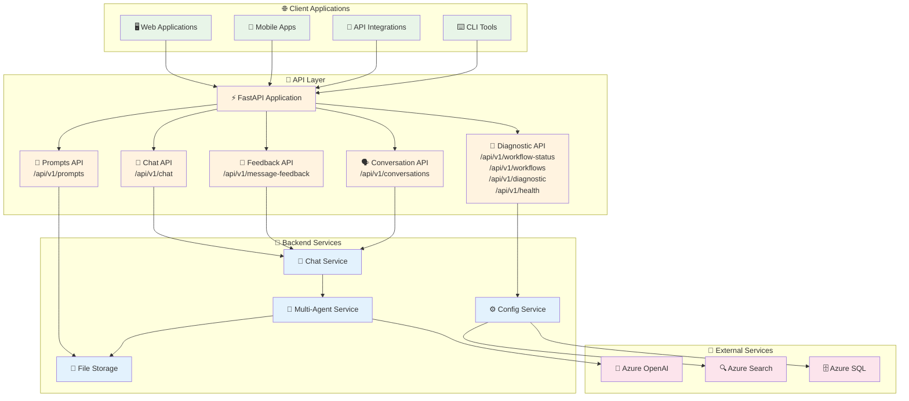
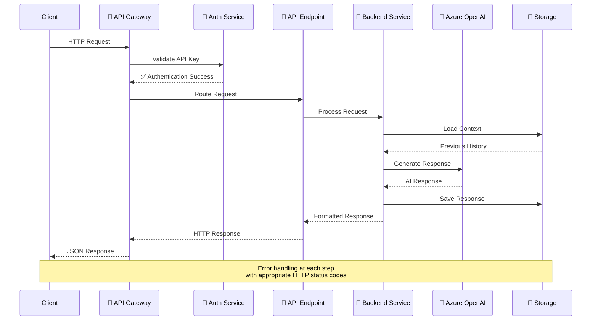
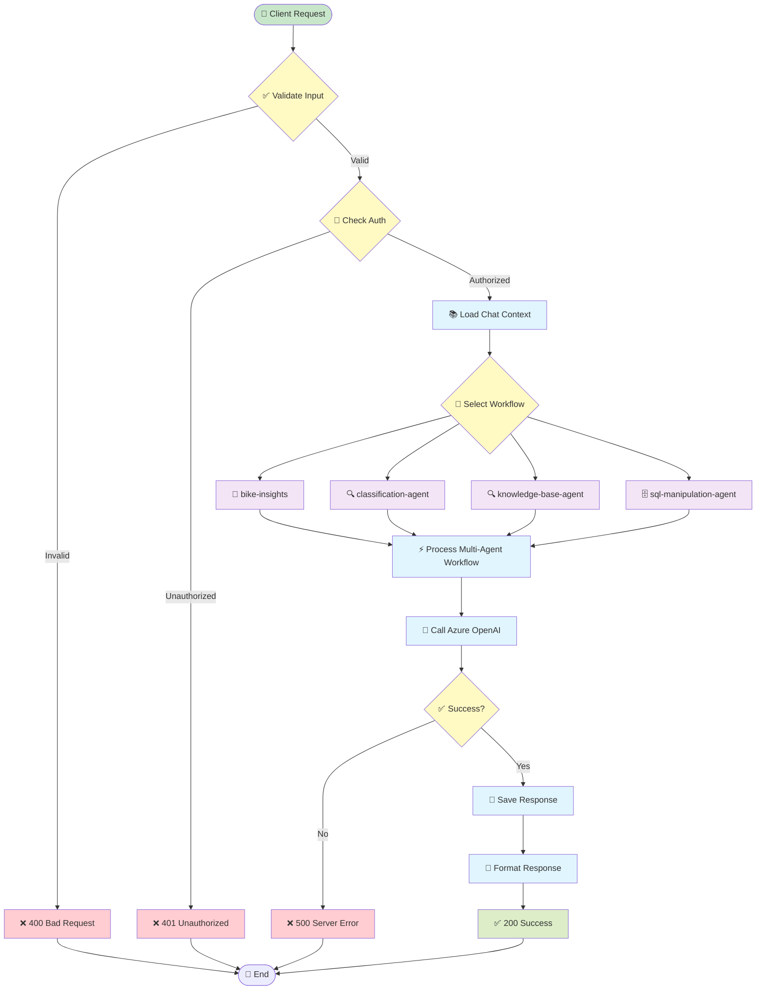
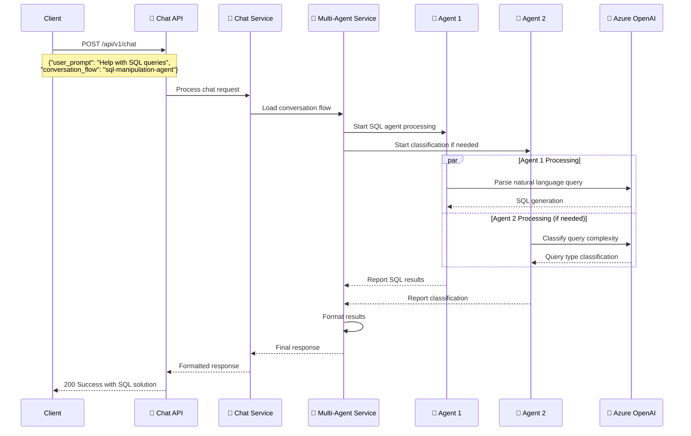
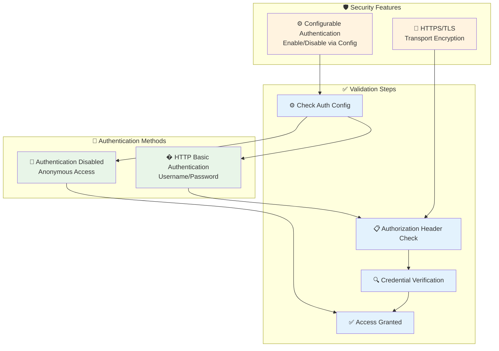

# API Reference

Complete API documentation for Insight Ingenious - an enterprise-grade Python library for building AI agent APIs with Microsoft Azure integrations. This reference covers REST endpoints, workflow examples, debugging utilities, and integration guides.

## 🚀 API Architecture Overview



## 🔄 API Request Flow



## 📡 Core API Endpoints

### 🔍 Endpoint Overview

```mermaid
graph LR
    subgraph "💬 Chat Endpoints"
        CHAT_POST[POST /api/v1/chat<br/>Send Message]
    end

    subgraph "🔄 Diagnostic Endpoints"
        WORKFLOW_STATUS[GET /api/v1/workflow-status/{name}<br/>Check Workflow Status]
        WORKFLOWS_LIST[GET /api/v1/workflows<br/>List All Workflows]
        DIAGNOSTIC[GET /api/v1/diagnostic<br/>System Diagnostic]
    end

    subgraph "❤️ System Endpoints"
        HEALTH[GET /api/v1/health<br/>Health Check]
    end

    subgraph "📝 Management Endpoints"
        PROMPTS_VIEW[GET /api/v1/prompts/view/{revision_id}/{filename}<br/>View Prompt]
        PROMPTS_LIST[GET /api/v1/prompts/list/{revision_id}<br/>List Prompts]
        PROMPTS_UPDATE[POST /api/v1/prompts/update/{revision_id}/{filename}<br/>Update Prompt]
        FEEDBACK[PUT /api/v1/message-feedback<br/>Message Feedback]
    end

    classDef chat fill:#e8f5e8
    classDef workflow fill:#fff3e0
    classDef system fill:#e3f2fd
    classDef management fill:#f3e5f5

    class CHAT_POST chat
    class WORKFLOW_STATUS,WORKFLOWS_LIST,DIAGNOSTIC workflow
    class HEALTH system
    class PROMPTS_VIEW,PROMPTS_LIST,PROMPTS_UPDATE,FEEDBACK management
```

### 💬 Chat API Flow



### 🔄 Workflow API Flow



## 🔐 Authentication & Security

### Authentication Flow



### 🚀 Getting Started with the API

The Insight Ingenious API provides powerful endpoints for creating and managing AI-powered conversation workflows programmatically.

### Base API Information
- **Base URL**: `http://localhost:80` (default) or your configured port
- **Content-Type**: `application/json`
- **Authentication**: HTTP Basic Authentication (configurable)

### [🔄 Workflow API](/api/workflows/)
Complete documentation for all available workflow endpoints, including:
- Classification and routing workflows
- Educational content generation
- Knowledge base search and retrieval
- SQL query generation and execution

### 🛠️ Core API Endpoints

#### Health Check
```bash
GET /api/v1/health
```
Returns the health status of the API service.

#### List Available Workflows
```bash
GET /api/v1/workflows
```
Returns a list of all available workflow types and their configurations.

### 📋 Common API Patterns

#### Making API Requests
All API requests should include appropriate headers:

```bash
curl -X POST http://localhost:80/api/v1/chat \
  -H "Content-Type: application/json" \
  -d '{"user_prompt": "Hello", "conversation_flow": "classification-agent"}'
```

With authentication enabled:
```bash
curl -X POST http://localhost:80/api/v1/chat \
  -H "Content-Type: application/json" \
  -u "username:password" \
  -d '{"user_prompt": "Hello", "conversation_flow": "classification-agent"}'
```

#### Response Format
All API responses follow a consistent format:

```json
{
  "status": "success|error",
  "data": {
    // Response data
  },
  "message": "Human-readable message",
  "timestamp": "2025-07-04T12:00:00Z"
}
```

## 🔧 Integration Examples

### Python Integration
```python
import requests

def call_chat_api(user_prompt, conversation_flow, username=None, password=None):
    auth = (username, password) if username and password else None

    response = requests.post(
        "http://localhost:80/api/v1/chat",
        json={
            "user_prompt": user_prompt,
            "conversation_flow": conversation_flow
        },
        headers={
            "Content-Type": "application/json"
        },
        auth=auth
    )
    return response.json()

# Example usage
result = call_chat_api("Hello", "classification-agent", "username", "password")
```

### JavaScript Integration
```javascript
async function callChatAPI(userPrompt, conversationFlow, username, password) {
    const auth = username && password ?
        'Basic ' + btoa(username + ':' + password) : undefined;

    const response = await fetch('http://localhost:80/api/v1/chat', {
        method: 'POST',
        headers: {
            'Content-Type': 'application/json',
            ...(auth && { 'Authorization': auth })
        },
        body: JSON.stringify({
            user_prompt: userPrompt,
            conversation_flow: conversationFlow
        })
    });

    return await response.json();
}

// Example usage
const result = await callChatAPI('Hello', 'classification-agent', 'username', 'password');
```

## 🔍 Error Handling

The API uses standard HTTP status codes and provides detailed error messages:

- `200 OK` - Successful request
- `400 Bad Request` - Invalid request parameters
- `401 Unauthorized` - Missing or invalid API key
- `404 Not Found` - Endpoint or resource not found
- `500 Internal Server Error` - Server-side error

Example error response:
```json
{
  "status": "error",
  "message": "Invalid workflow type specified",
  "error_code": "INVALID_WORKFLOW_TYPE",
  "timestamp": "2025-07-04T12:00:00Z"
}
```

## 📖 Additional Resources

- [🔄 Workflow API Documentation](/api/workflows/)
- [⚙️ Configuration Guide](/configuration/)
- [🛠️ Development Setup](/development/)
- [📝 CLI Reference](/CLI_REFERENCE/)

## 💡 Need Help?

- Check the [troubleshooting guide](/troubleshooting/)
- Review the [workflow examples](/api/workflows/)
- Open an issue on [GitHub](https://github.com/Insight-Services-APAC/Insight_Ingenious/issues)
