# API Reference

Complete API documentation for Insight Ingenious, including REST endpoints, workflow examples, and integration guides.

## 🚀 API Architecture Overview

```mermaid
graph TB
    subgraph "🌐 Client Applications"
        WEB_CLIENT[🖥️ Web Applications]
        MOBILE_CLIENT[📱 Mobile Apps]
        API_CLIENT[🔌 API Integrations]
        CLI_CLIENT[⌨️ CLI Tools]
    end
    
    subgraph "🔗 API Gateway"
        LOAD_BALANCER[⚖️ Load Balancer]
        RATE_LIMITER[⏱️ Rate Limiter]
        AUTH_LAYER[🔐 Authentication]
    end
    
    subgraph "🎯 API Endpoints"
        CHAT_API[💬 Chat API<br/>/api/v1/chat]
        WORKFLOW_API[🔄 Workflow API<br/>/api/v1/workflow]
        HEALTH_API[❤️ Health API<br/>/health]
        ADMIN_API[👑 Admin API<br/>/admin]
    end
    
    subgraph "🤖 Backend Services"
        AGENT_SERVICE[🤖 Agent Service]
        WORKFLOW_SERVICE[⚡ Workflow Service]
        CONFIG_SERVICE[⚙️ Config Service]
        STORAGE_SERVICE[💾 Storage Service]
    end
    
    WEB_CLIENT --> LOAD_BALANCER
    MOBILE_CLIENT --> LOAD_BALANCER
    API_CLIENT --> LOAD_BALANCER
    CLI_CLIENT --> LOAD_BALANCER
    
    LOAD_BALANCER --> RATE_LIMITER
    RATE_LIMITER --> AUTH_LAYER
    
    AUTH_LAYER --> CHAT_API
    AUTH_LAYER --> WORKFLOW_API
    AUTH_LAYER --> HEALTH_API
    AUTH_LAYER --> ADMIN_API
    
    CHAT_API --> AGENT_SERVICE
    WORKFLOW_API --> WORKFLOW_SERVICE
    HEALTH_API --> CONFIG_SERVICE
    ADMIN_API --> STORAGE_SERVICE
    
    classDef client fill:#e8f5e8
    classDef gateway fill:#fff3e0
    classDef api fill:#e3f2fd
    classDef service fill:#fce4ec
    
    class WEB_CLIENT,MOBILE_CLIENT,API_CLIENT,CLI_CLIENT client
    class LOAD_BALANCER,RATE_LIMITER,AUTH_LAYER gateway
    class CHAT_API,WORKFLOW_API,HEALTH_API,ADMIN_API api
    class AGENT_SERVICE,WORKFLOW_SERVICE,CONFIG_SERVICE,STORAGE_SERVICE service
```



## 🔄 API Request Flow

```mermaid
sequenceDiagram
    participant Client
    participant Gateway as 🔗 API Gateway
    participant Auth as 🔐 Auth Service
    participant API as 📡 API Endpoint
    participant Service as 🤖 Backend Service
    participant LLM as 🧠 Azure OpenAI
    participant Storage as 💾 Storage

    Client->>Gateway: HTTP Request
    Gateway->>Auth: Validate API Key
    Auth-->>Gateway: ✅ Authentication Success

    Gateway->>API: Route Request
    API->>Service: Process Request

    Service->>Storage: Load Context
    Storage-->>Service: Previous History

    Service->>LLM: Generate Response
    LLM-->>Service: AI Response

    Service->>Storage: Save Response
    Service-->>API: Formatted Response

    API-->>Gateway: HTTP Response
    Gateway-->>Client: JSON Response

    Note over Client,Storage: Error handling at each step<br/>with appropriate HTTP status codes
```



## 📡 Core API Endpoints

### 🔍 Endpoint Overview

```mermaid
graph LR
    subgraph "💬 Chat Endpoints"
        CHAT_POST[POST /api/v1/chat<br/>Send Message]
        CHAT_HISTORY[GET /api/v1/chat/history<br/>Get Chat History]
        CHAT_CLEAR[DELETE /api/v1/chat/history<br/>Clear History]
    end
    
    subgraph "🔄 Workflow Endpoints"
        WORKFLOW_LIST[GET /api/v1/workflows<br/>List Workflows]
        WORKFLOW_POST[POST /api/v1/workflow<br/>Execute Workflow]
        WORKFLOW_STATUS[GET /api/v1/workflow/{id}<br/>Check Status]
    end
    
    subgraph "❤️ System Endpoints"
        HEALTH[GET /health<br/>Health Check]
        METRICS[GET /metrics<br/>System Metrics]
        VERSION[GET /version<br/>Version Info]
    end
    
    subgraph "👑 Admin Endpoints"
        ADMIN_CONFIG[GET /admin/config<br/>Configuration]
        ADMIN_AGENTS[GET /admin/agents<br/>Agent Status]
        ADMIN_LOGS[GET /admin/logs<br/>System Logs]
    end
    
    classDef chat fill:#e8f5e8
    classDef workflow fill:#fff3e0
    classDef system fill:#e3f2fd
    classDef admin fill:#fce4ec
    
    class CHAT_POST,CHAT_HISTORY,CHAT_CLEAR chat
    class WORKFLOW_LIST,WORKFLOW_POST,WORKFLOW_STATUS workflow
    class HEALTH,METRICS,VERSION system
    class ADMIN_CONFIG,ADMIN_AGENTS,ADMIN_LOGS admin
```

### 💬 Chat API Flow

```mermaid
flowchart TD
    START([📱 Client Request]) --> VALIDATE{✅ Validate Input}
    VALIDATE -->|Valid| AUTH{🔐 Check Auth}
    VALIDATE -->|Invalid| ERROR_400[❌ 400 Bad Request]
    
    AUTH -->|Authorized| LOAD_CONTEXT[📚 Load Chat Context]
    AUTH -->|Unauthorized| ERROR_401[❌ 401 Unauthorized]
    
    LOAD_CONTEXT --> SELECT_AGENT{🤖 Select Agent}
    SELECT_AGENT --> BIKE_AGENT[🚴 Bike Agent]
    SELECT_AGENT --> SENTIMENT_AGENT[😊 Sentiment Agent]
    SELECT_AGENT --> GENERAL_AGENT[💬 General Agent]
    
    BIKE_AGENT --> PROCESS_MESSAGE[⚡ Process Message]
    SENTIMENT_AGENT --> PROCESS_MESSAGE
    GENERAL_AGENT --> PROCESS_MESSAGE
    
    PROCESS_MESSAGE --> LLM_CALL[🧠 Call LLM]
    LLM_CALL --> SUCCESS{✅ Success?}
    
    SUCCESS -->|Yes| SAVE_RESPONSE[💾 Save Response]
    SUCCESS -->|No| ERROR_500[❌ 500 Server Error]
    
    SAVE_RESPONSE --> FORMAT_RESPONSE[📝 Format Response]
    FORMAT_RESPONSE --> RETURN_200[✅ 200 Success]
    
    ERROR_400 --> END([🏁 End])
    ERROR_401 --> END
    ERROR_500 --> END
    RETURN_200 --> END
    
    classDef start fill:#c8e6c9
    classDef process fill:#e1f5fe
    classDef decision fill:#fff9c4
    classDef agent fill:#f3e5f5
    classDef success fill:#dcedc8
    classDef error fill:#ffcdd2
    
    class START start
    class LOAD_CONTEXT,PROCESS_MESSAGE,LLM_CALL,SAVE_RESPONSE,FORMAT_RESPONSE process
    class VALIDATE,AUTH,SELECT_AGENT,SUCCESS decision
    class BIKE_AGENT,SENTIMENT_AGENT,GENERAL_AGENT agent
    class RETURN_200 success
    class ERROR_400,ERROR_401,ERROR_500 error
```



### 🔄 Workflow API Flow

```mermaid
sequenceDiagram
    participant Client
    participant API as 📡 Workflow API
    participant Registry as 📋 Workflow Registry
    participant Engine as ⚡ Workflow Engine
    participant Agent1 as 🤖 Agent 1
    participant Agent2 as 🤖 Agent 2
    participant LLM as 🧠 Azure OpenAI
    
    Client->>API: POST /api/workflow
    Note over Client,API: {"workflow_type": "bike_insights",<br/>"query": "Analyze Q2 sales"}
    
    API->>Registry: Get workflow definition
    Registry-->>API: Workflow configuration
    
    API->>Engine: Initialize workflow
    Engine->>Agent1: Start parallel execution
    Engine->>Agent2: Start parallel execution
    
    par Agent 1 Processing
        Agent1->>LLM: Process bike data
        LLM-->>Agent1: Sales analysis
    and Agent 2 Processing
        Agent2->>LLM: Process sentiment data
        LLM-->>Agent2: Sentiment analysis
    end
    
    Agent1-->>Engine: Report completion
    Agent2-->>Engine: Report completion
    
    Engine->>Engine: Combine results
    Engine-->>API: Final response
    API-->>Client: 200 Success with results
```



## 🔐 Authentication & Security

### Authentication Flow

```mermaid
graph TB
    subgraph "🔑 Authentication Methods"
        API_KEY[🗝️ API Key Authentication]
        JWT_TOKEN[🎫 JWT Token Authentication]
        BEARER_TOKEN[📋 Bearer Token]
    end
    
    subgraph "🛡️ Security Layers"
        RATE_LIMITING[⏱️ Rate Limiting<br/>100 req/min]
        IP_FILTERING[🌐 IP Filtering<br/>Whitelist/Blacklist]
        HTTPS_TLS[🔐 HTTPS/TLS<br/>Encryption]
    end
    
    subgraph "✅ Validation Steps"
        HEADER_CHECK[📋 Header Validation]
        TOKEN_VERIFY[🔍 Token Verification]
        PERMISSION_CHECK[👤 Permission Check]
        AUDIT_LOG[📝 Audit Logging]
    end
    
    API_KEY --> HEADER_CHECK
    JWT_TOKEN --> HEADER_CHECK
    BEARER_TOKEN --> HEADER_CHECK
    
    HEADER_CHECK --> TOKEN_VERIFY
    TOKEN_VERIFY --> PERMISSION_CHECK
    PERMISSION_CHECK --> AUDIT_LOG
    
    RATE_LIMITING --> HEADER_CHECK
    IP_FILTERING --> HEADER_CHECK
    HTTPS_TLS --> HEADER_CHECK
    
    classDef auth fill:#e8f5e8
    classDef security fill:#fff3e0
    classDef validation fill:#e3f2fd
    
    class API_KEY,JWT_TOKEN,BEARER_TOKEN auth
    class RATE_LIMITING,IP_FILTERING,HTTPS_TLS security
    class HEADER_CHECK,TOKEN_VERIFY,PERMISSION_CHECK,AUDIT_LOG validation
```



### 🚀 Getting Started with the API

The Insight Ingenious API provides powerful endpoints for creating and managing AI-powered conversation workflows programmatically.

### Base API Information
- **Base URL**: `http://localhost:8000` (default local development)
- **Content-Type**: `application/json`
- **Authentication**: API key-based (see configuration guide)

### [🔄 Workflow API](/api/workflows/)
Complete documentation for all available workflow endpoints, including:
- Bike insights and analysis
- Customer sentiment analysis
- Financial data processing
- Document analysis workflows

### 🛠️ Core API Endpoints

#### Health Check
```bash
GET /health
```
Returns the health status of the API service.

#### List Available Workflows
```bash
GET /workflows
```
Returns a list of all available workflow types and their configurations.

### 📋 Common API Patterns

#### Making API Requests
All API requests should include appropriate headers:

```bash
curl -X POST http://localhost:8000/api/workflow \
  -H "Content-Type: application/json" \
  -H "Authorization: Bearer YOUR_API_KEY" \
  -d '{"workflow_type": "bike_insights", "query": "Show me sales data"}'
```

#### Response Format
All API responses follow a consistent format:

```json
{
  "status": "success|error",
  "data": {
    // Response data
  },
  "message": "Human-readable message",
  "timestamp": "2025-07-04T12:00:00Z"
}
```

## 🔧 Integration Examples

### Python Integration
```python
import requests

def call_workflow_api(workflow_type, query, api_key):
    response = requests.post(
        "http://localhost:8000/api/workflow",
        json={
            "workflow_type": workflow_type,
            "query": query
        },
        headers={
            "Authorization": f"Bearer {api_key}",
            "Content-Type": "application/json"
        }
    )
    return response.json()

# Example usage
result = call_workflow_api("bike_insights", "Show sales trends", "your-api-key")
```

### JavaScript Integration
```javascript
async function callWorkflowAPI(workflowType, query, apiKey) {
    const response = await fetch('http://localhost:8000/api/workflow', {
        method: 'POST',
        headers: {
            'Authorization': `Bearer ${apiKey}`,
            'Content-Type': 'application/json'
        },
        body: JSON.stringify({
            workflow_type: workflowType,
            query: query
        })
    });
    
    return await response.json();
}

// Example usage
const result = await callWorkflowAPI('bike_insights', 'Show sales trends', 'your-api-key');
```

## 🔍 Error Handling

The API uses standard HTTP status codes and provides detailed error messages:

- `200 OK` - Successful request
- `400 Bad Request` - Invalid request parameters
- `401 Unauthorized` - Missing or invalid API key
- `404 Not Found` - Endpoint or resource not found
- `500 Internal Server Error` - Server-side error

Example error response:
```json
{
  "status": "error",
  "message": "Invalid workflow type specified",
  "error_code": "INVALID_WORKFLOW_TYPE",
  "timestamp": "2025-07-04T12:00:00Z"
}
```

## 📖 Additional Resources

- [🔄 Workflow API Documentation](/api/workflows/)
- [⚙️ Configuration Guide](/configuration/)
- [🛠️ Development Setup](/development/)
- [📝 CLI Reference](/CLI_REFERENCE/)

## 💡 Need Help?

- Check the [troubleshooting guide](/troubleshooting/)
- Review the [workflow examples](/api/workflows/)
- Open an issue on [GitHub](https://github.com/Insight-Services-APAC/Insight_Ingenious/issues)
