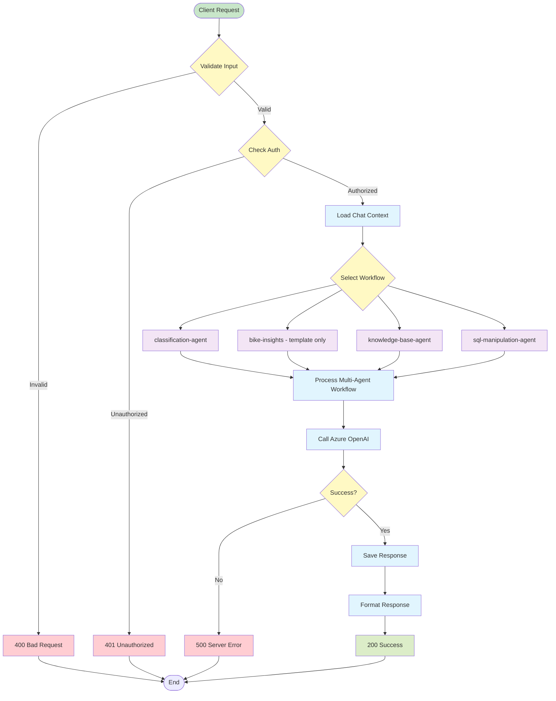
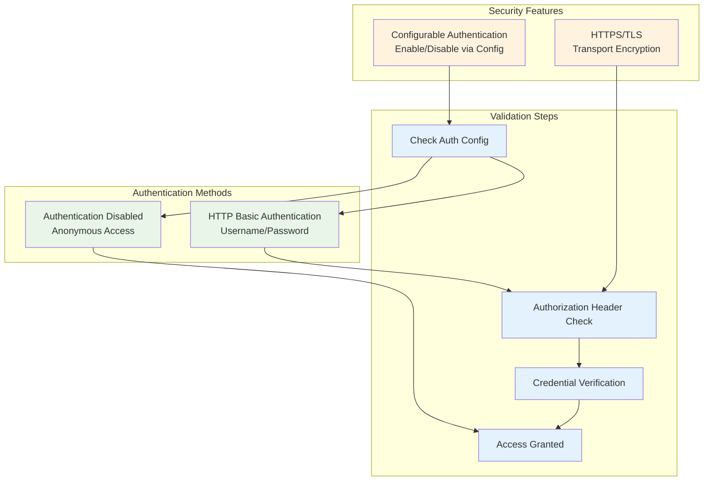

# API Reference

Complete API documentation for Insight Ingenious - an enterprise-grade Python library for building AI agent APIs with Microsoft Azure integrations. This reference covers REST endpoints, workflow examples, debugging utilities, and integration guides.

## API Architecture Overview

```mermaid
graph TB
    subgraph "Client Applications"
        WEB_CLIENT[Web Applications]
        MOBILE_CLIENT[Mobile Apps]
        API_CLIENT[API Integrations]
        CLI_CLIENT[CLI Tools]
    end

    subgraph "API Layer"
        FASTAPI[FastAPI Application]
        CHAT_API[Chat API\n/api/v1/chat]
        DIAGNOSTIC_API[Diagnostic API\n/api/v1/workflow-status/{workflow_name}\n/api/v1/workflows\n/api/v1/diagnostic\n/api/v1/health]
        PROMPTS_API[Prompts API\n/api/v1/prompts]
        FEEDBACK_API[Feedback API\n/api/v1/messages/{message_id}/feedback]
    end

    subgraph "Backend Services"
        CHAT_SERVICE[Chat Service]
        MULTI_AGENT_SERVICE[Multi-Agent Service]
        CONFIG_SERVICE[Config Service]
        FILE_STORAGE[File Storage]
    end

    subgraph "External Services"
        AZURE_OPENAI[Azure OpenAI]
        AZURE_SEARCH[Azure Search]
        AZURE_SQL[Azure SQL]
    end

    WEB_CLIENT --> FASTAPI
    MOBILE_CLIENT --> FASTAPI
    API_CLIENT --> FASTAPI
    CLI_CLIENT --> FASTAPI

    FASTAPI --> CHAT_API
    FASTAPI --> DIAGNOSTIC_API
    FASTAPI --> PROMPTS_API
    FASTAPI --> FEEDBACK_API

    CHAT_API --> CHAT_SERVICE
    DIAGNOSTIC_API --> CONFIG_SERVICE
    PROMPTS_API --> FILE_STORAGE
    FEEDBACK_API --> CHAT_SERVICE

    CHAT_SERVICE --> MULTI_AGENT_SERVICE
    MULTI_AGENT_SERVICE --> FILE_STORAGE
    MULTI_AGENT_SERVICE --> AZURE_OPENAI

    CONFIG_SERVICE --> AZURE_SEARCH
    CONFIG_SERVICE --> AZURE_SQL

    classDef client fill:#e8f5e8
    classDef api fill:#fff3e0
    classDef service fill:#e3f2fd
    classDef external fill:#fce4ec

    class WEB_CLIENT,MOBILE_CLIENT,API_CLIENT,CLI_CLIENT client
    class FASTAPI,CHAT_API,DIAGNOSTIC_API,PROMPTS_API,FEEDBACK_API api
    class CHAT_SERVICE,MULTI_AGENT_SERVICE,CONFIG_SERVICE,FILE_STORAGE service
    class AZURE_OPENAI,AZURE_SEARCH,AZURE_SQL external
```

## API Request Flow


## Core API Endpoints

### Endpoint Overview

```mermaid
graph LR
    subgraph "Chat Endpoints"
        CHAT_POST[POST /api/v1/chat\nSend Message]
    end

    subgraph "Diagnostic Endpoints"
        WORKFLOW_STATUS[GET /api/v1/workflow-status/{workflow_name}\nCheck Workflow Status]
        WORKFLOWS_LIST[GET /api/v1/workflows\nList All Workflows]
        DIAGNOSTIC[GET /api/v1/diagnostic\nSystem Diagnostic]
    end

    subgraph "System Endpoints"
        HEALTH[GET /api/v1/health\nHealth Check]
    end

    subgraph "Management Endpoints"
        PROMPTS_VIEW[GET /api/v1/prompts/view/{revision_id}/{filename}\nView Prompt]
        PROMPTS_LIST[GET /api/v1/prompts/list/{revision_id}\nList Prompts]
        PROMPTS_UPDATE[POST /api/v1/prompts/update/{revision_id}/{filename}\nUpdate Prompt]
        FEEDBACK[PUT /api/v1/messages/{message_id}/feedback\nMessage Feedback]
    end

    classDef chat fill:#e8f5e8
    classDef workflow fill:#fff3e0
    classDef system fill:#e3f2fd
    classDef management fill:#f3e5f5

    class CHAT_POST chat
    class WORKFLOW_STATUS,WORKFLOWS_LIST,DIAGNOSTIC workflow
    class HEALTH system
    class PROMPTS_VIEW,PROMPTS_LIST,PROMPTS_UPDATE,FEEDBACK management
```

### Chat API Flow



### Workflow API Flow


## Authentication & Security

### Authentication Flow



### Getting Started with the API

The Insight Ingenious API provides powerful endpoints for creating and managing AI-powered conversation workflows programmatically.

### Base API Information
- **Base URL**: `http://localhost:80` (default) or your configured port
- **Content-Type**: `application/json`
- **Authentication**: HTTP Basic Authentication (configurable)

### [🔄 Workflow API](/api/workflows/)
Complete documentation for all available workflow endpoints, including:
- Classification and routing workflows
- Educational content generation
- Knowledge base search and retrieval
- SQL query generation and execution

### 🛠️ Core API Endpoints

#### Health Check
```bash
GET /api/v1/health
```
Returns the health status of the API service.

#### List Available Workflows
```bash
GET /api/v1/workflows
```
Returns a list of all available workflow types and their configurations.

### Workflow Naming Conventions

Insight Ingenious supports both hyphenated and underscored workflow names for backward compatibility:
- `classification-agent` or `classification_agent`
- `bike-insights` or `bike_insights` (template only)
- `knowledge-base-agent` or `knowledge_base_agent`
- `sql-manipulation-agent` or `sql_manipulation_agent`

**Note**: `bike-insights` is only available in projects created with `ingen init`, not in the core library.

### Common API Patterns

#### Making API Requests
All API requests should include appropriate headers:

```bash
curl -X POST http://localhost:80/api/v1/chat \
  -H "Content-Type: application/json" \
  -d '{"user_prompt": "Hello", "conversation_flow": "classification-agent"}'
```

With authentication enabled:
```bash
curl -X POST http://localhost:80/api/v1/chat \
  -H "Content-Type: application/json" \
  -u "username:password" \
  -d '{"user_prompt": "Hello", "conversation_flow": "classification-agent"}'
```

#### Response Format
All API responses follow a consistent format:

```json
{
  "status": "success|error",
  "data": {
    // Response data
  },
  "message": "Human-readable message",
  "timestamp": "2025-07-04T12:00:00Z"
}
```

## Integration Examples

### Python Integration
```python
import requests

def call_chat_api(user_prompt, conversation_flow, username=None, password=None):
    auth = (username, password) if username and password else None

    response = requests.post(
        "http://localhost:80/api/v1/chat",
        json={
            "user_prompt": user_prompt,
            "conversation_flow": conversation_flow
        },
        headers={
            "Content-Type": "application/json"
        },
        auth=auth
    )
    return response.json()

# Example usage
result = call_chat_api("Hello", "classification-agent", "username", "password")
```

### JavaScript Integration
```javascript
async function callChatAPI(userPrompt, conversationFlow, username, password) {
    const auth = username && password ?
        'Basic ' + btoa(username + ':' + password) : undefined;

    const response = await fetch('http://localhost:80/api/v1/chat', {
        method: 'POST',
        headers: {
            'Content-Type': 'application/json',
            ...(auth && { 'Authorization': auth })
        },
        body: JSON.stringify({
            user_prompt: userPrompt,
            conversation_flow: conversationFlow
        })
    });

    return await response.json();
}

// Example usage
const result = await callChatAPI('Hello', 'classification-agent', 'username', 'password');
```

## � Prompts API

The Prompts API provides endpoints for managing prompt templates used by conversation workflows. These templates are stored in the configured file storage backend (local or Azure Blob Storage).

### Key Features

- **Template Management**: Create, read, update, and delete prompt templates
- **Version Control**: Organize prompts by revision IDs for version management
- **Cloud Storage**: Seamlessly works with both local and Azure Blob Storage backends
- **Real-time Updates**: Changes take effect immediately in active workflows

### Base Endpoints

#### List Prompt Files
```bash
GET /api/v1/prompts/list/{revision_id}
```

Lists all prompt template files for a specific revision.

**Parameters:**
- `revision_id` (path): The revision identifier (e.g., "v1.0", "main", "development")

**Response:**
```json
[
  "user_prompt.md",
  "system_prompt.md",
  "classification_prompt.jinja",
  "sql_generation_prompt.md"
]
```

**Example:**
```bash
curl "http://localhost:8080/api/v1/prompts/list/v1.0"
```

#### View Prompt Content
```bash
GET /api/v1/prompts/view/{revision_id}/{filename}
```

Retrieves the content of a specific prompt template file.

**Parameters:**
- `revision_id` (path): The revision identifier
- `filename` (path): The name of the prompt file

**Response:** Raw text content of the prompt file

**Example:**
```bash
curl "http://localhost:8080/api/v1/prompts/view/v1.0/user_prompt.md"
```

#### Update Prompt Content
```bash
POST /api/v1/prompts/update/{revision_id}/{filename}
```

Updates or creates a prompt template file with new content.

**Parameters:**
- `revision_id` (path): The revision identifier
- `filename` (path): The name of the prompt file

**Request Body:**
```json
{
  "content": "# Updated Prompt Template\n\nYour prompt content here..."
}
```

**Response:**
```json
{
  "message": "Prompt file updated successfully"
}
```

**Example:**
```bash
curl -X POST "http://localhost:8080/api/v1/prompts/update/v1.0/user_prompt.md" \
  -H "Content-Type: application/json" \
  -d '{"content": "# My Updated Prompt\n\nContext: {{ context }}\nQuestion: {{ question }}"}'
```

### Integration with Storage Backends

The Prompts API automatically uses the configured file storage backend:

#### Local Storage
- Files stored in `.files/prompts/{revision_id}/` directory
- Direct filesystem access for development and testing

#### Azure Blob Storage
- Files stored in Azure Blob Storage containers
- Scalable, distributed storage for production environments
- Automatic authentication using configured credentials

### Workflow Integration

Prompt templates are automatically loaded by conversation workflows:

```python
# Workflows automatically use updated prompts
from ingenious.utils.conversation_builder import Sync_Prompt_Templates

# Sync templates from storage (local or cloud)
await Sync_Prompt_Templates(config, revision_id="v1.0")
```

### Template Format Support

The API supports various template formats:

- **Markdown (.md)**: For human-readable prompts
- **Jinja2 (.jinja)**: For templated prompts with variables
- **Text (.txt)**: For simple text prompts

### Example Workflow

1. **Create a new prompt revision:**
   ```bash
   # Create user prompt
   curl -X POST "http://localhost:8080/api/v1/prompts/update/v2.0/user_prompt.md" \
     -H "Content-Type: application/json" \
     -d '{"content": "# Enhanced User Prompt\n\nContext: {{ context }}\nUser Input: {{ user_question }}\n\nProvide a comprehensive response."}'
   ```

2. **List available prompts:**
   ```bash
   curl "http://localhost:8080/api/v1/prompts/list/v2.0"
   ```

3. **View the prompt content:**
   ```bash
   curl "http://localhost:8080/api/v1/prompts/view/v2.0/user_prompt.md"
   ```

4. **Update configuration to use new revision:**
   ```yaml
   # In your workflow configuration
   prompt_revision: "v2.0"
   ```

### Python Integration Example

```python
import requests

class PromptsAPIClient:
    def __init__(self, base_url="http://localhost:8080"):
        self.base_url = base_url

    def list_prompts(self, revision_id):
        """List all prompt files for a revision"""
        response = requests.get(f"{self.base_url}/api/v1/prompts/list/{revision_id}")
        return response.json()

    def get_prompt(self, revision_id, filename):
        """Get content of a specific prompt file"""
        response = requests.get(f"{self.base_url}/api/v1/prompts/view/{revision_id}/{filename}")
        return response.text

    def update_prompt(self, revision_id, filename, content):
        """Update or create a prompt file"""
        response = requests.post(
            f"{self.base_url}/api/v1/prompts/update/{revision_id}/{filename}",
            json={"content": content}
        )
        return response.json()

# Usage
client = PromptsAPIClient()

# List prompts
prompts = client.list_prompts("v1.0")
print(f"Available prompts: {prompts}")

# Get prompt content
content = client.get_prompt("v1.0", "user_prompt.md")
print(f"Prompt content: {content}")

# Update prompt
result = client.update_prompt("v1.0", "user_prompt.md", "# New Prompt Content")
print(f"Update result: {result}")
```

### Best Practices

1. **Use semantic versioning** for revision IDs (e.g., "v1.0", "v1.1", "v2.0")
2. **Test prompts** in development revisions before promoting to production
3. **Include templates variables** for dynamic content (e.g., `{{ context }}`, `{{ user_question }}`)
4. **Document prompt changes** in commit messages or change logs
5. **Backup important prompts** before making major changes

### Error Handling

The Prompts API returns standard HTTP status codes:

- `200 OK` - Successful request
- `404 Not Found` - Prompt file or revision not found
- `400 Bad Request` - Invalid request body or parameters
- `500 Internal Server Error` - Storage backend error

Example error response:
```json
{
  "detail": "Prompt file not found: user_prompt.md in revision v1.0"
}
```

## �🔍 Error Handling

The API uses standard HTTP status codes and provides detailed error messages:

- `200 OK` - Successful request
- `400 Bad Request` - Invalid request parameters
- `401 Unauthorized` - Missing or invalid API key
- `404 Not Found` - Endpoint or resource not found
- `500 Internal Server Error` - Server-side error

Example error response:
```json
{
  "status": "error",
  "message": "Invalid workflow type specified",
  "error_code": "INVALID_WORKFLOW_TYPE",
  "timestamp": "2025-07-04T12:00:00Z"
}
```

## 📖 Additional Resources

- [🔄 Workflow API Documentation](/api/workflows/)
- [⚙️ Configuration Guide](/configuration/)
- [🛠️ Development Setup](/development/)
- [📝 CLI Reference](/CLI_REFERENCE/)

## Need Help?

- Check the [troubleshooting guide](/troubleshooting/)
- Review the [workflow examples](/api/workflows/)
- Open an issue on [GitHub](https://github.com/Insight-Services-APAC/ingenious/issues)
