# API Reference

Complete API documentation for Insight Ingenious - an enterprise-grade Python library for building AI agent APIs with Microsoft Azure integrations. This reference covers REST endpoints, workflow examples, debugging utilities, and integration guides.

## 🚀 API Architecture Overview

```mermaid
graph TB
    subgraph "🌐 Client Applications"
        WEB_CLIENT[🖥️ Web Applications]
        MOBILE_CLIENT[📱 Mobile Apps]
        API_CLIENT[🔌 API Integrations]
        CLI_CLIENT[⌨️ CLI Tools]
    end

    subgraph "🎯 API Layer"
        FASTAPI[⚡ FastAPI Application]
        CHAT_API[💬 Chat API\n/api/v1/chat]
        DIAGNOSTIC_API[🔄 Diagnostic API\n/api/v1/workflow-status\n/api/v1/workflows\n/api/v1/diagnostic\n/api/v1/health]
        PROMPTS_API[📝 Prompts API\n/api/v1/prompts]
        FEEDBACK_API[💬 Feedback API\n/api/v1/messages/_message_id_/feedback]
    end

    subgraph "🤖 Backend Services"
        CHAT_SERVICE[💬 Chat Service]
        MULTI_AGENT_SERVICE[🤖 Multi-Agent Service]
        CONFIG_SERVICE[⚙️ Config Service]
        FILE_STORAGE[💾 File Storage]
    end

    subgraph "🧠 External Services"
        AZURE_OPENAI[🧠 Azure OpenAI]
        AZURE_SEARCH[🔍 Azure Search]
        AZURE_SQL[🗄️ Azure SQL]
    end

    WEB_CLIENT --> FASTAPI
    MOBILE_CLIENT --> FASTAPI
    API_CLIENT --> FASTAPI
    CLI_CLIENT --> FASTAPI

    FASTAPI --> CHAT_API
    FASTAPI --> DIAGNOSTIC_API
    FASTAPI --> PROMPTS_API
    FASTAPI --> FEEDBACK_API

    CHAT_API --> CHAT_SERVICE
    DIAGNOSTIC_API --> CONFIG_SERVICE
    PROMPTS_API --> FILE_STORAGE
    FEEDBACK_API --> CHAT_SERVICE

    CHAT_SERVICE --> MULTI_AGENT_SERVICE
    MULTI_AGENT_SERVICE --> FILE_STORAGE
    MULTI_AGENT_SERVICE --> AZURE_OPENAI

    CONFIG_SERVICE --> AZURE_SEARCH
    CONFIG_SERVICE --> AZURE_SQL

    classDef client fill:#e8f5e8
    classDef api fill:#fff3e0
    classDef service fill:#e3f2fd
    classDef external fill:#fce4ec

    class WEB_CLIENT,MOBILE_CLIENT,API_CLIENT,CLI_CLIENT client
    class FASTAPI,CHAT_API,DIAGNOSTIC_API,PROMPTS_API,FEEDBACK_API api
    class CHAT_SERVICE,MULTI_AGENT_SERVICE,CONFIG_SERVICE,FILE_STORAGE service
    class AZURE_OPENAI,AZURE_SEARCH,AZURE_SQL external
```



## 🔄 API Request Flow

```mermaid
sequenceDiagram
    participant Client
    participant Gateway as 🔗 API Gateway
    participant Auth as 🔐 Auth Service
    participant API as 📡 API Endpoint
    participant Service as 🤖 Backend Service
    participant LLM as 🧠 Azure OpenAI
    participant Storage as 💾 Storage

    Client->>Gateway: HTTP Request
    Gateway->>Auth: Validate API Key
    Auth-->>Gateway: ✅ Authentication Success

    Gateway->>API: Route Request
    API->>Service: Process Request

    Service->>Storage: Load Context
    Storage-->>Service: Previous History

    Service->>LLM: Generate Response
    LLM-->>Service: AI Response

    Service->>Storage: Save Response
    Service-->>API: Formatted Response

    API-->>Gateway: HTTP Response
    Gateway-->>Client: JSON Response

    Note over Client,Storage: Error handling at each step\nwith appropriate HTTP status codes
```



## 📡 Core API Endpoints

### 🔍 Endpoint Overview

```mermaid
graph LR
    subgraph "💬 Chat Endpoints"
        CHAT_POST[POST /api/v1/chat\nSend Message]
    end

    subgraph "🔄 Diagnostic Endpoints"
        WORKFLOW_STATUS[GET /api/v1/workflow-status/_name_\nCheck Workflow Status]
        WORKFLOWS_LIST[GET /api/v1/workflows\nList All Workflows]
        DIAGNOSTIC[GET /api/v1/diagnostic\nSystem Diagnostic]
    end

    subgraph "❤️ System Endpoints"
        HEALTH[GET /api/v1/health\nHealth Check]
    end

    subgraph "📝 Management Endpoints"
        PROMPTS_VIEW[GET /api/v1/prompts/view/_revision_id_/_filename_\nView Prompt]
        PROMPTS_LIST[GET /api/v1/prompts/list/_revision_id_\nList Prompts]
        PROMPTS_UPDATE[POST /api/v1/prompts/update/_revision_id_/_filename_\nUpdate Prompt]
        FEEDBACK[PUT /api/v1/messages/_message_id_/feedback\nMessage Feedback]
    end

    classDef chat fill:#e8f5e8
    classDef workflow fill:#fff3e0
    classDef system fill:#e3f2fd
    classDef management fill:#f3e5f5

    class CHAT_POST chat
    class WORKFLOW_STATUS,WORKFLOWS_LIST,DIAGNOSTIC workflow
    class HEALTH system
    class PROMPTS_VIEW,PROMPTS_LIST,PROMPTS_UPDATE,FEEDBACK management
```



### 💬 Chat API Flow

```mermaid
flowchart TD
    START([📱 Client Request]) --> VALIDATE{✅ Validate Input}
    VALIDATE -->|Valid| AUTH{🔐 Check Auth}
    VALIDATE -->|Invalid| ERROR_400[❌ 400 Bad Request]

    AUTH -->|Authorized| LOAD_CONTEXT[📚 Load Chat Context]
    AUTH -->|Unauthorized| ERROR_401[❌ 401 Unauthorized]

    LOAD_CONTEXT --> SELECT_WORKFLOW{🔄 Select Workflow}
    SELECT_WORKFLOW --> CLASSIFICATION[🔍 classification-agent]
    SELECT_WORKFLOW --> KNOWLEDGE_BASE[🔍 knowledge-base-agent]
    SELECT_WORKFLOW --> SQL_AGENT[🗄️ sql-manipulation-agent]

    CLASSIFICATION --> PROCESS_MESSAGE[⚡ Process Multi-Agent Workflow]
    KNOWLEDGE_BASE --> PROCESS_MESSAGE
    SQL_AGENT --> PROCESS_MESSAGE

    PROCESS_MESSAGE --> LLM_CALL[🧠 Call Azure OpenAI]
    LLM_CALL --> SUCCESS{✅ Success?}

    SUCCESS -->|Yes| SAVE_RESPONSE[💾 Save Response]
    SUCCESS -->|No| ERROR_500[❌ 500 Server Error]

    SAVE_RESPONSE --> FORMAT_RESPONSE[📝 Format Response]
    FORMAT_RESPONSE --> RETURN_200[✅ 200 Success]

    ERROR_400 --> END([🏁 End])
    ERROR_401 --> END
    ERROR_500 --> END
    RETURN_200 --> END

    classDef start fill:#c8e6c9
    classDef process fill:#e1f5fe
    classDef decision fill:#fff9c4
    classDef workflow fill:#f3e5f5
    classDef success fill:#dcedc8
    classDef error fill:#ffcdd2

    class START start
    class LOAD_CONTEXT,PROCESS_MESSAGE,LLM_CALL,SAVE_RESPONSE,FORMAT_RESPONSE process
    class VALIDATE,AUTH,SELECT_WORKFLOW,SUCCESS decision
    class BIKE_INSIGHTS,CLASSIFICATION,KNOWLEDGE_BASE,SQL_AGENT workflow
    class RETURN_200 success
    class ERROR_400,ERROR_401,ERROR_500 error
```



### 🔄 Workflow API Flow


## 🔐 Authentication & Security

### Authentication Flow


### 🚀 Getting Started with the API

The Insight Ingenious API provides powerful endpoints for creating and managing AI-powered conversation workflows programmatically.

### Base API Information
- **Base URL**: `http://localhost:80` (default) or your configured port
- **Content-Type**: `application/json`
- **Authentication**: HTTP Basic Authentication (configurable)

### [🔄 Workflow API](/api/workflows/)
Complete documentation for all available workflow endpoints, including:
- Classification and routing workflows
- Educational content generation
- Knowledge base search and retrieval
- SQL query generation and execution

### 🛠️ Core API Endpoints

#### Health Check
```bash
GET /api/v1/health
```
Returns the health status of the API service.

#### List Available Workflows
```bash
GET /api/v1/workflows
```
Returns a list of all available workflow types and their configurations.

### 📋 Common API Patterns

#### Making API Requests
All API requests should include appropriate headers:

```bash
curl -X POST http://localhost:80/api/v1/chat \
  -H "Content-Type: application/json" \
  -d '{"user_prompt": "Hello", "conversation_flow": "classification-agent"}'
```

With authentication enabled:
```bash
curl -X POST http://localhost:80/api/v1/chat \
  -H "Content-Type: application/json" \
  -u "username:password" \
  -d '{"user_prompt": "Hello", "conversation_flow": "classification-agent"}'
```

#### Response Format
All API responses follow a consistent format:

```json
{
  "status": "success|error",
  "data": {
    // Response data
  },
  "message": "Human-readable message",
  "timestamp": "2025-07-04T12:00:00Z"
}
```

## 🔧 Integration Examples

### Python Integration
```python
import requests

def call_chat_api(user_prompt, conversation_flow, username=None, password=None):
    auth = (username, password) if username and password else None

    response = requests.post(
        "http://localhost:80/api/v1/chat",
        json={
            "user_prompt": user_prompt,
            "conversation_flow": conversation_flow
        },
        headers={
            "Content-Type": "application/json"
        },
        auth=auth
    )
    return response.json()

# Example usage
result = call_chat_api("Hello", "classification-agent", "username", "password")
```

### JavaScript Integration
```javascript
async function callChatAPI(userPrompt, conversationFlow, username, password) {
    const auth = username && password ?
        'Basic ' + btoa(username + ':' + password) : undefined;

    const response = await fetch('http://localhost:80/api/v1/chat', {
        method: 'POST',
        headers: {
            'Content-Type': 'application/json',
            ...(auth && { 'Authorization': auth })
        },
        body: JSON.stringify({
            user_prompt: userPrompt,
            conversation_flow: conversationFlow
        })
    });

    return await response.json();
}

// Example usage
const result = await callChatAPI('Hello', 'classification-agent', 'username', 'password');
```

## 🔍 Error Handling

The API uses standard HTTP status codes and provides detailed error messages:

- `200 OK` - Successful request
- `400 Bad Request` - Invalid request parameters
- `401 Unauthorized` - Missing or invalid API key
- `404 Not Found` - Endpoint or resource not found
- `500 Internal Server Error` - Server-side error

Example error response:
```json
{
  "status": "error",
  "message": "Invalid workflow type specified",
  "error_code": "INVALID_WORKFLOW_TYPE",
  "timestamp": "2025-07-04T12:00:00Z"
}
```

## 📖 Additional Resources

- [🔄 Workflow API Documentation](/api/workflows/)
- [⚙️ Configuration Guide](/configuration/)
- [🛠️ Development Setup](/development/)
- [📝 CLI Reference](/CLI_REFERENCE/)

## 💡 Need Help?

- Check the [troubleshooting guide](/troubleshooting/)
- Review the [workflow examples](/api/workflows/)
- Open an issue on [GitHub](https://github.com/Insight-Services-APAC/Insight_Ingenious/issues)
