This document describes the high-level architecture of Insight Ingenious, an enterprise-grade Python library designed for quickly setting up APIs to interact with AI Agents with comprehensive Azure service integrations and debugging capabilities.

## System Architecture

Insight Ingenious is architected as a production-ready library with enterprise-grade features including seamless Azure service integrations, robust debugging tools, and extensive customization capabilities. The system consists of the following main components:

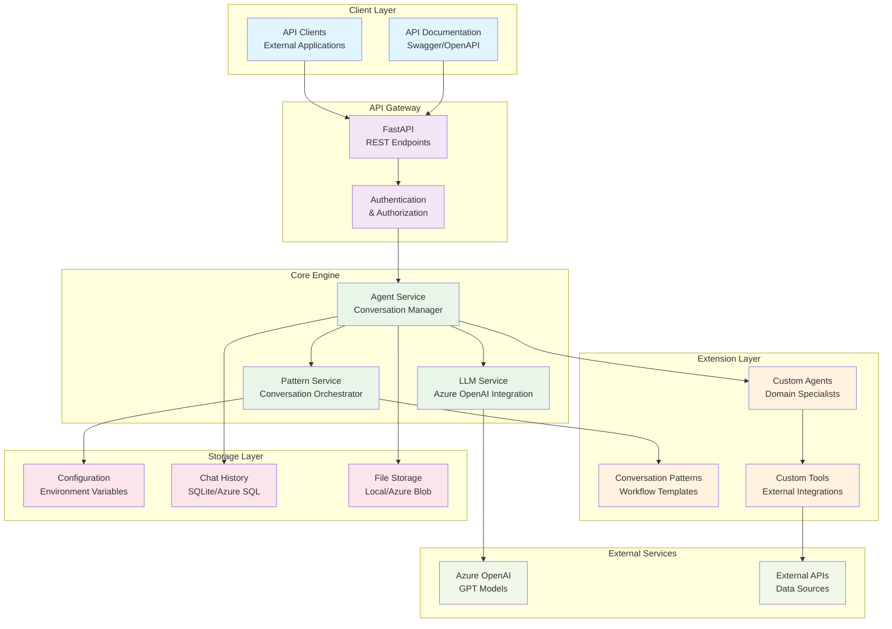

## Detailed Component Architecture

### Multi-Agent Framework

The heart of Insight Ingenious is its multi-agent framework, which enables sophisticated AI conversations.

**Note on Architecture**: The system has two parallel structures:
- **Conversation Flows**: Located in `conversation_flows/` directory, these implement the actual agent logic
- **Conversation Patterns**: Located in `conversation_patterns/` directory, these appear to be legacy or alternative implementations

Most active development uses the Conversation Flows approach:

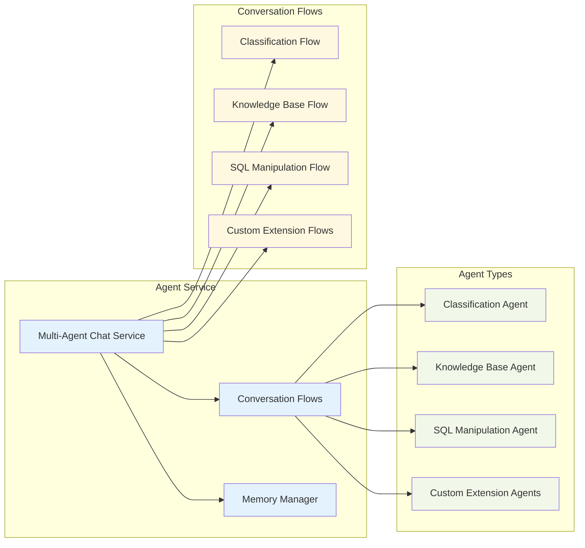

### API Layer Architecture

The API layer provides secure, scalable access to the system:


### Web Interface Integration

The system provides web interfaces through FastAPI:

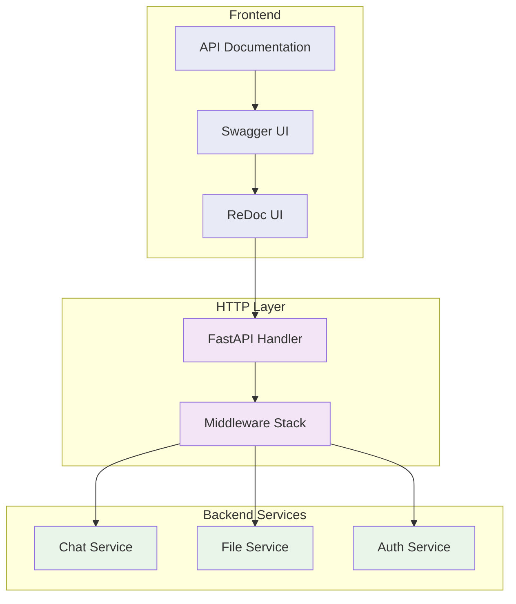

### Storage Architecture

The storage layer provides flexible, cloud-aware persistence and configuration management. For detailed information about chat history, memory persistence, and token counting, see the [Memory & Token Architecture](./memory-and-tokens.md) documentation.

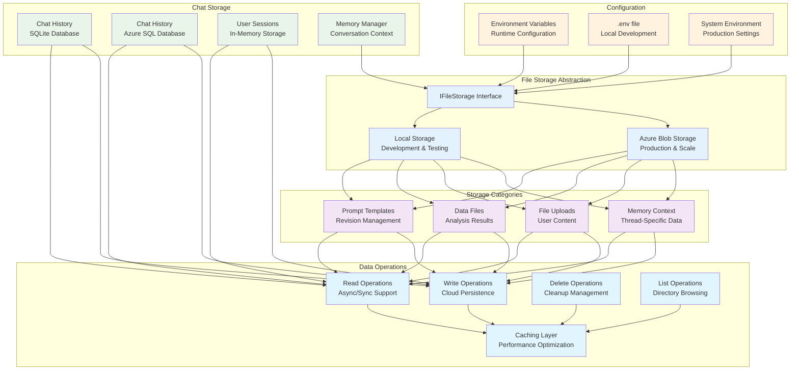

#### Storage Features

**Multi-Backend Support:**
- **Local Storage**: Fast development and testing with filesystem access
- **Azure Blob Storage**: Production-ready cloud storage with enterprise features
- **Transparent Switching**: Change backends via configuration without code changes

**Memory Management:**
- **Thread-Specific Memory**: Isolated conversation context per user/thread
- **Automatic Truncation**: Maintain memory within configurable word limits
- **Cloud Persistence**: Memory survives application restarts and scales across instances
- **Async Operations**: Non-blocking memory operations for better performance

**File Storage Categories:**
- **Prompts** (`revisions` container): Template versioning and prompt management
- **Data Files** (`data` container): Analysis results, functional test outputs
- **Memory Context**: Conversation state and context files
- **Uploads**: User-submitted files and documents

**Authentication Methods:**
- **Connection String**: Simple development setup with full connection details
- **Managed Identity**: Production Azure authentication without credential management
- **Service Principal**: Application-specific authentication with client secrets
- **Default Credential**: Automatic Azure credential discovery

## Data Flow Architecture

### Request Processing Flow

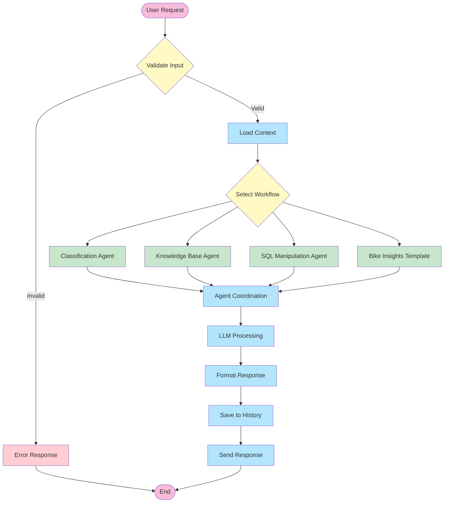

### Multi-Agent Conversation Flow

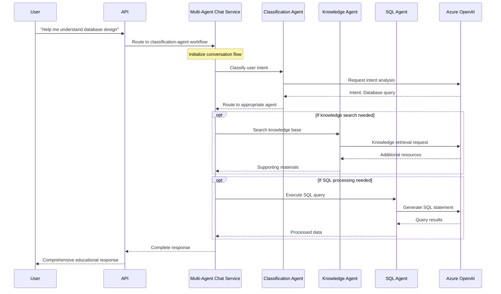

## Extension Points & Customization

### Extension Architecture

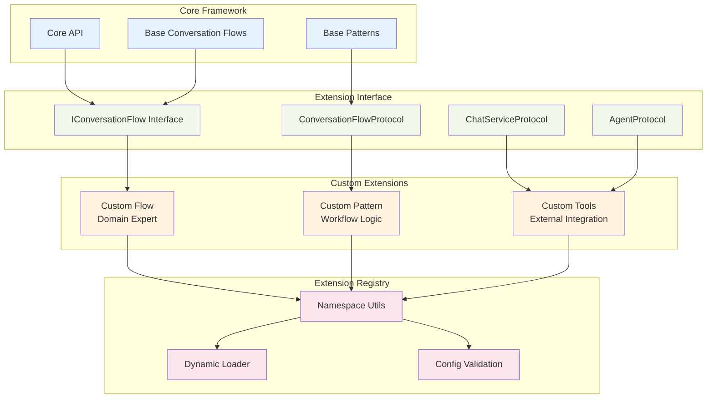

## Key Classes and Interfaces

### Core Agent Framework

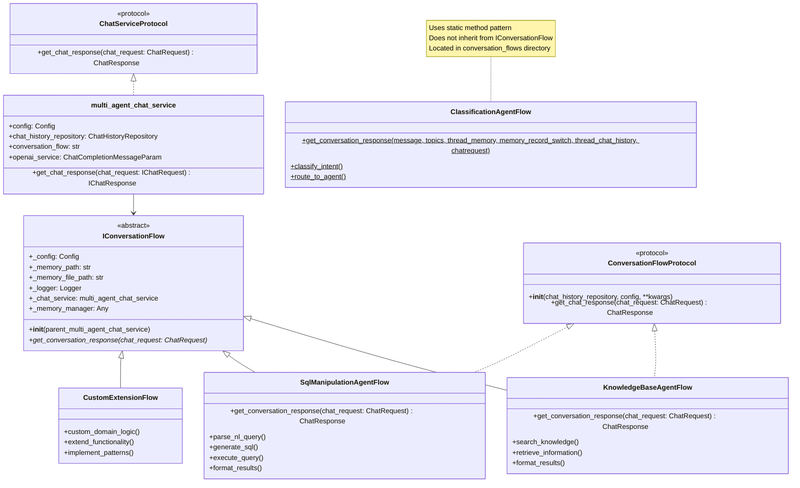

## Configuration Architecture

### Configuration Management

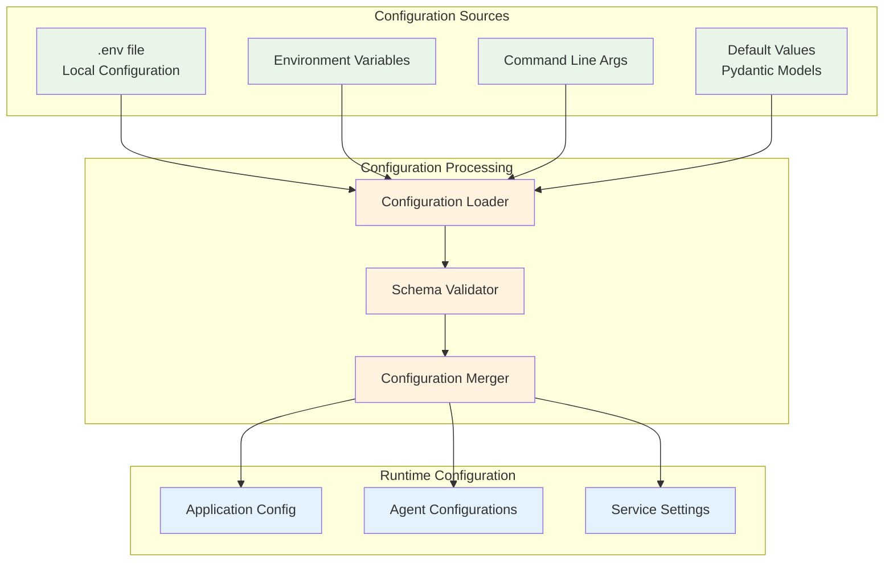

## Deployment Architecture

### Deployment Options

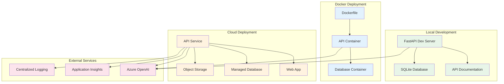

## Security Architecture

### Security Model

```mermaid
graph TB
    subgraph "Authentication Layer"
        JWT_AUTH[JWT Bearer Authentication]
        BASIC_AUTH[HTTP Basic Authentication]
        CONFIG_AUTH[Configurable Authentication]
        NO_AUTH[Anonymous Access Option]
    end

    subgraph "Data Protection"
        AZURE_SECRETS[Azure Service Keys]
        CONFIG_SECRETS[Profile Configuration]
        ENV_VARS[Environment Variables]
    end

    subgraph "Network Security"
        HTTPS[HTTPS/TLS]
        CORS[CORS Policy]
        FASTAPI_SEC[FastAPI Security]
    end

    subgraph "External Service Security"
        AZURE_AUTH[Azure OpenAI Authentication]
        SEARCH_AUTH[Azure Search Authentication]
        SQL_AUTH[Database Authentication]
    end

    JWT_AUTH --> CONFIG_AUTH
    BASIC_AUTH --> CONFIG_AUTH
    CONFIG_AUTH --> NO_AUTH
    AZURE_SECRETS --> CONFIG_SECRETS
    CONFIG_SECRETS --> ENV_VARS

    HTTPS --> CORS
    CORS --> FASTAPI_SEC

    AZURE_AUTH --> SEARCH_AUTH
    SEARCH_AUTH --> SQL_AUTH

    classDef auth fill:#e8f5e8
    classDef data fill:#fff3e0
    classDef network fill:#e3f2fd
    classDef external fill:#fce4ec

    class JWT_AUTH,BASIC_AUTH,CONFIG_AUTH,NO_AUTH auth
    class AZURE_SECRETS,CONFIG_SECRETS,ENV_VARS data
    class HTTPS,CORS,FASTAPI_SEC network
    class AZURE_AUTH,SEARCH_AUTH,SQL_AUTH external
```
## Performance & Scalability

### Performance Architecture

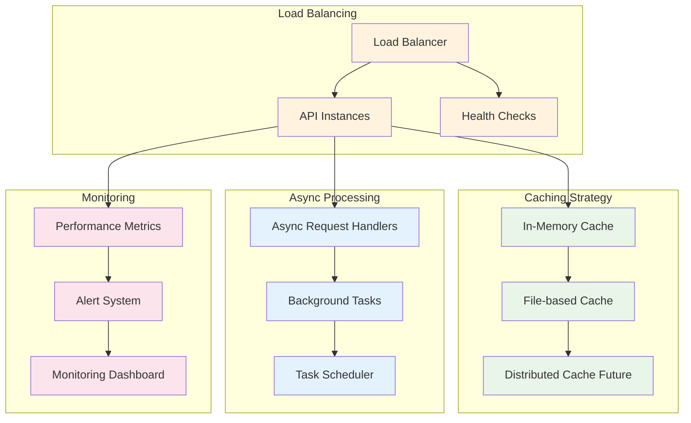

## Protocol Registry

The system defines a comprehensive set of protocols (interfaces) for dynamic imports and extensions:

### Available Protocols

- **WorkflowProtocol**: For workflow classes with `execute()` method
- **ConversationFlowProtocol**: For conversation flow classes in multi-agent systems
- **ChatServiceProtocol**: For chat service implementations
- **ExtractorProtocol**: For document extractor classes
- **RepositoryProtocol**: For repository pattern implementations
- **FileStorageProtocol**: For file storage backends (local, Azure)
- **AgentProtocol**: For AI agent implementations
- **ToolProtocol**: For tool implementations in multi-agent systems
- **ValidatorProtocol**: For data validator classes
- **ProcessorProtocol**: For data processor classes
- **ConfigurableProtocol**: For configurable objects
- **ExtensionProtocol**: For extension modules

### Protocol Validation

The system provides utilities to validate protocol compliance:

```python
from ingenious.utils.protocols import validate_protocol_compliance, get_missing_protocol_methods

# Check if an object implements a protocol
is_valid = validate_protocol_compliance(my_object, ChatServiceProtocol)

# Get missing methods for protocol compliance
missing = get_missing_protocol_methods(my_object, ChatServiceProtocol)
```

## Extension Development

The system is designed for extensibility at several key points:

- **Custom Agents**: Create specialized agents for specific domains
- **Conversation Patterns**: Define new ways agents can interact
- **Conversation Flows**: Implement domain-specific conversation flows
- **Custom API Routes**: Add new API endpoints
- **Custom Models**: Define domain-specific data models
- **Custom Tools**: Integrate with external systems and APIs

### Dynamic Import System

The framework uses a sophisticated namespace-based dynamic import system:

- **Namespace Utils**: Handles dynamic loading of flows, patterns, and extensions
- **Import Fallback**: Supports both core and extension module imports
- **Workflow Normalization**: Automatically normalizes workflow names (e.g., "classification-agent" → "classification_agent")
- **Safe Imports**: Validates imports against defined protocols

Example usage:
```python
from ingenious.utils.namespace_utils import import_class_with_fallback

# Import a conversation flow with fallback support
flow_class = import_class_with_fallback(
    "my_custom_flow",
    "conversation_flows",
    fallback_module="ingenious_extensions_template.services.chat_services.multi_agent"
)
```

### Development Best Practices

1. **Modular Design**: Keep components loosely coupled
2. **Protocol Compliance**: Implement required protocols for extensions
3. **Test Coverage**: Maintain comprehensive test suites
4. **Documentation**: Document all public APIs and interfaces
5. **Security**: Follow security best practices for all extensions
6. **Performance**: Consider performance implications of custom code
7. **Compatibility**: Ensure backward compatibility when possible

For detailed development instructions, see the [Development Guide](../development/README.md).

## Next Steps

- Read the [Getting Started Guide](../getting-started/README.md) to begin using the system
- Review the [Memory & Token Architecture](./memory-and-tokens.md) for detailed persistence mechanisms
- Explore the [Streaming Responses Architecture](./streaming-responses.md) for real-time response capabilities
- Follow the [Development Guide](../development/README.md) to start extending the framework
- Check the [Configuration Guide](../getting-started/configuration.md) for setup details
- Explore the [API Documentation](../api/README.md) for integration options
