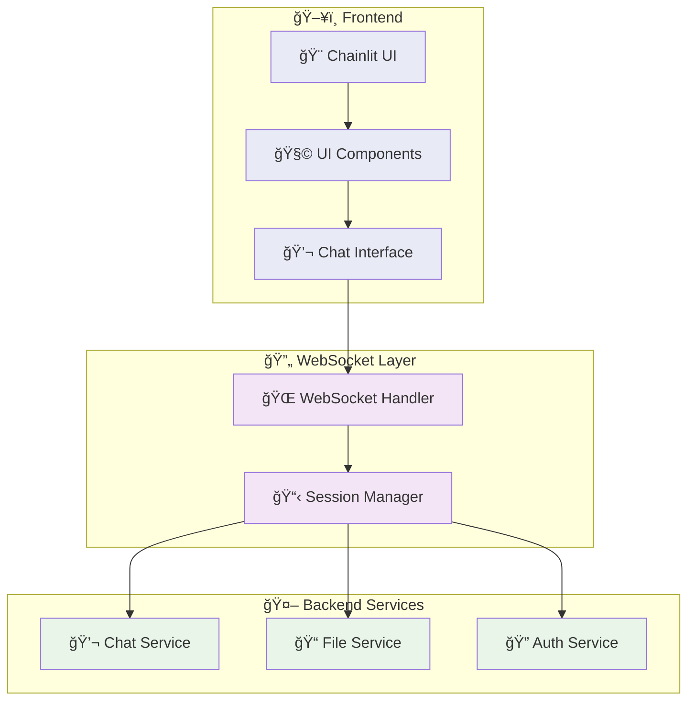
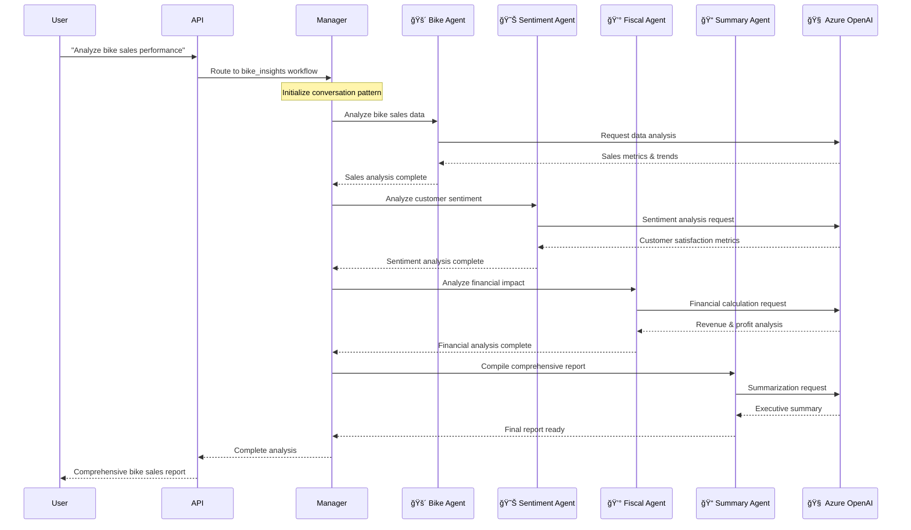

```mermaid
graph TB
    subgraph "🭠Core Framework"
        CORE_API[🔧 Core API]
        CORE_AGENTS[👤 Base Agents]
        CORE_PATTERNS[📋 Base Patterns]
    end
    
    subgraph "🯠Extension Interface"
        AGENT_INTERFACE[🤖 IAgent Interface]
        PATTERN_INTERFACE[🔄 IPattern Interface]
        TOOL_INTERFACE[ğŸ› ï¸ ITool Interface]
    end
    
    subgraph "🔌 Custom Extensions"
        CUSTOM_AGENT[👥 Custom Agent<br/>Domain Expert]
        CUSTOM_PATTERN[🭠Custom Pattern<br/>Workflow Logic]
        CUSTOM_TOOL[âš™ï¸ Custom Tool<br/>External Integration]
    end
    
    subgraph "📦 Extension Registry"
        REGISTRY[📋 Extension Registry]
        LOADER[âš¡ Dynamic Loader]
        VALIDATOR[✅ Validation Engine]
    end
    
    CORE_API --> AGENT_INTERFACE
    CORE_AGENTS --> AGENT_INTERFACE
    CORE_PATTERNS --> PATTERN_INTERFACE
    
    AGENT_INTERFACE --> CUSTOM_AGENT
    PATTERN_INTERFACE --> CUSTOM_PATTERN
    TOOL_INTERFACE --> CUSTOM_TOOL
    
    CUSTOM_AGENT --> REGISTRY
    CUSTOM_PATTERN --> REGISTRY
    CUSTOM_TOOL --> REGISTRY
    
    REGISTRY --> LOADER
    REGISTRY --> VALIDATOR
    
    classDef core fill:#e3f2fd
    classDef interface fill:#f1f8e9
    classDef custom fill:#fff3e0
    classDef registry fill:#fce4ec
    
    class CORE_API,CORE_AGENTS,CORE_PATTERNS core
    class AGENT_INTERFACE,PATTERN_INTERFACE,TOOL_INTERFACE interface
    class CUSTOM_AGENT,CUSTOM_PATTERN,CUSTOM_TOOL custom
    class REGISTRY,LOADER,VALIDATOR registry
```

# Architecture Overview

This document describes the high-level architecture of Insight Ingenious, explaining its key components and how they interact.

## System Architecture

Insight Ingenious is designed with a modular architecture that allows for extensibility and customization. The system consists of the following main components:

## Detailed Component Architecture

### Multi-Agent Framework

The heart of Insight Ingenious is its multi-agent framework, which enables sophisticated AI conversations:

### API Layer Architecture

The API layer provides secure, scalable access to the system:

```mermaid
sequenceDiagram
    participant Client
    participant FastAPI
    participant Auth
    participant AgentService
    participant LLM
    participant Storage

    Client->>FastAPI: POST /api/chat
    FastAPI->>Auth: Validate API Key
    Auth-->>FastAPI: ✅ Authorized
    FastAPI->>AgentService: Process Request
    AgentService->>Storage: Load Chat History
    Storage-->>AgentService: Previous Context
    AgentService->>LLM: Generate Response
    LLM-->>AgentService: AI Response
    AgentService->>Storage: Save Response
    AgentService-->>FastAPI: Formatted Response
    FastAPI-->>Client: JSON Response
```

### Web UI Integration

The Chainlit integration provides an intuitive user experience:

### Storage Architecture

The storage layer handles persistence and configuration:

## Data Flow Architecture

### Request Processing Flow

```mermaid
flowchart TD
    START([🚀 User Request]) --> INPUT_VALIDATION{📋 Validate Input}
    INPUT_VALIDATION -->|✅ Valid| LOAD_CONTEXT[📚 Load Context]
    INPUT_VALIDATION -->|❌ Invalid| ERROR_RESPONSE[❌ Error Response]

    LOAD_CONTEXT --> SELECT_WORKFLOW{🎯 Select Workflow}
    SELECT_WORKFLOW --> BIKE_WORKFLOW[🚴 Bike Analysis]
    SELECT_WORKFLOW --> SENTIMENT_WORKFLOW[😊 Sentiment Analysis]
    SELECT_WORKFLOW --> FISCAL_WORKFLOW[💰 Fiscal Analysis]
    SELECT_WORKFLOW --> CUSTOM_WORKFLOW[🔧 Custom Workflow]

    BIKE_WORKFLOW --> AGENT_COORDINATION[👥 Agent Coordination]
    SENTIMENT_WORKFLOW --> AGENT_COORDINATION
    FISCAL_WORKFLOW --> AGENT_COORDINATION
    CUSTOM_WORKFLOW --> AGENT_COORDINATION

    AGENT_COORDINATION --> LLM_PROCESSING[🧠 LLM Processing]
    LLM_PROCESSING --> RESPONSE_FORMATTING[📝 Format Response]
    RESPONSE_FORMATTING --> SAVE_HISTORY[💾 Save to History]
    SAVE_HISTORY --> SEND_RESPONSE[📤 Send Response]

    ERROR_RESPONSE --> END([🏁 End])
    SEND_RESPONSE --> END

    classDef startEnd fill:#f8bbd9
    classDef process fill:#b3e5fc
    classDef decision fill:#fff9c4
    classDef workflow fill:#c8e6c9
    classDef error fill:#ffcdd2

    class START,END startEnd
    class LOAD_CONTEXT,AGENT_COORDINATION,LLM_PROCESSING,RESPONSE_FORMATTING,SAVE_HISTORY,SEND_RESPONSE process
    class INPUT_VALIDATION,SELECT_WORKFLOW decision
    class BIKE_WORKFLOW,SENTIMENT_WORKFLOW,FISCAL_WORKFLOW,CUSTOM_WORKFLOW workflow
    class ERROR_RESPONSE error
```

### Multi-Agent Conversation Flow

## Extension Points & Customization

### Extension Architecture

## Key Classes and Interfaces

### Core Agent Framework

## Configuration Architecture

### Configuration Management

```mermaid
graph TB
    subgraph "📁 Configuration Sources"
        CONFIG_FILE[📄 config.yml<br/>Project Configuration]
        PROFILES_FILE[🔐 profiles.yml<br/>Environment Secrets]
        ENV_VARS[🌍 Environment Variables]
        CLI_ARGS[⌨️ Command Line Args]
    end

    subgraph "🔄 Configuration Processing"
        LOADER[📖 Configuration Loader]
        VALIDATOR[✅ Schema Validator]
        MERGER[🔀 Configuration Merger]
    end

    subgraph "💾 Runtime Configuration"
        APP_CONFIG[⚙️ Application Config]
        AGENT_CONFIG[🤖 Agent Configurations]
        SERVICE_CONFIG[🔧 Service Settings]
    end

    CONFIG_FILE --> LOADER
    PROFILES_FILE --> LOADER
    ENV_VARS --> LOADER
    CLI_ARGS --> LOADER

    LOADER --> VALIDATOR
    VALIDATOR --> MERGER
    MERGER --> APP_CONFIG
    MERGER --> AGENT_CONFIG
    MERGER --> SERVICE_CONFIG

    classDef source fill:#e8f5e8
    classDef process fill:#fff3e0
    classDef runtime fill:#e3f2fd

    class CONFIG_FILE,PROFILES_FILE,ENV_VARS,CLI_ARGS source
    class LOADER,VALIDATOR,MERGER process
    class APP_CONFIG,AGENT_CONFIG,SERVICE_CONFIG runtime
```

## Deployment Architecture

### Deployment Options

```mermaid
graph TB
    subgraph "🖥️ Local Development"
        LOCAL_API[🔧 FastAPI Dev Server]
        LOCAL_UI[🎨 Chainlit Dev UI]
        LOCAL_DB[💾 SQLite Database]
    end

    subgraph "🐳 Docker Deployment"
        DOCKER_API[📦 API Container]
        DOCKER_UI[📦 UI Container]
        DOCKER_DB[📦 Database Container]
        DOCKER_COMPOSE[🔧 Docker Compose]
    end

    subgraph "☁️ Cloud Deployment"
        CLOUD_API[🌐 API Service]
        CLOUD_UI[🎨 Web App]
        CLOUD_DB[💾 Managed Database]
        CLOUD_STORAGE[📁 Object Storage]
    end

    subgraph "🔧 External Services"
        AZURE_OPENAI[🧠 Azure OpenAI]
        MONITORING[📊 Application Insights]
        LOGGING[📝 Centralized Logging]
    end

    LOCAL_API --> LOCAL_UI
    LOCAL_API --> LOCAL_DB

    DOCKER_COMPOSE --> DOCKER_API
    DOCKER_COMPOSE --> DOCKER_UI
    DOCKER_COMPOSE --> DOCKER_DB

    CLOUD_API --> CLOUD_UI
    CLOUD_API --> CLOUD_DB
    CLOUD_API --> CLOUD_STORAGE

    LOCAL_API --> AZURE_OPENAI
    DOCKER_API --> AZURE_OPENAI
    CLOUD_API --> AZURE_OPENAI

    CLOUD_API --> MONITORING
    CLOUD_API --> LOGGING

    classDef local fill:#e8f5e8
    classDef docker fill:#e3f2fd
    classDef cloud fill:#fff3e0
    classDef external fill:#fce4ec

    class LOCAL_API,LOCAL_UI,LOCAL_DB local
    class DOCKER_API,DOCKER_UI,DOCKER_DB,DOCKER_COMPOSE docker
    class CLOUD_API,CLOUD_UI,CLOUD_DB,CLOUD_STORAGE cloud
    class AZURE_OPENAI,MONITORING,LOGGING external
```

## Security Architecture

### Security Model

```mermaid
graph TB
    subgraph "🛡️ Authentication Layer"
        API_KEY[🔑 API Key Validation]
        JWT_TOKEN[🎫 JWT Tokens]
        SESSION_MGR[👤 Session Management]
    end

    subgraph "🔒 Authorization Layer"
        RBAC[👥 Role-Based Access]
        PERMISSIONS[📋 Permission System]
        RESOURCE_GUARD[🛡️ Resource Protection]
    end

    subgraph "🔐 Data Protection"
        ENCRYPTION[🔒 Data Encryption]
        SECRETS_MGR[🗝️ Secrets Management]
        AUDIT_LOG[📝 Audit Logging]
    end

    subgraph "🌐 Network Security"
        HTTPS[🔐 HTTPS/TLS]
        CORS[🌍 CORS Policy]
        RATE_LIMIT[⏱️ Rate Limiting]
    end

    API_KEY --> RBAC
    JWT_TOKEN --> RBAC
    SESSION_MGR --> RBAC

    RBAC --> PERMISSIONS
    PERMISSIONS --> RESOURCE_GUARD

    RESOURCE_GUARD --> ENCRYPTION
    ENCRYPTION --> SECRETS_MGR
    SECRETS_MGR --> AUDIT_LOG

    HTTPS --> CORS
    CORS --> RATE_LIMIT

    classDef auth fill:#e8f5e8
    classDef authz fill:#fff3e0
    classDef data fill:#e3f2fd
    classDef network fill:#fce4ec

    class API_KEY,JWT_TOKEN,SESSION_MGR auth
    class RBAC,PERMISSIONS,RESOURCE_GUARD authz
    class ENCRYPTION,SECRETS_MGR,AUDIT_LOG data
    class HTTPS,CORS,RATE_LIMIT network
```

## Performance & Scalability

### Performance Architecture

```mermaid
graph TB
    subgraph "⚡ Caching Strategy"
        REDIS[🔴 Redis Cache]
        MEMORY[💾 In-Memory Cache]
        CDN[🌐 CDN Cache]
    end

    subgraph "📊 Load Balancing"
        LOAD_BALANCER[⚖️ Load Balancer]
        API_INSTANCES[🔧 API Instances]
        HEALTH_CHECK[❤️ Health Checks]
    end

    subgraph "🔄 Async Processing"
        TASK_QUEUE[📋 Task Queue]
        WORKERS[👷 Background Workers]
        SCHEDULER[⏰ Job Scheduler]
    end

    subgraph "📈 Monitoring"
        METRICS[📊 Performance Metrics]
        ALERTS[🚨 Alert System]
        DASHBOARDS[📈 Monitoring Dashboard]
    end

    REDIS --> MEMORY
    MEMORY --> CDN

    LOAD_BALANCER --> API_INSTANCES
    LOAD_BALANCER --> HEALTH_CHECK

    TASK_QUEUE --> WORKERS
    WORKERS --> SCHEDULER

    METRICS --> ALERTS
    ALERTS --> DASHBOARDS

    API_INSTANCES --> REDIS
    API_INSTANCES --> TASK_QUEUE
    API_INSTANCES --> METRICS

    classDef cache fill:#e8f5e8
    classDef balance fill:#fff3e0
    classDef async fill:#e3f2fd
    classDef monitor fill:#fce4ec

    class REDIS,MEMORY,CDN cache
    class LOAD_BALANCER,API_INSTANCES,HEALTH_CHECK balance
    class TASK_QUEUE,WORKERS,SCHEDULER async
    class METRICS,ALERTS,DASHBOARDS monitor
```

## Extension Development

The system is designed for extensibility at several key points:

- **🤖 Custom Agents**: Create specialized agents for specific domains
- **📋 Conversation Patterns**: Define new ways agents can interact
- **🔄 Conversation Flows**: Implement domain-specific conversation flows
- **🔌 Custom API Routes**: Add new API endpoints
- **📊 Custom Models**: Define domain-specific data models
- **🛠️ Custom Tools**: Integrate with external systems and APIs

### Development Best Practices

1. **🏗️ Modular Design**: Keep components loosely coupled
2. **🧪 Test Coverage**: Maintain comprehensive test suites
3. **📝 Documentation**: Document all public APIs and interfaces
4. **🔐 Security**: Follow security best practices for all extensions
5. **⚡ Performance**: Consider performance implications of custom code
6. **🔄 Compatibility**: Ensure backward compatibility when possible

For detailed development instructions, see the [Development Guide](/development/).

## Next Steps

- 📖 Read the [Getting Started Guide](/getting-started/) to begin using the system
- 🛠️ Follow the [Development Guide](/development/) to start extending the framework
- 🔧 Check the [Configuration Guide](/configuration/) for setup details
- 📡 Explore the [API Documentation](/api/) for integration options
