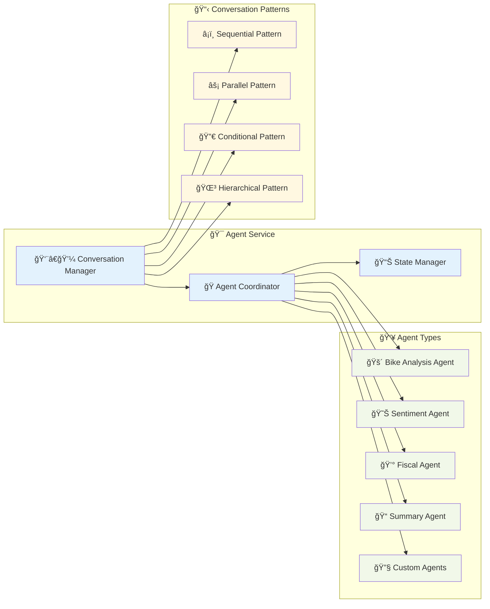

# Architecture Overview

This document describes the high-level architecture of Insight Ingenious, explaining its key components and how they interact.

## System Architecture

Insight Ingenious is designed with a modular architecture that allows for extensibility and customization. The system consists of the following main components:

## Detailed Component Architecture

### 🤖 Multi-Agent Framework

The heart of Insight Ingenious is its multi-agent framework, which enables sophisticated AI conversations:

- Creation of specialized AI agents
- Orchestration of conversations between agents
- Definition of conversation patterns and flows
- Tool integration for agents

#### Key Classes

- `IConversationPattern`: Abstract base class for conversation patterns
- `IConversationFlow`: Interface for implementing conversation flows
- `multi_agent_chat_service`: Service managing agent conversations

### 2. API Layer

The API layer provides programmatic access to the system:

- REST API endpoints for chat interactions
- Authentication and security
- Integration points for custom extensions

### 3. Web UI

The Chainlit integration provides a user-friendly web interface:

- Interactive chat interface
- Visualization of agent responses
- User authentication

### 4. Storage Layer

The storage layer handles persistence:

- Chat history storage
- File management
- Configuration storage

### 5. Extensions Layer

The extensions layer allows for customization:

- Custom agents and conversation patterns
- Domain-specific prompts and templates
- Integration with external systems

## Data Flow

1. User input arrives through API or UI
2. The chat service processes the request
3. The appropriate conversation flow is selected
4. Agents collaborate based on conversation pattern
5. Results are returned to the user and stored

## Configuration System

Insight Ingenious uses a two-file configuration approach:

- `config.yml`: Project-specific, non-sensitive configuration
- `profiles.yml`: Environment-specific, sensitive configuration (API keys, credentials)

## Extension Points

The system is designed for extensibility at several points:

- **Custom Agents**: Create specialized agents for specific domains
- **Conversation Patterns**: Define new ways agents can interact
- **Conversation Flows**: Implement domain-specific conversation flows
- **Custom API Routes**: Add new API endpoints
- **Custom Models**: Define domain-specific data models
