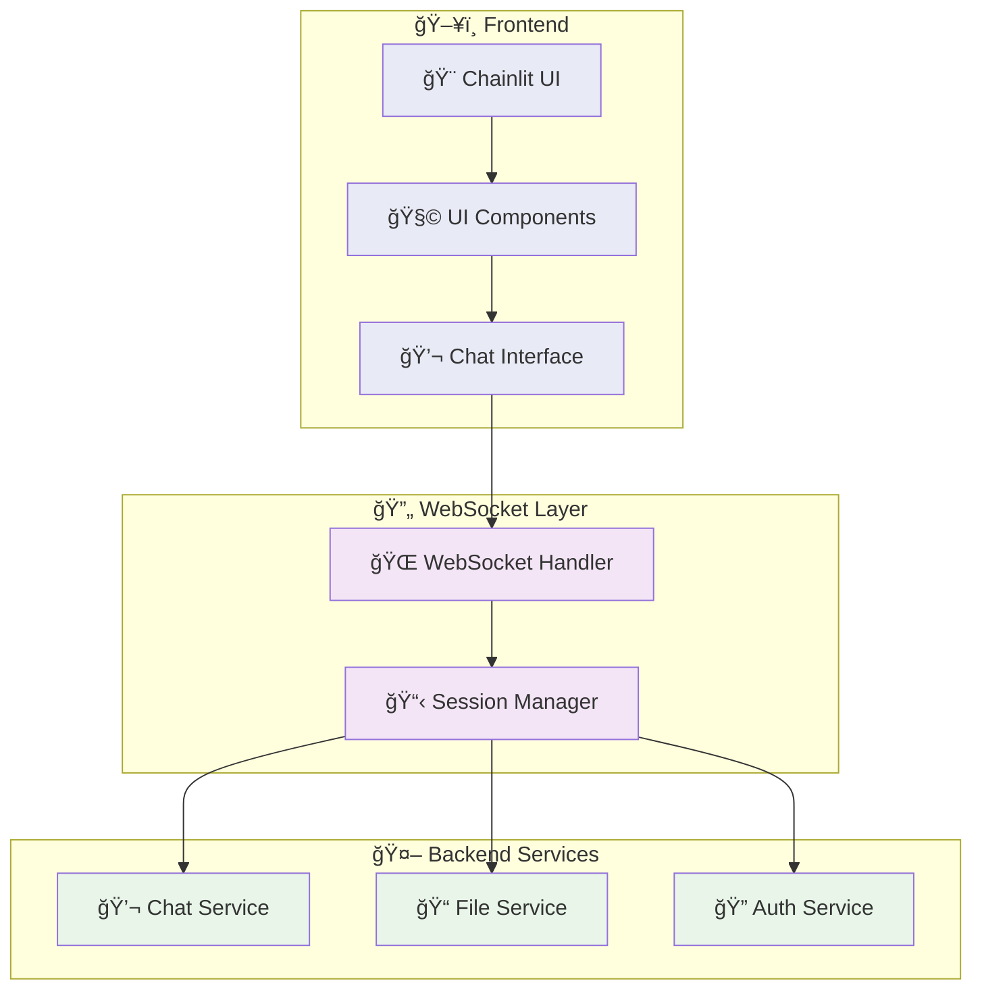

# Architecture Overview

This document describes the high-level architecture of Insight Ingenious, an enterprise-grade Python library designed for rapid deployment of AI agent         CHAT_INTERFACE[💬 IChatService Interface]PIs with tight Microsoft Azure integrations and comprehensive debugging capabilities.

## System Architecture

Insight Ingenious is architected as a production-ready library with enterprise-grade features including seamless Azure service integrations, robust debugging tools, and extensive customization capabilities. The system consists of the following main components:

## Detailed Component Architecture

### Multi-Agent Framework

The heart of Insight Ingenious is its multi-agent framework, which enables sophisticated AI conversations:

### API Layer Architecture

The API layer provides secure, scalable access to the system:

### Web UI Integration

The Chainlit integration provides an intuitive user experience:

### Storage Architecture

The storage layer provides flexible, cloud-aware persistence and configuration management:

#### Storage Features

**Multi-Backend Support:**
- **Local Storage**: Fast development and testing with filesystem access
- **Azure Blob Storage**: Production-ready cloud storage with enterprise features
- **Transparent Switching**: Change backends via configuration without code changes

**Memory Management:**
- **Thread-Specific Memory**: Isolated conversation context per user/thread
- **Automatic Truncation**: Maintain memory within configurable word limits
- **Cloud Persistence**: Memory survives application restarts and scales across instances
- **Async Operations**: Non-blocking memory operations for better performance

**File Storage Categories:**
- **Prompts** (`revisions` container): Template versioning and prompt management
- **Data Files** (`data` container): Analysis results, functional test outputs
- **Memory Context**: Conversation state and context files
- **Uploads**: User-submitted files and documents

**Authentication Methods:**
- **Connection String**: Simple development setup with full connection details
- **Managed Identity**: Production Azure authentication without credential management
- **Service Principal**: Application-specific authentication with client secrets
- **Default Credential**: Automatic Azure credential discovery

## Data Flow Architecture

### Request Processing Flow

```mermaid
flowchart TD
    START([🚀 User Request]) --> INPUT_VALIDATION{📋 Validate Input}
    INPUT_VALIDATION -->|✅ Valid| LOAD_CONTEXT[📚 Load Context]
    INPUT_VALIDATION -->|❌ Invalid| ERROR_RESPONSE[❌ Error Response]

    LOAD_CONTEXT --> SELECT_WORKFLOW{🎯 Select Workflow}
    SELECT_WORKFLOW --> CLASSIFICATION_WORKFLOW[🔍 Classification Agent]
    SELECT_WORKFLOW --> EDUCATION_WORKFLOW[🎓 Education Expert]
    SELECT_WORKFLOW --> KNOWLEDGE_WORKFLOW[🔍 Knowledge Base Agent]
    SELECT_WORKFLOW --> SQL_WORKFLOW[🗄️ SQL Manipulation Agent]

    CLASSIFICATION_WORKFLOW --> AGENT_COORDINATION[👥 Agent Coordination]
    EDUCATION_WORKFLOW --> AGENT_COORDINATION
    KNOWLEDGE_WORKFLOW --> AGENT_COORDINATION
    SQL_WORKFLOW --> AGENT_COORDINATION

    AGENT_COORDINATION --> LLM_PROCESSING[🧠 LLM Processing]
    LLM_PROCESSING --> RESPONSE_FORMATTING[📝 Format Response]
    RESPONSE_FORMATTING --> SAVE_HISTORY[💾 Save to History]
    SAVE_HISTORY --> SEND_RESPONSE[📤 Send Response]

    ERROR_RESPONSE --> END([🏁 End])
    SEND_RESPONSE --> END

    classDef startEnd fill:#f8bbd9
    classDef process fill:#b3e5fc
    classDef decision fill:#fff9c4
    classDef workflow fill:#c8e6c9
    classDef error fill:#ffcdd2

    class START,END startEnd
    class LOAD_CONTEXT,AGENT_COORDINATION,LLM_PROCESSING,RESPONSE_FORMATTING,SAVE_HISTORY,SEND_RESPONSE process
    class INPUT_VALIDATION,SELECT_WORKFLOW decision
    class CLASSIFICATION_WORKFLOW,EDUCATION_WORKFLOW,KNOWLEDGE_WORKFLOW,SQL_WORKFLOW workflow
    class ERROR_RESPONSE error
```

### Multi-Agent Conversation Flow

```mermaid
sequenceDiagram
    participant User
    participant API
    participant Manager
    participant Agent1 as 🔍 Classification Agent
    participant Agent2 as 🔍 Knowledge Agent
    participant Agent3 as 🗄️ SQL Agent
    participant LLM as 🧠 Azure OpenAI

    User->>API: "Help me understand database design"
    API->>Manager: Route to classification-agent workflow

    Note over Manager: Initialize conversation pattern
    Manager->>Agent1: Classify user intent
    Agent1->>LLM: Request intent analysis
    LLM-->>Agent1: Intent: Database query
    Agent1-->>Manager: Route to appropriate agent

    opt If knowledge search needed
        Manager->>Agent2: Search knowledge base
        Agent2->>LLM: Knowledge retrieval request
        LLM-->>Agent2: Additional resources
        Agent2-->>Manager: Supporting materials
    end

    opt If SQL processing needed
        Manager->>Agent3: Execute SQL query
        Agent3->>LLM: Generate SQL statement
        LLM-->>Agent3: Query results
        Agent3-->>Manager: Processed data
    end

    Manager-->>API: Complete response
    API-->>User: Comprehensive educational response
```

## Extension Points & Customization

### Extension Architecture

```mermaid
graph TB
    subgraph "🏭 Core Framework"
        CORE_API[🔧 Core API]
        CORE_FLOWS[👤 Base Conversation Flows]
        CORE_PATTERNS[📋 Base Patterns]
    end

    subgraph "🎯 Extension Interface"
        FLOW_INTERFACE[🤖 IConversationFlow Interface]
        PATTERN_INTERFACE[🔄 IConversationPattern Interface]
        CHAT_INTERFACE[� IChatService Interface]
    end

    subgraph "🔌 Custom Extensions"
        CUSTOM_FLOW[👥 Custom Flow<br/>Domain Expert]
        CUSTOM_PATTERN[🎭 Custom Pattern<br/>Workflow Logic]
        CUSTOM_TOOLS[⚙️ Custom Tools<br/>External Integration]
    end

    subgraph "📦 Extension Registry"
        NAMESPACE_LOADER[📋 Namespace Utils]
        DYNAMIC_LOADER[⚡ Dynamic Loader]
        CONFIG_VALIDATOR[✅ Config Validation]
    end

    CORE_API --> FLOW_INTERFACE
    CORE_FLOWS --> FLOW_INTERFACE
    CORE_PATTERNS --> PATTERN_INTERFACE

    FLOW_INTERFACE --> CUSTOM_FLOW
    PATTERN_INTERFACE --> CUSTOM_PATTERN
    CHAT_INTERFACE --> CUSTOM_TOOLS

    CUSTOM_FLOW --> NAMESPACE_LOADER
    CUSTOM_PATTERN --> NAMESPACE_LOADER
    CUSTOM_TOOLS --> NAMESPACE_LOADER

    NAMESPACE_LOADER --> DYNAMIC_LOADER
    NAMESPACE_LOADER --> CONFIG_VALIDATOR

    classDef core fill:#e3f2fd
    classDef interface fill:#f1f8e9
    classDef custom fill:#fff3e0
    classDef registry fill:#fce4ec

    class CORE_API,CORE_FLOWS,CORE_PATTERNS core
    class FLOW_INTERFACE,PATTERN_INTERFACE,CHAT_INTERFACE interface
    class CUSTOM_FLOW,CUSTOM_PATTERN,CUSTOM_TOOLS custom
    class NAMESPACE_LOADER,DYNAMIC_LOADER,CONFIG_VALIDATOR registry
```

## Key Classes and Interfaces

### Core Agent Framework

## Configuration Architecture

### Configuration Management

```mermaid
graph TB
    subgraph "📁 Configuration Sources"
        CONFIG_FILE[📄 config.yml<br/>Project Configuration]
        PROFILES_FILE[🔐 profiles.yml<br/>Environment Secrets]
        ENV_VARS[🌍 Environment Variables]
        CLI_ARGS[⌨️ Command Line Args]
    end

    subgraph "🔄 Configuration Processing"
        LOADER[📖 Configuration Loader]
        VALIDATOR[✅ Schema Validator]
        MERGER[🔀 Configuration Merger]
    end

    subgraph "💾 Runtime Configuration"
        APP_CONFIG[⚙️ Application Config]
        AGENT_CONFIG[🤖 Agent Configurations]
        SERVICE_CONFIG[🔧 Service Settings]
    end

    CONFIG_FILE --> LOADER
    PROFILES_FILE --> LOADER
    ENV_VARS --> LOADER
    CLI_ARGS --> LOADER

    LOADER --> VALIDATOR
    VALIDATOR --> MERGER
    MERGER --> APP_CONFIG
    MERGER --> AGENT_CONFIG
    MERGER --> SERVICE_CONFIG

    classDef source fill:#e8f5e8
    classDef process fill:#fff3e0
    classDef runtime fill:#e3f2fd

    class CONFIG_FILE,PROFILES_FILE,ENV_VARS,CLI_ARGS source
    class LOADER,VALIDATOR,MERGER process
    class APP_CONFIG,AGENT_CONFIG,SERVICE_CONFIG runtime
```

## Deployment Architecture

### Deployment Options

```mermaid
graph TB
    subgraph "🖥️ Local Development"
        LOCAL_API[🔧 FastAPI Dev Server]
        LOCAL_UI[🎨 Chainlit Dev UI]
        LOCAL_DB[💾 SQLite Database]
    end

    subgraph "🐳 Docker Deployment"
        DOCKER_API[📦 API Container]
        DOCKER_UI[📦 UI Container]
        DOCKER_DB[📦 Database Container]
        DOCKER_COMPOSE[🔧 Docker Compose]
    end

    subgraph "☁️ Cloud Deployment"
        CLOUD_API[🌐 API Service]
        CLOUD_UI[🎨 Web App]
        CLOUD_DB[💾 Managed Database]
        CLOUD_STORAGE[📁 Object Storage]
    end

    subgraph "🔧 External Services"
        AZURE_OPENAI[🧠 Azure OpenAI]
        MONITORING[📊 Application Insights]
        LOGGING[📝 Centralized Logging]
    end

    LOCAL_API --> LOCAL_UI
    LOCAL_API --> LOCAL_DB

    DOCKER_COMPOSE --> DOCKER_API
    DOCKER_COMPOSE --> DOCKER_UI
    DOCKER_COMPOSE --> DOCKER_DB

    CLOUD_API --> CLOUD_UI
    CLOUD_API --> CLOUD_DB
    CLOUD_API --> CLOUD_STORAGE

    LOCAL_API --> AZURE_OPENAI
    DOCKER_API --> AZURE_OPENAI
    CLOUD_API --> AZURE_OPENAI

    CLOUD_API --> MONITORING
    CLOUD_API --> LOGGING

    classDef local fill:#e8f5e8
    classDef docker fill:#e3f2fd
    classDef cloud fill:#fff3e0
    classDef external fill:#fce4ec

    class LOCAL_API,LOCAL_UI,LOCAL_DB local
    class DOCKER_API,DOCKER_UI,DOCKER_DB,DOCKER_COMPOSE docker
    class CLOUD_API,CLOUD_UI,CLOUD_DB,CLOUD_STORAGE cloud
    class AZURE_OPENAI,MONITORING,LOGGING external
```

## Security Architecture

### Security Model

```mermaid
graph TB
    subgraph "🛡️ Authentication Layer"
        BASIC_AUTH[� HTTP Basic Authentication]
        CONFIG_AUTH[⚙️ Configurable Authentication]
        NO_AUTH[� Anonymous Access Option]
    end

    subgraph "� Data Protection"
        AZURE_SECRETS[�️ Azure Service Keys]
        CONFIG_SECRETS[� Profile Configuration]
        ENV_VARS[🌐 Environment Variables]
    end

    subgraph "🌐 Network Security"
        HTTPS[🔐 HTTPS/TLS]
        CORS[🌍 CORS Policy]
        FASTAPI_SEC[⚡ FastAPI Security]
    end

    subgraph "🔒 External Service Security"
        AZURE_AUTH[🧠 Azure OpenAI Authentication]
        SEARCH_AUTH[� Azure Search Authentication]
        SQL_AUTH[🗄️ Database Authentication]
    end

    BASIC_AUTH --> CONFIG_AUTH
    CONFIG_AUTH --> NO_AUTH
    AZURE_SECRETS --> CONFIG_SECRETS
    CONFIG_SECRETS --> ENV_VARS

    HTTPS --> CORS
    CORS --> FASTAPI_SEC

    AZURE_AUTH --> SEARCH_AUTH
    SEARCH_AUTH --> SQL_AUTH

    classDef auth fill:#e8f5e8
    classDef data fill:#fff3e0
    classDef network fill:#e3f2fd
    classDef external fill:#fce4ec

    class BASIC_AUTH,CONFIG_AUTH,NO_AUTH auth
    class AZURE_SECRETS,CONFIG_SECRETS,ENV_VARS data
    class HTTPS,CORS,FASTAPI_SEC network
    class AZURE_AUTH,SEARCH_AUTH,SQL_AUTH external
```

## Performance & Scalability

### Performance Architecture

```mermaid
graph TB
    subgraph "⚡ Caching Strategy"
        MEMORY[� In-Memory Cache]
        FILE_CACHE[� File-based Cache]
        CDN[🌐 CDN Cache]
    end

    subgraph "📊 Load Balancing"
        LOAD_BALANCER[⚖️ Load Balancer]
        API_INSTANCES[🔧 API Instances]
        HEALTH_CHECK[❤️ Health Checks]
    end

    subgraph "🔄 Async Processing"
        ASYNC_HANDLERS[📋 Async Request Handlers]
        BACKGROUND_TASKS[👷 Background Tasks]
        SCHEDULER[⏰ Task Scheduler]
    end

    subgraph "📈 Monitoring"
        METRICS[📊 Performance Metrics]
        ALERTS[🚨 Alert System]
        DASHBOARDS[📈 Monitoring Dashboard]
    end

    MEMORY --> FILE_CACHE
    FILE_CACHE --> CDN

    LOAD_BALANCER --> API_INSTANCES
    LOAD_BALANCER --> HEALTH_CHECK

    ASYNC_HANDLERS --> BACKGROUND_TASKS
    BACKGROUND_TASKS --> SCHEDULER

    METRICS --> ALERTS
    ALERTS --> DASHBOARDS

    API_INSTANCES --> MEMORY
    API_INSTANCES --> ASYNC_HANDLERS
    API_INSTANCES --> METRICS

    classDef cache fill:#e8f5e8
    classDef balance fill:#fff3e0
    classDef async fill:#e3f2fd
    classDef monitor fill:#fce4ec

    class MEMORY,FILE_CACHE,CDN cache
    class LOAD_BALANCER,API_INSTANCES,HEALTH_CHECK balance
    class ASYNC_HANDLERS,BACKGROUND_TASKS,SCHEDULER async
    class METRICS,ALERTS,DASHBOARDS monitor
```

## Extension Development

The system is designed for extensibility at several key points:

- **🤖 Custom Agents**: Create specialized agents for specific domains
- **📋 Conversation Patterns**: Define new ways agents can interact
- **🔄 Conversation Flows**: Implement domain-specific conversation flows
- **🔌 Custom API Routes**: Add new API endpoints
- **📊 Custom Models**: Define domain-specific data models
- **🛠️ Custom Tools**: Integrate with external systems and APIs

### Development Best Practices

1. **🏗️ Modular Design**: Keep components loosely coupled
2. **🧪 Test Coverage**: Maintain comprehensive test suites
3. **📝 Documentation**: Document all public APIs and interfaces
4. **🔐 Security**: Follow security best practices for all extensions
5. **⚡ Performance**: Consider performance implications of custom code
6. **🔄 Compatibility**: Ensure backward compatibility when possible

For detailed development instructions, see the [Development Guide](/development/).

## Next Steps

- 📖 Read the [Getting Started Guide](/getting-started/) to begin using the system
- 🛠️ Follow the [Development Guide](/development/) to start extending the framework
- 🔧 Check the [Configuration Guide](/configuration/) for setup details
- 📡 Explore the [API Documentation](/api/) for integration options
