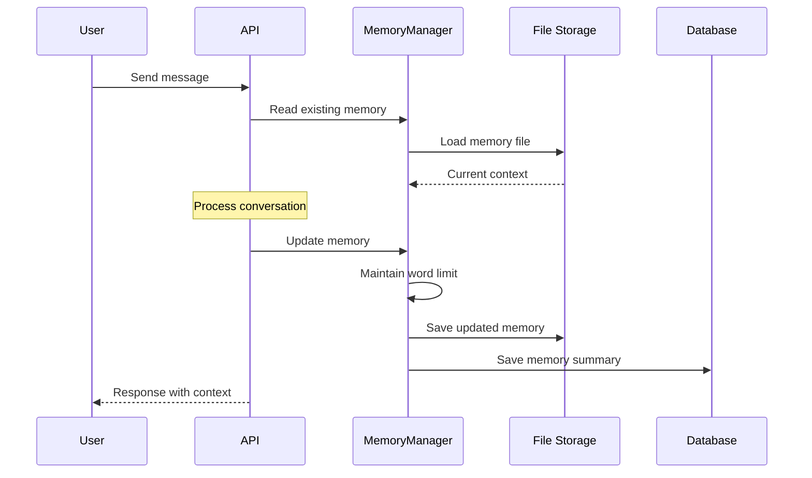

This document provides a comprehensive overview of how Insight Ingenious manages chat memory, token counting, and data persistence across conversations. Understanding these mechanisms is crucial for developers working with the framework and for system administrators managing production deployments.

## Overview

Insight Ingenious provides a dual-layer approach to conversation persistence:

1. **Chat History Storage**: Complete conversation records with message details, metadata, and token usage statistics
2. **Memory Management**: Context-aware conversation summaries and thread-specific memory for maintaining conversation continuity

Both systems support local development (SQLite + local files) and production deployment (Azure SQL + Azure Blob Storage) with transparent switching via configuration.

## Database Architecture

### Core Database Tables

The system creates and manages several interconnected tables for comprehensive conversation tracking:

#### Primary Tables

**Chat History Table** (`chat_history`)
```sql
CREATE TABLE chat_history (
    user_id VARCHAR/NVARCHAR(255),              -- User identifier
    thread_id VARCHAR/NVARCHAR(255),            -- Conversation thread ID
    message_id VARCHAR/NVARCHAR(255) PRIMARY KEY, -- Unique message identifier
    positive_feedback BOOLEAN/BIT,              -- User feedback on message
    timestamp DATETIME/DATETIME2,               -- Message timestamp (UTC)
    role VARCHAR/NVARCHAR(50),                  -- Message role (user/assistant/system)
    content TEXT/NVARCHAR(MAX),                 -- Message content
    content_filter_results TEXT/NVARCHAR(MAX), -- Azure content filtering results
    tool_calls TEXT/NVARCHAR(MAX),              -- JSON serialized tool calls
    tool_call_id VARCHAR/NVARCHAR(255),         -- Tool call identifier
    tool_call_function VARCHAR/NVARCHAR(255)    -- Tool function name
);
```

**Memory Summary Table** (`chat_history_summary`)
```sql
CREATE TABLE chat_history_summary (
    -- Same structure as chat_history
    -- Contains latest memory/summary records per thread
    -- Updated via MERGE/UPSERT operations for efficiency
);
```

**Supporting Tables**
- **`users`**: User management with metadata and preferences
- **`threads`**: Conversation thread metadata and configuration
- **`steps`**: Individual conversation steps (Chainlit-style interface support)
- **`elements`**: UI elements, attachments, and rich content
- **`feedbacks`**: User feedback and rating data

### Database Implementation Details

#### SQLite Implementation
- **File Location**: `./tmp/high_level_logs.db` (configurable via `INGENIOUS_CHAT_HISTORY__DATABASE_PATH`)
- **Connection Pooling**: Uses `ConnectionPool` class for thread-safe database access
- **Auto-Schema Creation**: Automatically creates tables on first startup
- **Transaction Support**: ACID compliance for data integrity

```python
# Configuration for SQLite
INGENIOUS_CHAT_HISTORY__DATABASE_TYPE=sqlite
INGENIOUS_CHAT_HISTORY__DATABASE_PATH=./tmp/high_level_logs.db
```

#### Azure SQL Implementation
- **Connection String**: Full SQL Server connection with encryption and authentication
- **Retry Logic**: Automatic connection retry (3 attempts) with exponential backoff
- **SQL Server Features**: Uses MERGE statements for efficient upsert operations
- **Schema Compatibility**: Automatically handles SQL Server data type differences

```python
# Configuration for Azure SQL
INGENIOUS_CHAT_HISTORY__DATABASE_TYPE=azuresql
INGENIOUS_AZURE_SQL_SERVICES__DATABASE_CONNECTION_STRING=Driver={ODBC Driver 18 for SQL Server};Server=tcp:your-server.database.windows.net,1433;Database=your-db;Uid=username;Pwd=password;Encrypt=yes;TrustServerCertificate=no;Connection Timeout=30;
INGENIOUS_AZURE_SQL_SERVICES__DATABASE_NAME=your_database_name
INGENIOUS_AZURE_SQL_SERVICES__TABLE_NAME=chat_history
```

## Memory Management Architecture

### Memory Manager Overview

The `MemoryManager` class provides intelligent conversation context management with support for both local and cloud storage:

```python
from ingenious.services.memory_manager import MemoryManager

# Initialize with storage backend
memory_manager = MemoryManager(
    memory_path="./tmp",           # Local path or ignored for cloud
    file_storage=azure_file_storage # Optional: Azure Blob Storage
)

# Thread-specific operations
await memory_manager.read_memory(thread_id="conversation-123")
await memory_manager.write_memory("Updated context...", thread_id="conversation-123")
```

### Memory Storage Structure

#### Local File Storage
```
memory/
├── context.md                    # Global memory context
└── {thread_id}/
    └── context.md               # Thread-specific memory
```

#### Azure Blob Storage
```
Container: memory (or configured container)
├── context.md                    # Global memory context
└── {thread_id}/
    └── context.md               # Thread-specific memory context
```

### Memory Maintenance Features

#### Automatic Word Limit Management
```python
# Maintains memory within word limits (default: 150 words)
await memory_manager.maintain_memory(
    memory_content="Long conversation context...",
    thread_id="conversation-123",
    word_limit=150  # Configurable limit
)
```

#### Memory Persistence Flow


## Token Counting and Management

### Token Counter Implementation

The system uses the `tiktoken` library for accurate token counting with model-specific encoding:

```python
from ingenious.utils.token_counter import count_tokens_for_messages

# Model-specific token limits
MAX_TOKENS = {
    "gpt-3.5-turbo": 4096,
    "gpt-3.5-turbo-16k": 16384,
    "gpt-4": 8192,
    "gpt-4-32k": 32768,
    "gpt-4-0613": 8192,
    "gpt-4-32k-0613": 32768,
}

# Count tokens for conversation
messages = [
    {"role": "user", "content": "Hello"},
    {"role": "assistant", "content": "Hi there!"}
]
token_count = count_tokens_for_messages(messages, model="gpt-4")
```

### Token Counting Algorithm

The token counter implements OpenAI's exact token counting methodology:

1. **Message Formatting Tokens**: 3 tokens per message + 1 token if name field present
2. **Content Tokenization**: Uses model-specific encoding (cl100k_base for GPT-4)
3. **Reply Priming**: Adds 3 tokens for assistant response preparation
4. **Fallback Handling**: Uses cl100k_base encoding for unknown models

### Token Usage Tracking

#### LLM Usage Tracker
The `LLMUsageTracker` class monitors token usage during conversations:

```python
from ingenious.models.agent import LLMUsageTracker

# Automatic usage tracking during conversations
tracker = LLMUsageTracker()
print(f"Total tokens: {tracker.tokens}")           # Combined prompt + completion
print(f"Prompt tokens: {tracker.prompt_tokens}")   # Input tokens
print(f"Output tokens: {tracker.completion_tokens}") # Generated tokens
```

#### Token Persistence
Token usage data is automatically saved to:
- **Chat History Database**: Token counts stored with each message record
- **File Storage**: Usage statistics persisted for analysis and reporting

## API Response Integration

### Chat Response Model

All chat responses include comprehensive memory and token information:

```python
class IChatResponse(BaseModel):
    thread_id: Optional[str]                    # Conversation thread identifier
    message_id: Optional[str]                   # Unique message identifier  
    agent_response: Optional[str]               # Generated response content
    followup_questions: Optional[dict[str, str]] = {} # Suggested follow-ups
    token_count: Optional[int]                  # Current request token usage
    max_token_count: Optional[int]              # Model's maximum token limit
    topic: Optional[str] = None                 # Classified conversation topic
    memory_summary: Optional[str] = None        # Current memory context
    event_type: Optional[str] = None           # Event classification
```

### Example API Response
```json
{
    "thread_id": "be0c291c-69ee-4d56-a0a9-f032684ea3d7",
    "message_id": "d8d2fbb8-ab86-4c4c-bbb4-8ed03240df22",
    "agent_response": "I can help you with database design concepts...",
    "token_count": 1247,
    "max_token_count": 8192,
    "memory_summary": "User is learning database design, focusing on normalization",
    "topic": "education",
    "followup_questions": {
        "concepts": "What specific database concepts interest you?",
        "examples": "Would you like to see practical examples?"
    }
}
```

## Database Operations

### Message Storage Operations

#### Adding Messages
```python
# Automatic message storage during chat
await chat_history_repository.add_message(
    user_id="user123",
    thread_id="conversation-456",
    message_id="msg-789",
    role="assistant",
    content="Response content",
    token_usage={"total": 150, "prompt": 100, "completion": 50}
)
```

#### Memory Updates
```python
# Memory persistence with automatic summarization
await chat_history_repository.add_memory(
    user_id="user123",
    thread_id="conversation-456", 
    memory_content="Conversation summary and context",
    memory_type="summary"
)
```

#### Thread Context Retrieval
```python
# Load recent conversation context (default: last 10 messages)
recent_messages = await chat_history_repository.get_thread_messages(
    thread_id="conversation-456",
    limit=10
)

# Get current memory state
thread_memory = await chat_history_repository.get_thread_memory(
    thread_id="conversation-456"
)
```

### Performance Optimizations

#### Database Indexing Strategy
```sql
-- Recommended indexes for performance
CREATE INDEX idx_chat_history_thread_timestamp ON chat_history(thread_id, timestamp);
CREATE INDEX idx_chat_history_user_thread ON chat_history(user_id, thread_id);
CREATE INDEX idx_memory_summary_thread ON chat_history_summary(thread_id);
```

#### Connection Pooling
- **SQLite**: Thread-safe connection pooling for concurrent access
- **Azure SQL**: Connection string pooling with configurable pool sizes
- **Retry Logic**: Automatic reconnection with exponential backoff

## Error Handling and Resilience

### Token Limit Management

#### TokenLimitExceededError
```python
class TokenLimitExceededError(Exception):
    def __init__(self, 
                 message: str = "This chat has exceeded the token limit, please start a new conversation.",
                 max_context_length: int = 0,
                 requested_tokens: int = 0,
                 prompt_tokens: int = 0,
                 completion_tokens: int = 0):
        # Detailed token usage information for debugging
```

#### Automatic Token Management
- **Pre-request Validation**: Checks token limits before sending to LLM
- **Context Truncation**: Automatically trims conversation history when approaching limits
- **Graceful Degradation**: Falls back to shorter context when memory exceeds limits

### Database Error Handling

#### Connection Resilience
```python
# Azure SQL connection with retry logic
for attempt in range(1, 4):  # 3 attempts
    try:
        connection = await establish_connection()
        logger.info(f"Azure SQL connection established successfully")
        break
    except Exception as e:
        logger.warning(f"Connection attempt {attempt}/3 failed: {e}")
        if attempt == 3:
            raise
        await asyncio.sleep(2 ** attempt)  # Exponential backoff
```

#### Data Integrity Protection
- **Transaction Rollback**: Automatic rollback on operation failures
- **Constraint Validation**: Database-level constraints prevent invalid data
- **Backup Mechanisms**: Automatic backup creation before major operations

## Configuration Reference

### Complete Configuration Options

```bash
# === Chat History Database Configuration ===
INGENIOUS_CHAT_HISTORY__DATABASE_TYPE=sqlite|azuresql
INGENIOUS_CHAT_HISTORY__DATABASE_PATH=./tmp/high_level_logs.db  # SQLite only
INGENIOUS_CHAT_HISTORY__MEMORY_PATH=./tmp                       # Memory file path

# === Azure SQL Configuration ===
INGENIOUS_AZURE_SQL_SERVICES__DATABASE_CONNECTION_STRING=Driver={ODBC Driver 18 for SQL Server};Server=tcp:server.database.windows.net,1433;Database=db;Uid=user;Pwd=pass;Encrypt=yes;TrustServerCertificate=no;Connection Timeout=30;
INGENIOUS_AZURE_SQL_SERVICES__DATABASE_NAME=your_database_name
INGENIOUS_AZURE_SQL_SERVICES__TABLE_NAME=chat_history

# === Memory Management Configuration ===
INGENIOUS_FILE_STORAGE__REVISIONS__ENABLE=true                 # Enable file storage
INGENIOUS_FILE_STORAGE__REVISIONS__STORAGE_TYPE=local|azure    # Storage backend
INGENIOUS_FILE_STORAGE__REVISIONS__CONTAINER_NAME=memory       # Azure container
INGENIOUS_FILE_STORAGE__REVISIONS__PATH=./                     # Local base path
INGENIOUS_FILE_STORAGE__REVISIONS__URL=https://storage.blob.core.windows.net/
INGENIOUS_FILE_STORAGE__REVISIONS__TOKEN=DefaultEndpointsProtocol=https;AccountName=account;AccountKey=key;EndpointSuffix=core.windows.net

# === Token Management Configuration ===
# Token limits are built-in per model, but can be customized via code
# Memory word limits default to 150 words but are configurable per operation
```

## Monitoring and Observability

### Structured Logging

The system provides comprehensive logging for memory and token operations:

```python
# Memory operations logging
logger.info("Memory updated", 
           thread_id="conversation-123",
           memory_length=150,
           word_count=145,
           operation="memory_update")

# Token usage logging  
logger.info("Token usage tracked",
           total_tokens=1247,
           prompt_tokens=900,
           completion_tokens=347,
           model="gpt-4",
           thread_id="conversation-123")

# Database operations logging
logger.info("Message saved",
           message_id="msg-456", 
           thread_id="conversation-123",
           user_id="user789",
           operation="save_message")
```

### Health Monitoring

#### Database Health Checks
```python
# Automatic health checks via /api/v1/health endpoint
GET /api/v1/health
{
    "status": "healthy",
    "database": {
        "type": "azuresql",
        "connected": true,
        "response_time_ms": 45
    },
    "memory_storage": {
        "type": "azure_blob",
        "connected": true,
        "response_time_ms": 120
    }
}
```

## Production Deployment Considerations

### Scalability Guidelines

#### Database Scaling
- **Azure SQL**: Use appropriate service tier for expected load
- **Connection Pooling**: Configure connection pool size based on concurrent users
- **Read Replicas**: Consider read replicas for high-traffic read operations

#### Memory Storage Scaling
- **Azure Blob Storage**: Automatically scales with usage
- **Caching Strategy**: Implement Redis for frequently accessed memory contexts
- **Geographic Distribution**: Use geo-replicated storage for global applications

### Security Best Practices

#### Data Protection
- **Encryption at Rest**: Enable transparent data encryption for Azure SQL
- **Encryption in Transit**: Use TLS/SSL for all database connections
- **Access Control**: Implement least-privilege access for database accounts

#### Memory Security  
- **Content Filtering**: Sensitive information filtering before memory storage
- **Retention Policies**: Implement data retention and deletion policies
- **Audit Logging**: Comprehensive audit trails for memory access and modifications

## Integration Examples

### Custom Memory Management

```python
from ingenious.services.memory_manager import MemoryManager

class CustomMemoryManager(MemoryManager):
    async def write_memory(self, memory_content: str, thread_id: str = None):
        # Add custom preprocessing
        processed_content = await self.preprocess_memory(memory_content)
        
        # Call parent implementation
        result = await super().write_memory(processed_content, thread_id)
        
        # Add custom post-processing
        await self.log_memory_update(thread_id, len(processed_content))
        
        return result
    
    async def preprocess_memory(self, content: str) -> str:
        # Custom logic: remove sensitive information, format content, etc.
        return content
```

### Custom Token Management

```python
from ingenious.utils.token_counter import count_tokens_for_messages

class CustomTokenManager:
    def __init__(self, model: str, custom_limits: dict = None):
        self.model = model
        self.limits = custom_limits or self.get_default_limits()
    
    def check_token_limit(self, messages: list) -> tuple[bool, int]:
        token_count = count_tokens_for_messages(messages, self.model)
        limit = self.limits.get(self.model, 4096)
        
        return token_count <= limit, token_count
    
    def truncate_conversation(self, messages: list, target_tokens: int) -> list:
        # Custom truncation logic while preserving important messages
        return self.smart_truncate(messages, target_tokens)
```

## Troubleshooting Guide

### Common Issues and Solutions

#### Database Connection Issues
```bash
# Check connection string format
INGENIOUS_AZURE_SQL_SERVICES__DATABASE_CONNECTION_STRING=Driver={ODBC Driver 18 for SQL Server};Server=tcp:server.database.windows.net,1433;Database=db;Uid=user;Pwd=password;Encrypt=yes;TrustServerCertificate=no;Connection Timeout=30;

# Verify ODBC driver installation
odbcinst -q -d -n "ODBC Driver 18 for SQL Server"

# Test connection manually
sqlcmd -S server.database.windows.net -d database -U username -P password
```

#### Memory Storage Issues
```bash
# Check Azure Blob Storage connectivity
az storage blob list --account-name youraccount --container-name memory

# Verify local storage permissions
ls -la ./tmp/memory/
chmod 755 ./tmp/memory/
```

#### Token Limit Problems
```python
# Debug token counting
from ingenious.utils.token_counter import count_tokens_for_messages
messages = [{"role": "user", "content": "Your message"}]
token_count = count_tokens_for_messages(messages, "gpt-4")
print(f"Token count: {token_count}")

# Check model limits
from ingenious.utils.token_counter import max_tokens
print(f"Model limit: {max_tokens.get('gpt-4', 'Unknown')}")
```

## Performance Benchmarks

### Typical Performance Metrics

| Operation | SQLite (Local) | Azure SQL | Azure Blob Storage |
|-----------|----------------|-----------|-------------------|
| Message Save | 1-5ms | 10-50ms | N/A |
| Memory Read | 1-3ms | 15-40ms | 100-300ms |
| Memory Write | 2-8ms | 20-60ms | 150-400ms |
| Token Count | 5-15ms | N/A | N/A |
| Thread History | 5-20ms | 25-100ms | N/A |

### Optimization Recommendations

1. **Database Indexing**: Ensure proper indexes on frequently queried columns
2. **Connection Pooling**: Use appropriate pool sizes for your workload
3. **Async Operations**: Leverage async/await for I/O operations
4. **Caching**: Implement caching for frequently accessed memory contexts
5. **Batch Operations**: Group multiple database operations when possible

This comprehensive architecture ensures robust, scalable, and maintainable chat memory and token management across all deployment scenarios.