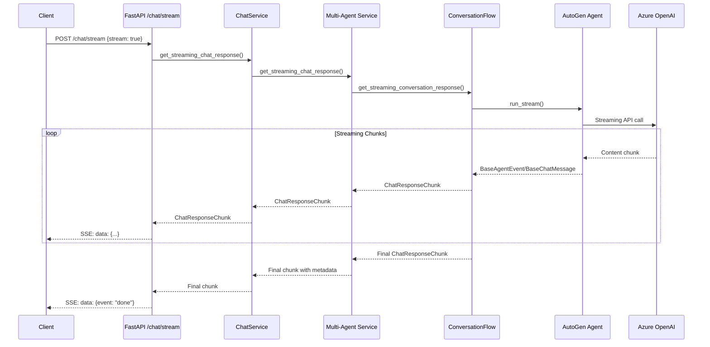

This document provides comprehensive information about the streaming response architecture in Insight Ingenious. Streaming responses enable real-time, token-by-token delivery of AI agent responses, providing improved user experience and perceived performance.

## Overview

Insight Ingenious supports streaming responses at multiple architectural layers:

1. **API Layer**: Server-Sent Events (SSE) endpoints for real-time streaming
2. **Service Layer**: Streaming-aware chat services with fallback support
3. **Conversation Flow Layer**: Native streaming support using AutoGen v0.4 capabilities
4. **OpenAI Integration**: Direct streaming from Azure OpenAI services
5. **Configuration Layer**: Flexible streaming configuration options

## Streaming Architecture

### Request Flow Architecture



## API Endpoints

### Streaming Chat Endpoint

**Endpoint**: `POST /chat/stream`

**Request Model**:
```json
{
    "user_prompt": "Your question here",
    "conversation_flow": "knowledge-base-agent",
    "thread_id": "optional-thread-id",
    "stream": true,
    "user_id": "optional-user-id",
    "memory_record": true
}
```

**Response Format**: Server-Sent Events (SSE)

```
data: {"event": "data", "data": {"chunk_type": "status", "content": "Searching knowledge base..."}}

data: {"event": "data", "data": {"chunk_type": "content", "content": "I found relevant information about"}}

data: {"event": "data", "data": {"chunk_type": "content", "content": " your query in the knowledge base."}}

data: {"event": "data", "data": {"chunk_type": "token_count", "token_count": 145}}

data: {"event": "data", "data": {"chunk_type": "final", "is_final": true, "memory_summary": "..."}}

data: {"event": "done"}
```

### Headers
```
Content-Type: text/plain
Cache-Control: no-cache
Connection: keep-alive
X-Accel-Buffering: no
```

## Response Models

### ChatResponseChunk

```python
class ChatResponseChunk(BaseModel):
    thread_id: Optional[str]
    message_id: Optional[str]
    chunk_type: str  # "content", "token_count", "memory_summary", "followup_questions", "final", "status", "error"
    content: Optional[str] = None
    token_count: Optional[int] = None
    max_token_count: Optional[int] = None
    topic: Optional[str] = None
    memory_summary: Optional[str] = None
    followup_questions: Optional[dict[str, str]] = None
    event_type: Optional[str] = None
    is_final: bool = False
```

### StreamingChatResponse

```python
class StreamingChatResponse(BaseModel):
    event: str  # "data", "error", "done"
    data: Optional[ChatResponseChunk] = None
    error: Optional[str] = None
```

### Chunk Types

| Chunk Type | Description | Contains |
|------------|-------------|----------|
| `status` | Processing status update | `content` with status message |
| `content` | Actual response content | `content` with text chunk |
| `token_count` | Token usage update | `token_count`, `max_token_count` |
| `memory_summary` | Memory context update | `memory_summary` |
| `followup_questions` | Suggested questions | `followup_questions` dict |
| `final` | Final chunk with metadata | All metadata fields, `is_final: true` |
| `error` | Error information | `content` with error message |

## Configuration

### Web Settings

```yaml
# In config.yml or environment variables
web:
  enable_streaming: true              # Enable/disable streaming globally
  streaming_chunk_size: 100          # Characters per chunk for fallback mode
  streaming_delay_ms: 50             # Delay between chunks in milliseconds
```

### Environment Variables

```bash
# Enable streaming responses
INGENIOUS_WEB__ENABLE_STREAMING=true

# Configure chunk size for fallback streaming
INGENIOUS_WEB__STREAMING_CHUNK_SIZE=100

# Configure streaming delay
INGENIOUS_WEB__STREAMING_DELAY_MS=50
```

## Implementation Details

### Service Layer Integration

The streaming architecture supports three implementation patterns:

#### 1. Native Streaming Support
Conversation flows that implement `get_streaming_conversation_response()`:

```python
class ConversationFlow(IConversationFlow):
    async def get_streaming_conversation_response(
        self, chat_request: ChatRequest
    ) -> AsyncIterator[ChatResponseChunk]:
        # Native streaming implementation using AutoGen run_stream()
        async for message in agent.run_stream(task=user_msg):
            yield ChatResponseChunk(
                thread_id=chat_request.thread_id,
                message_id=message_id,
                chunk_type="content",
                content=message.content,
                is_final=False
            )
```

#### 2. Fallback Chunking
Automatic conversion of regular responses to streaming chunks:

```python
# Automatically handles conversation flows without streaming support
response = await self.get_conversation_response(chat_request)
chunk_size = self.config.web.streaming_chunk_size

for i in range(0, len(content), chunk_size):
    chunk_content = content[i:i+chunk_size]
    yield ChatResponseChunk(
        chunk_type="content",
        content=chunk_content,
        is_final=False
    )
```

#### 3. Error Handling
Graceful error handling with streaming error responses:

```python
try:
    async for chunk in streaming_method():
        yield chunk
except Exception as e:
    yield ChatResponseChunk(
        chunk_type="error",
        content=f"An error occurred: {str(e)}",
        is_final=True
    )
```

### AutoGen Integration

The streaming implementation leverages AutoGen v0.4's `run_stream()` method:

```python
# Configure Azure OpenAI client with streaming
azure_config = {
    "model": model_config.model,
    "api_key": model_config.api_key,
    "azure_endpoint": model_config.base_url,
    "model_client_stream": True,  # Enable streaming
}

model_client = AzureOpenAIChatCompletionClient(**azure_config)

# Create streaming agent
search_assistant = AssistantAgent(
    name="search_assistant",
    model_client=model_client,
    tools=[search_function_tool],
    system_message=search_system_message,
)

# Stream the response
stream = search_assistant.run_stream(
    task=user_msg,
    cancellation_token=cancellation_token
)

async for message in stream:
    if hasattr(message, 'content') and message.content:
        yield ChatResponseChunk(
            chunk_type="content",
            content=message.content,
            is_final=False
        )
```

### OpenAI Service Streaming

Direct streaming support from Azure OpenAI:

```python
async def generate_streaming_response(
    self,
    messages: list[ChatCompletionMessageParam],
    **kwargs
) -> AsyncIterator[str]:
    response = self.client.chat.completions.create(
        model=self.model,
        messages=messages,
        stream=True,  # Enable streaming
        **kwargs
    )

    for chunk in response:
        if chunk.choices and chunk.choices[0].delta and chunk.choices[0].delta.content:
            yield chunk.choices[0].delta.content
```

## Client Integration

### JavaScript Example

```javascript
async function streamChat(request) {
    const response = await fetch('/chat/stream', {
        method: 'POST',
        headers: {
            'Content-Type': 'application/json',
        },
        body: JSON.stringify({
            ...request,
            stream: true
        })
    });

    const reader = response.body.getReader();
    const decoder = new TextDecoder();

    while (true) {
        const { done, value } = await reader.read();
        if (done) break;

        const chunk = decoder.decode(value);
        const lines = chunk.split('\n');

        for (const line of lines) {
            if (line.startsWith('data: ')) {
                const data = JSON.parse(line.slice(6));

                if (data.event === 'data') {
                    handleStreamChunk(data.data);
                } else if (data.event === 'done') {
                    handleStreamComplete();
                } else if (data.event === 'error') {
                    handleStreamError(data.error);
                }
            }
        }
    }
}

function handleStreamChunk(chunk) {
    switch (chunk.chunk_type) {
        case 'status':
            updateStatus(chunk.content);
            break;
        case 'content':
            appendContent(chunk.content);
            break;
        case 'token_count':
            updateTokenCount(chunk.token_count);
            break;
        case 'final':
            finalizeResponse(chunk);
            break;
    }
}
```

### Python Client Example

```python
import json
import requests

def stream_chat(request_data):
    response = requests.post(
        'http://localhost/chat/stream',
        json={**request_data, 'stream': True},
        stream=True
    )

    for line in response.iter_lines():
        if line.startswith(b'data: '):
            data = json.loads(line[6:].decode('utf-8'))

            if data['event'] == 'data':
                chunk = data['data']
                if chunk['chunk_type'] == 'content':
                    print(chunk['content'], end='', flush=True)
                elif chunk['chunk_type'] == 'final':
                    print(f"\n[Final - Tokens: {chunk.get('token_count', 'N/A')}]")
            elif data['event'] == 'done':
                print("\n[Stream Complete]")
                break
            elif data['event'] == 'error':
                print(f"\n[Error: {data['error']}]")
                break
```

## Performance Considerations

### Memory Management

- **Chunk Size**: Configure appropriate chunk sizes (50-200 characters) to balance responsiveness and overhead
- **Buffer Management**: Streaming responses use minimal memory buffering
- **Connection Pooling**: Use connection pooling for concurrent streaming requests

### Token Counting

- **Real-time Updates**: Token counts are updated during streaming when available from AutoGen
- **Fallback Estimation**: Uses character-based estimation when real-time token data unavailable
- **Final Reconciliation**: Final chunk includes accurate token counts

### Error Recovery

- **Graceful Degradation**: Falls back to chunked responses if native streaming fails
- **Connection Recovery**: Handles network interruptions with proper error messages
- **Timeout Management**: Configurable timeouts prevent hanging connections

## Monitoring and Debugging

### Logging

Streaming operations include comprehensive structured logging:

```python
logger.debug(
    "Starting streaming chat response",
    conversation_flow=self.conversation_flow,
    thread_id=chat_request.thread_id,
    streaming_enabled=True
)

logger.info(
    "Streaming chunk sent",
    chunk_type=chunk.chunk_type,
    content_length=len(chunk.content or ""),
    is_final=chunk.is_final
)
```

### Health Monitoring

- **Endpoint Health**: `/chat/stream` endpoint health monitoring
- **Streaming Metrics**: Track chunk delivery rates and error rates
- **Connection Monitoring**: Monitor active streaming connections

### Debugging Tools

```bash
# Test streaming endpoint with curl
curl -X POST http://localhost/chat/stream \
  -H "Content-Type: application/json" \
  -d '{"user_prompt": "Hello", "conversation_flow": "knowledge-base-agent", "stream": true}' \
  --no-buffer

# Monitor streaming logs
tail -f logs/ingenious.log | grep "streaming"
```

## Security Considerations

### Authentication

- **Same Security**: Streaming endpoints use identical authentication as regular endpoints
- **Token Validation**: JWT/API key validation for streaming connections
- **Rate Limiting**: Apply rate limiting to prevent streaming abuse

### Data Protection

- **Content Filtering**: Same content filtering applies to streaming responses
- **Sensitive Data**: Monitor for accidental streaming of sensitive information
- **Audit Logging**: Full audit trails for streaming conversations

## Troubleshooting

### Common Issues

#### Streaming Not Working
```bash
# Check if streaming is enabled
curl -s http://localhost/chat/stream -X POST \
  -H "Content-Type: application/json" \
  -d '{"user_prompt": "test", "conversation_flow": "knowledge-base-agent"}' \
  | head -5
```

#### Chunked Fallback Instead of Streaming
- Verify conversation flow implements `get_streaming_conversation_response()`
- Check AutoGen agent configuration includes `model_client_stream: True`
- Review logs for fallback indicators

#### Token Count Issues
- Streaming token counts may be estimates during response generation
- Final chunk contains accurate token counts
- Check token counter configuration for model compatibility

### Configuration Validation

```python
# Validate streaming configuration
def validate_streaming_config(config):
    if not config.web.enable_streaming:
        return "Streaming disabled in configuration"

    if config.web.streaming_chunk_size < 10:
        return "Chunk size too small"

    if config.web.streaming_delay_ms > 1000:
        return "Streaming delay too high"

    return "Configuration valid"
```

## Migration Guide

### From Non-Streaming to Streaming

1. **Update Request Format**:
   ```diff
   {
     "user_prompt": "Hello",
     "conversation_flow": "knowledge-base-agent",
   + "stream": true
   }
   ```

2. **Update Client Code**:
   ```diff
   - response = await fetch('/chat', {...})
   - const data = await response.json()
   + const response = await fetch('/chat/stream', {...})
   + // Handle SSE streaming (see client examples above)
   ```

3. **Optional: Implement Native Streaming**:
   ```python
   class ConversationFlow(IConversationFlow):
   +   async def get_streaming_conversation_response(
   +       self, chat_request: ChatRequest
   +   ) -> AsyncIterator[ChatResponseChunk]:
   +       # Native streaming implementation
   ```

### Backward Compatibility

- Regular `/chat` endpoint remains unchanged
- Existing conversation flows work with automatic fallback
- No breaking changes to existing integrations

This streaming architecture provides real-time, responsive AI interactions while maintaining full backward compatibility and comprehensive error handling.
