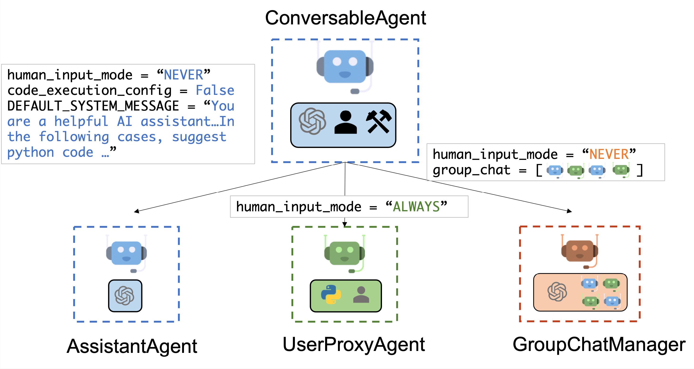

---

    weight: 2

---
# Insight Service Prefabs

## AutoGen: Multi-Agent Conversation Framework

Our framework is developed based on AutoGen. 

AutoGen offers a unified multi-agent conversation framework as a high-level abstraction of using foundation models. It features capable, customizable, and conversable agents which integrate LLMs, tools, and humans via automated agent chat. By automating chat among multiple agents, one can easily make them collectively perform tasks autonomously or with human feedback, including tasks that require using tools via code.

This framework simplifies the orchestration, automation, and optimization of a complex LLM workflow. It maximizes the performance of LLM models and overcomes their weaknesses. It enables building next-gen LLM applications based on multi-agent conversations with minimal effort.

AutoGen abstracts and implements conversable agents designed to solve tasks through inter-agent conversations. Specifically, the agents in AutoGen have the following features:

- **Conversable:** Agents in AutoGen can send and receive messages to initiate or continue a conversation.
- **Customizable:** Agents can be customized to integrate LLMs, humans, tools, or a combination of these.

The figure below shows the built-in agents in AutoGen.

<p style="text-align: center;">
    
</p>


## Solution Architecture

### Overview 
We have designed a generic framework - **service prefabs** - that can let agents converse with each other through message exchanges to jointly finish a task.
Different prefabs can perform different actions after receiving messages.

You can find them under `services/chat_services`  [folder structure](./folder_structure).


```powershell title="view service prefabs"
.
├── __init__.py
├── chat_service.py
├── chat_services
│  ├── __init__.py
│  ├── fast_agent
│  │  └── __init__.py
│  └── multi_agent
│      ├── __init__.py
│      ├── tool_factory.py
│      ├── agents
│      ├── conversation_flows
│      ├── conversation_patterns
│      └── service.py
├── message_feedback_service.py
└── tool_service.py
```

Each prefab has 2 components:

- The **`ConversationPattern`** class creates a complex conversation flow involving topic classification, factual retrieval, and reporting, using multiple agents working in sequence.
- The **`ConversationFlow`** class acts as a wrapper to interact with the `ConversationPattern` and adds a specialized `search_agent` for health and safety information retrieval. It simplifies the process of getting responses for user messages.


Let's break down the two classes step by step:

#### 1. **`ConversationPattern` Class**

The `ConversationPattern` class is designed to create a structured multi-agent conversation flow. The main purpose of this class is to handle complex conversations, especially those involving topic classification, factual information retrieval, and reporting the results back to the user. Here's a breakdown of its components:

**Key Components:**

- **Initialization (`__init__`)**:
  - **Attributes**:
    - `default_llm_config`: This is a dictionary containing the configuration for the language model (LLM) that will be used by the agents.
    - `topics`: A list of predefined topics for classification.
    - `termination_msg`: A lambda function used to detect termination messages. If a message contains "TERMINATE", the conversation will end.
  
  - **Agents**:
    - **`user_proxy`**: An instance of `RetrieveUserProxyAgent` that acts as a proxy between the user and the other agents. This proxy agent handles interactions without human intervention and retrieves context from the system's database.
    - **`researcher`**: A `ConversableAgent` responsible for planning the conversation, determining if search or factual retrieval is needed, and summarizing the conversation. The researcher ensures that no unnecessary repetitions occur.
    - **`report_agent`**: An `AssistantAgent` tasked with reporting the summarized result of the conversation to the user in a clear and concise format. It also records the conversation summary using a registered memory function.
    - **`classification_agent`**: Another `AssistantAgent` responsible for classifying user messages into the predefined topics. It ensures proper routing of the conversation based on the user's input.
  
  - **`add_topic_agent` Method**:
    - This method allows adding additional topic-specific agents. Each agent is provided a tool (a callable function) to handle specific tasks. This method also registers the topic agents in the conversation flow, so they can interact properly with the researcher, proxy, and report agent.

- **`get_conversation_response` Method**:
  - This method orchestrates the entire conversation flow. It creates a `GroupChat` instance that handles multi-agent interactions, where agents work together to classify, research, and report back responses to the user.
  - The agents interact based on the `graph_dict`, which defines which agent is responsible for the next action (e.g., classification, research, report).
  - The user message triggers the process, and the response is generated asynchronously.

#### Workflow:
- User inputs a message.
- `user_proxy` retrieves context or initiates the conversation.
- The `classification_agent` classifies the message topic.
- Based on the classification, the `researcher` decides whether further factual retrieval is needed.
- Once the task is completed, the `report_agent` provides a summarized response to the user.

---

#### 2. **`ConversationFlow` Class**

The `ConversationFlow` class simplifies interaction with the `ConversationPattern` class by providing a static method to get a response for a given user message. It focuses on integrating the `ConversationPattern` into an existing system and adds a specialized search agent for information retrieval.

**Key Components:**

- **`get_conversation_response` Method**:
  - This method is static and serves as the entry point for obtaining conversation responses.
  - It retrieves the LLM configuration from an external `config` module.
  - An instance of `ConversationPattern` is initialized with predefined topics like 'health' and 'safety'.
  
  - **`search_agent`**:
    - This agent is specifically designed to handle search requests related to health and safety topics. It uses specific indices (`vector-health` and `vector-safety`) to retrieve information from a database. This agent does not add extra information or follow up on ambiguous queries but ensures that searches are performed accurately.

  - **`add_topic_agent` Method**:
    - The search agent is added to the `ConversationPattern` using the `add_topic_agent` method, similar to the `ConversationPattern` class. This allows the search agent to act within the conversation flow, performing factual retrieval when required.

  - **Response Handling**:
    - The `get_conversation_response` method asynchronously waits for the conversation flow to complete and returns the summarized response as a `ChatResponse`.

#### Workflow:
- The user message is passed to the `ConversationPattern`.
- The conversation proceeds with topic classification, information retrieval (if necessary), and reporting the result.
- The final summarized response is returned as a `ChatResponse`.

