This guide provides detailed information for developers who want to extend, modify, or contribute to Insight Ingenious - an enterprise-grade Python library for building AI agent APIs with Microsoft Azure integrations. The library's architecture supports extensive customization and debugging capabilities for enterprise development teams.

## Development Environment Setup

### Prerequisites

- Python 3.13 or higher
- Git
- [uv](https://docs.astral.sh/uv/) for Python package management

### Setting Up for Development

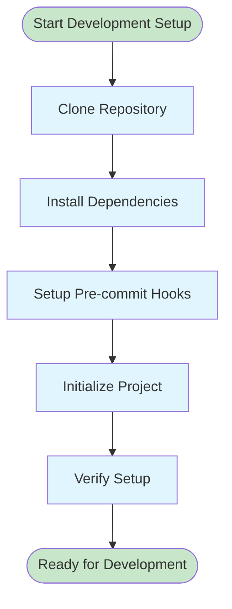

1. **Clone the repository:**

   ```bash
   git clone https://github.com/Insight-Services-APAC/ingenious.git
   cd ingenious
   ```

2. **Install dependencies and set up development environment:**

   ```bash
   uv sync --group dev
   ```

3. **Set up pre-commit hooks:**

   ```bash
   uv run pre-commit install
   ```

4. **Initialize the project:**
   ```bash
   uv run ingen init
   ```

## Project Architecture

### Core Framework Structure

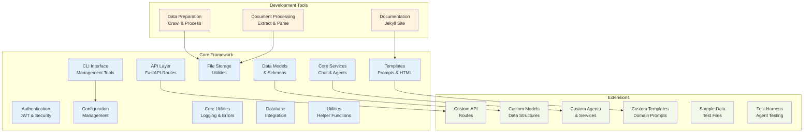

### Directory Structure

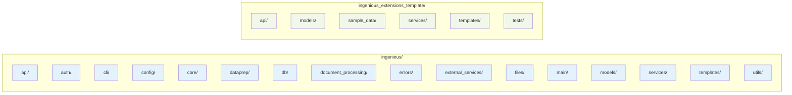

## Core Components

### Multi-Agent Framework

The multi-agent framework is the heart of Insight Ingenious:

#### Interfaces

- `IConversationPattern`: Abstract base class for conversation patterns
- `IConversationFlow`: Interface for implementing conversation flows

#### Services

- `multi_agent_chat_service`: Service managing agent conversations

#### Patterns and Flows

The multi-agent framework uses a two-layer architecture:

**Conversation Patterns** (`conversation_patterns/`): Define the core logic for how agents interact and process messages. Each pattern implements the conversation mechanics and agent orchestration.

**Conversation Flows** (`conversation_flows/`): Provide the entry points for API integration. Flows instantiate and configure patterns, then expose them through standardized interfaces.

Current implementations:

- **Classification Agent** (`classification_agent/`): Classifies inputs and routes to specialized agents
  - Pattern: Implements classification logic and routing mechanics
  - Flow: Exposes via API endpoint (`classification-agent`)

- **Knowledge Base Agent** (`knowledge_base_agent/`): Handles knowledge retrieval and question answering
  - Pattern: Implements RAG (Retrieval-Augmented Generation) logic
  - Flow: Exposes via API endpoint (`knowledge-base-agent`)

- **SQL Manipulation Agent** (`sql_manipulation_agent/`): Generates and executes SQL queries
  - Pattern: Implements SQL generation and execution logic
  - Flow: Exposes via API endpoint (`sql-manipulation-agent`)

- **Education Expert** (`education_expert/`): Educational content generation
  - Pattern: Implements educational content generation logic
  - Flow: Not implemented (pattern only, no API endpoint)

Note: Folder names use underscores, but API endpoints use hyphens (e.g., `classification-agent`)

### Configuration System

The configuration system uses environment variables with `INGENIOUS_` prefixes.

Configuration is handled by:

- `ingenious/config/config.py`: Loads and validates configuration
- `ingenious/config/profile.py`: Manages profile configuration

Models:

- `ingenious/models/config.py`: Configuration data models
- `ingenious/models/config_ns.py`: Non-sensitive configuration models
- `ingenious/models/profile.py`: Profile data models

## Adding New Components

### Adding a New Agent

1. Create a new folder in `ingenious/services/chat_services/multi_agent/agents/your_agent_name/`
2. Create the agent definition file:
   - `agent.md`: Contains agent persona and system prompt
3. Add task description:
   - `tasks/task.md`: Describes the agent's tasks

### Adding a New Conversation Pattern

1. Create a new folder in `ingenious/services/chat_services/multi_agent/conversation_patterns/your_pattern_name/`
2. Create an `__init__.py` file:
   ```python
   from pkgutil import extend_path
   __path__ = extend_path(__path__, __name__)
   ```
3. Create the pattern implementation:

   ```python
   # your_pattern_name.py
   import autogen
   import logging

   class ConversationPattern:
       def __init__(self, default_llm_config: dict, topics: list, memory_record_switch: bool, memory_path: str, thread_memory: str):
           # Initialize parameters

       async def get_conversation_response(self, input_message: str) -> [str, str]:
           # Implement conversation logic
   ```

### Adding a New Conversation Flow

1. Create a new folder in `ingenious/services/chat_services/multi_agent/conversation_flows/your_flow_name/`
2. Create an `__init__.py` file:
   ```python
   from pkgutil import extend_path
   __path__ = extend_path(__path__, __name__)
   ```
3. Create the flow implementation:

   ```python
   # your_flow_name.py
   import ingenious.config.config as config
   from ingenious.models.chat import ChatResponse
   from ingenious.services.chat_services.multi_agent.conversation_patterns.your_pattern_name.your_pattern_name import ConversationPattern

   class ConversationFlow:
       @staticmethod
       async def get_conversation_response(message: str, topics: list = [], thread_memory: str='', memory_record_switch = True, thread_chat_history: list = []) -> ChatResponse:
           # Initialize and use your conversation pattern
   ```

### Adding a Custom API Route

1. Create a module in `ingenious_extensions_template/api/routes/custom.py`
2. Implement the `Api_Routes` class:

   ```python
   from fastapi import APIRouter, Depends, FastAPI
   from ingenious.models.api_routes import IApiRoutes
   from ingenious.models.config import Config

   class Api_Routes(IApiRoutes):
       def __init__(self, config: Config, app: FastAPI):
           self.config = config
           self.app = app
           self.router = APIRouter()

       def add_custom_routes(self):
           # Define your custom routes
   ```

## Testing

### Unit Tests

Run unit tests using pytest:

```bash
uv run pytest
```

### Testing Agents

Use the test harness to test agent behavior:

```bash
uv run ingen test
```


## Debugging

### Logging

Configure logging with environment variables:

```bash
export INGENIOUS_LOGGING__ROOT_LOG_LEVEL="DEBUG"
export INGENIOUS_LOGGING__LOG_LEVEL="DEBUG"
```

Logs are printed to the console and can be redirected to files.

### Using the Debug Interface

When running in development mode, you can access:

- http://localhost:80/docs - API documentation (or your configured port)

### Common Issues

- **Missing Configuration**: Ensure environment variables are set correctly
- **Agent Not Found**: Check module naming and imports
- **Pattern Registration**: Ensure conversation patterns are properly registered
- **API Key Issues**: Verify environment variables contain valid API keys

## Best Practices

### Code Style

This project follows these conventions:

- PEP 8 for Python code style
- Use Ruff for linting and formatting
- Use type hints for better IDE support

### Documentation

Document your code:

- Add docstrings to all functions and classes
- Update markdown documentation for user-facing features
- Include examples for complex functionality

### Versioning

Follow semantic versioning:

- Major version: Breaking API changes
- Minor version: New features, non-breaking changes
- Patch version: Bug fixes and minor improvements

### Commits

Write clear commit messages:

- Start with a verb (Add, Fix, Update, etc.)
- Keep first line under 50 characters
- Provide more detail in the body if needed

### Pull Requests

Create focused pull requests:

- Address one feature or fix per PR
- Include tests for new functionality
- Update documentation
- Pass all CI checks

## Development Workflow

### Agent Development

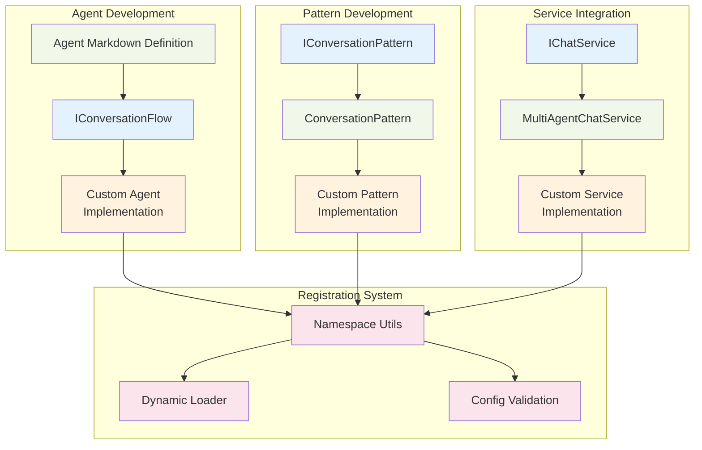

#### Creating a New Agent

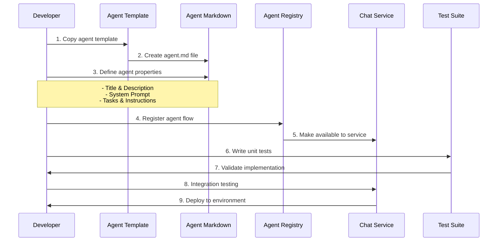

#### Creating a Custom Conversation Pattern

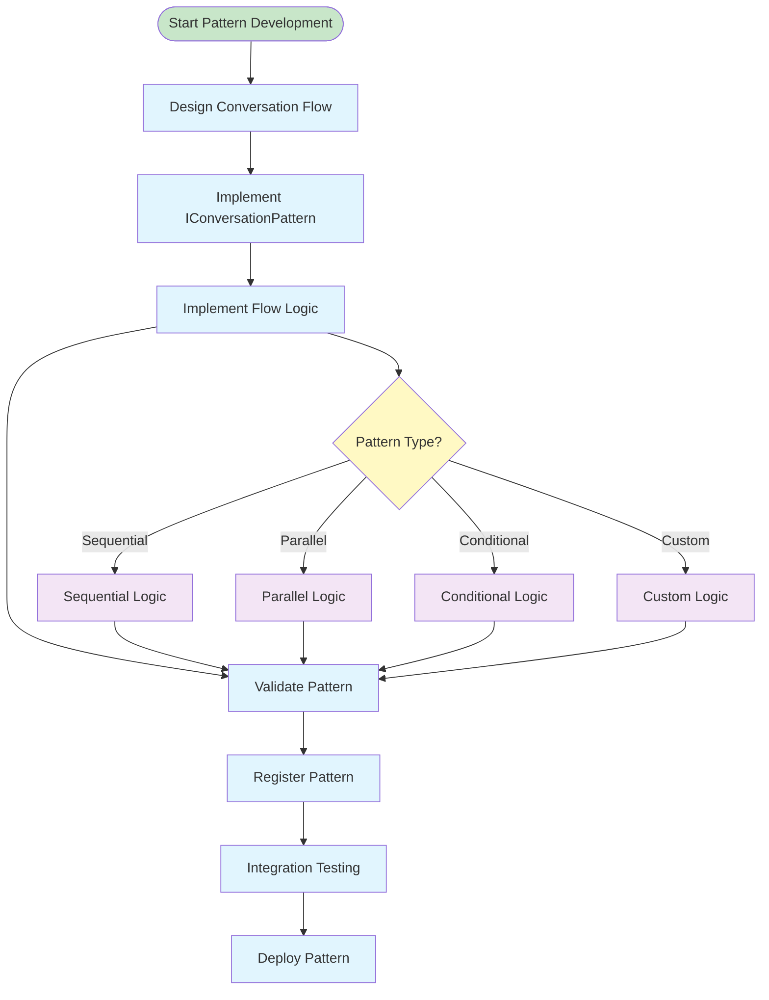

### Testing Framework

#### Test Architecture

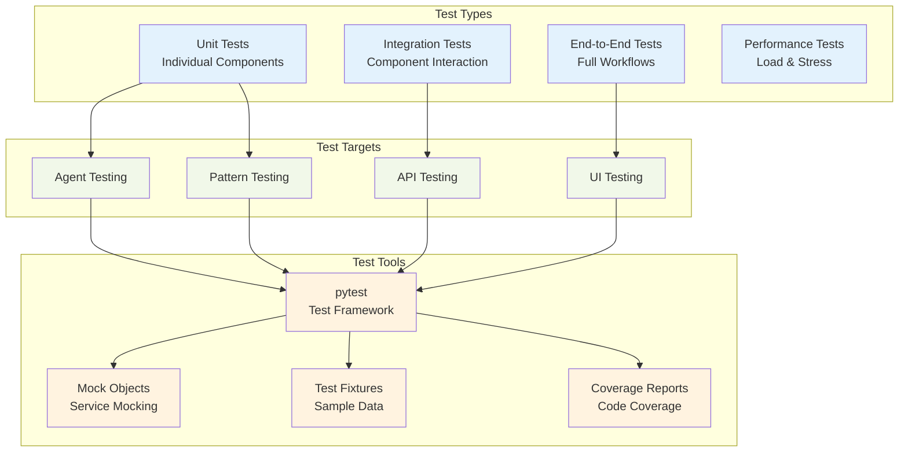

#### Testing Best Practices

1. **Unit Testing**: Test individual components in isolation
2. **Integration Testing**: Test component interactions
3. ** End-to-End Testing**: Test complete user workflows
4. ** Coverage**: Maintain >80% code coverage
5. **Mocking**: Mock external services and dependencies
6. ** Fixtures**: Use consistent test data

### Deployment Pipeline

```mermaid
flowchart LR
    subgraph "Development"
        CODE[Code Changes]
        COMMIT[ Git Commit]
        PUSH[Git Push]
    end

    subgraph " CI Pipeline"
        LINT[ Code Linting]
        TEST[ Run Tests]
        BUILD[Build Package]
        SECURITY[Security Scan]
    end

    subgraph " Staging"
        DEPLOY_STAGE[Deploy to Staging]
        SMOKE_TEST[Smoke Tests]
        INTEGRATION_TEST[Integration Tests]
    end

    subgraph " Production"
        DEPLOY_PROD[ Deploy to Production]
        MONITOR[ Monitor Health]
        ROLLBACK[ Rollback if Needed]
    end

    CODE --> COMMIT
    COMMIT --> PUSH
    PUSH --> LINT
    LINT --> TEST
    TEST --> BUILD
    BUILD --> SECURITY
    SECURITY --> DEPLOY_STAGE
    DEPLOY_STAGE --> SMOKE_TEST
    SMOKE_TEST --> INTEGRATION_TEST
    INTEGRATION_TEST --> DEPLOY_PROD
    DEPLOY_PROD --> MONITOR
    MONITOR --> ROLLBACK

    classDef dev fill:#e8f5e8
    classDef ci fill:#fff3e0
    classDef staging fill:#e3f2fd
    classDef prod fill:#fce4ec

    class CODE,COMMIT,PUSH dev
    class LINT,TEST,BUILD,SECURITY ci
    class DEPLOY_STAGE,SMOKE_TEST,INTEGRATION_TEST staging
    class DEPLOY_PROD,MONITOR,ROLLBACK prod
```

### Extension Development Guide

#### Step-by-Step Extension Creation

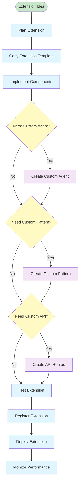

### Key Development Concepts

#### Agent Lifecycle

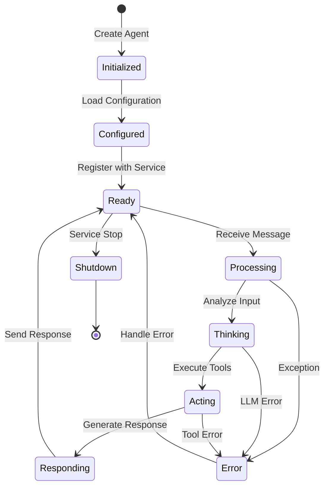

### Debugging and Troubleshooting

#### Debug Flow

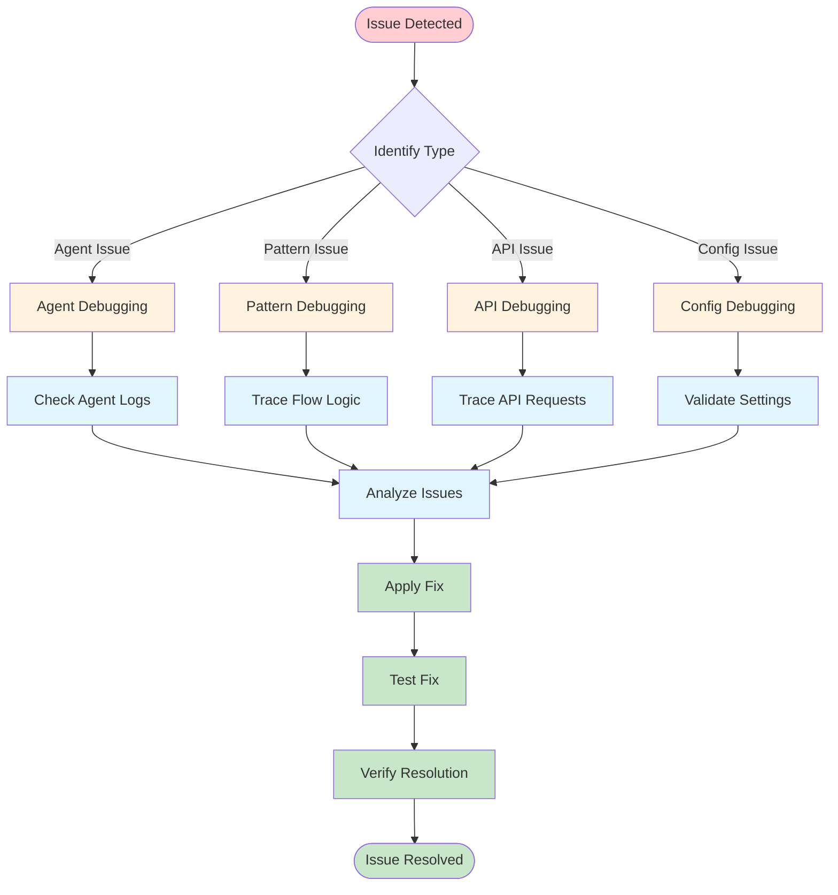

## Contributing Guidelines

### Contribution Process

1. **Fork the Repository**: Create your own fork
2. **Create Feature Branch**: Use descriptive branch names
3. **Implement Changes**: Follow coding standards
4. ** Add Tests**: Ensure proper test coverage
5. ** Update Documentation**: Keep docs current
6. **Submit Pull Request**: Use PR template
7. ** Code Review**: Address reviewer feedback
8. **Merge**: Celebrate your contribution!

### Code Style Guidelines

- **Python**: Follow PEP 8 standards
- **Line Length**: Maximum 88 characters
- **Type Hints**: Use type annotations
- ** Docstrings**: Document all public methods
- ** Tests**: Write tests for new features
- ** Security**: Follow security best practices

## Next Steps

- Read the [Architecture Guide](../architecture/README.md) for system design
- Check the [Configuration Guide](../getting-started/configuration.md) for setup
- Try the [Getting Started Guide](../getting-started/README.md) for quick setup
- Explore the [API Documentation](../api/README.md) for integration
