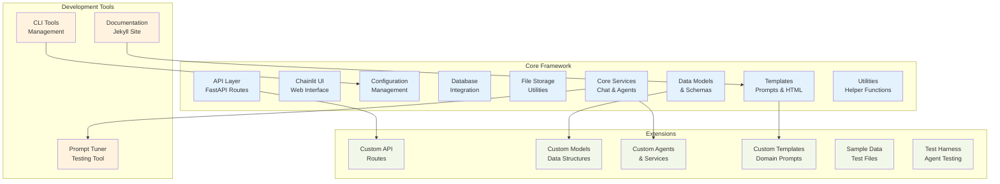

# Development Guide

This guide provides detailed information for developers who want to extend, modify, or contribute to Insight Ingenious - an enterprise-grade Python library for building AI agent APIs with Microsoft Azure integrations. The library's architecture supports extensive customization and debugging capabilities for enterprise development teams.

## Development Environment Setup

### Prerequisites

- Python 3.13 or higher
- Git
- [uv](https://docs.astral.sh/uv/) for Python package management

### Setting Up for Development


1. **Clone the repository:**
   ```bash
   git clone https://github.com/Insight-Services-APAC/ingenious.git
   cd ingenious
   ```

2. **Install dependencies and set up development environment:**
   ```bash
   uv sync --extra dev
   ```

3. **Set up pre-commit hooks:**
   ```bash
   uv run pre-commit install
   ```

4. **Initialize the project:**
   ```bash
   uv run ingen init
   ```

## Project Architecture

### Core Framework Structure



### 📁 Directory Structure

```mermaid
graph LR
    subgraph "📂 ingenious/"
        CORE_API[🌐 api/]
        CORE_CHAINLIT[🎨 chainlit/]
        CORE_CONFIG[⚙️ config/]
        CORE_DB[🗄️ db/]
        CORE_FILES[📁 files/]
        CORE_MODELS[📊 models/]
        CORE_SERVICES[🔧 services/]
        CORE_TEMPLATES[📝 templates/]
        CORE_UTILS[🛠️ utils/]
    end

    subgraph "🔌 ingenious_extensions_template/"
        EXT_API[🔗 api/]
        EXT_MODELS[📈 models/]
        EXT_SAMPLE[📄 sample_data/]
        EXT_SERVICES[🤖 services/]
        EXT_TEMPLATES[📋 templates/]
        EXT_TESTS[🧪 tests/]
    end

    subgraph "🎛️ ingenious_prompt_tuner/"
        TUNER_AUTH[🔐 auth.py]
        TUNER_PROCESSOR[⚡ event_processor.py]
        TUNER_PAYLOAD[📦 payload.py]
        TUNER_WRAPPER[🎁 response_wrapper.py]
    end

    classDef core fill:#e3f2fd
    classDef extensions fill:#f1f8e9
    classDef tuner fill:#fff3e0

    class CORE_API,CORE_CHAINLIT,CORE_CONFIG,CORE_DB,CORE_FILES,CORE_MODELS,CORE_SERVICES,CORE_TEMPLATES,CORE_UTILS core
    class EXT_API,EXT_MODELS,EXT_SAMPLE,EXT_SERVICES,EXT_TEMPLATES,EXT_TESTS extensions
    class TUNER_AUTH,TUNER_PROCESSOR,TUNER_PAYLOAD,TUNER_WRAPPER tuner
```



## Core Components

### 🤖 Multi-Agent Framework

The multi-agent framework is the heart of Insight Ingenious:

#### Interfaces

- `IConversationPattern`: Abstract base class for conversation patterns
- `IConversationFlow`: Interface for implementing conversation flows

#### Services

- `multi_agent_chat_service`: Service managing agent conversations

#### Patterns

Conversation patterns define how agents interact:

- `conversation_patterns/`: Contains different conversation pattern implementations
  - `classification_agent/`: Pattern for classifying inputs and routing to specialized agents (API: `classification-agent`)
  - `knowledge_base_agent/`: Pattern for knowledge retrieval and question answering (API: `knowledge-base-agent`)
  - `sql_manipulation_agent/`: Pattern for SQL query generation and execution (API: `sql-manipulation-agent`)
  - `education_expert/`: Pattern for educational content generation (pattern only, no direct API)

#### Flows

Conversation flows implement specific use cases:

- `conversation_flows/`: Contains flow implementations that use the patterns
  - `classification_agent/`: Flow for classification and routing (API: `classification-agent`)
  - `knowledge_base_agent/`: Flow for knowledge base interactions (API: `knowledge-base-agent`)
  - `sql_manipulation_agent/`: Flow for SQL queries (API: `sql-manipulation-agent`)

Note:
- `education_expert` exists as a pattern but does not have a corresponding flow implementation
- Folder names use underscores for historical reasons, but API calls should use hyphens (e.g., `classification-agent`)

### Configuration System

The configuration system uses:

- `config.yml`: Project-specific, non-sensitive configuration
- `profiles.yml`: Environment-specific, sensitive configuration

Configuration is handled by:

- `ingenious/config/config.py`: Loads and validates configuration
- `ingenious/config/profile.py`: Manages profile configuration

Models:

- `ingenious/models/config.py`: Configuration data models
- `ingenious/models/config_ns.py`: Non-sensitive configuration models
- `ingenious/models/profile.py`: Profile data models

## Adding New Components

### Adding a New Agent

1. Create a new folder in `ingenious/services/chat_services/multi_agent/agents/your_agent_name/`
2. Create the agent definition file:
   - `agent.md`: Contains agent persona and system prompt
3. Add task description:
   - `tasks/task.md`: Describes the agent's tasks

### Adding a New Conversation Pattern

1. Create a new folder in `ingenious/services/chat_services/multi_agent/conversation_patterns/your_pattern_name/`
2. Create an `__init__.py` file:
   ```python
   from pkgutil import extend_path
   __path__ = extend_path(__path__, __name__)
   ```
3. Create the pattern implementation:
   ```python
   # your_pattern_name.py
   import autogen
   import logging

   class ConversationPattern:
       def __init__(self, default_llm_config: dict, topics: list, memory_record_switch: bool, memory_path: str, thread_memory: str):
           # Initialize parameters

       async def get_conversation_response(self, input_message: str) -> [str, str]:
           # Implement conversation logic
   ```

### Adding a New Conversation Flow

1. Create a new folder in `ingenious/services/chat_services/multi_agent/conversation_flows/your_flow_name/`
2. Create an `__init__.py` file:
   ```python
   from pkgutil import extend_path
   __path__ = extend_path(__path__, __name__)
   ```
3. Create the flow implementation:
   ```python
   # your_flow_name.py
   import ingenious.config.config as config
   from ingenious.models.chat import ChatResponse
   from ingenious.services.chat_services.multi_agent.conversation_patterns.your_pattern_name.your_pattern_name import ConversationPattern

   class ConversationFlow:
       @staticmethod
       async def get_conversation_response(message: str, topics: list = [], thread_memory: str='', memory_record_switch = True, thread_chat_history: list = []) -> ChatResponse:
           # Initialize and use your conversation pattern
   ```

### Adding a Custom API Route

1. Create a module in `ingenious_extensions_template/api/routes/custom.py`
2. Implement the `Api_Routes` class:
   ```python
   from fastapi import APIRouter, Depends, FastAPI
   from ingenious.models.api_routes import IApiRoutes
   from ingenious.models.config import Config

   class Api_Routes(IApiRoutes):
       def __init__(self, config: Config, app: FastAPI):
           self.config = config
           self.app = app
           self.router = APIRouter()

       def add_custom_routes(self):
           # Define your custom routes
   ```

## Testing

### Unit Tests

Run unit tests using pytest:

```bash
uv run pytest
```

### Testing Agents

Use the test harness to test agent behavior:

```bash
uv run ingen test
```

### Testing Prompts

Use the prompt tuner for interactive testing:

1. Start the server:
   ```bash
   uv run ingen serve
   ```
2. Navigate to http://localhost:80/prompt-tuner (or your configured port)
3. Select a prompt to test
4. Provide sample inputs and evaluate responses

## Debugging

### Logging

Configure logging in `config.yml`:

```yaml
logging:
  root_log_level: "DEBUG"
  log_level: "DEBUG"
```

Logs are printed to the console and can be redirected to files.

### Using the Debug Interface

When running in development mode, you can access:

- http://localhost:80/docs - API documentation (or your configured port)
- http://localhost:80/prompt-tuner - Prompt tuning interface

### Common Issues

- **Missing Configuration**: Ensure environment variables are set correctly
- **Agent Not Found**: Check module naming and imports
- **Pattern Registration**: Ensure conversation patterns are properly registered
- **API Key Issues**: Verify profiles.yml contains valid API keys

## Best Practices

### Code Style

This project follows these conventions:

- PEP 8 for Python code style
- Use Ruff for linting and formatting
- Use type hints for better IDE support

### Documentation

Document your code:

- Add docstrings to all functions and classes
- Update markdown documentation for user-facing features
- Include examples for complex functionality

### Versioning

Follow semantic versioning:

- Major version: Breaking API changes
- Minor version: New features, non-breaking changes
- Patch version: Bug fixes and minor improvements

### Commits

Write clear commit messages:

- Start with a verb (Add, Fix, Update, etc.)
- Keep first line under 50 characters
- Provide more detail in the body if needed

### Pull Requests

Create focused pull requests:

- Address one feature or fix per PR
- Include tests for new functionality
- Update documentation
- Pass all CI checks

## Development Workflow

### 🤖 Agent Development

```mermaid
graph TB
    subgraph "🤖 Agent Development"
        AGENT_MARKDOWN[📄 Agent Markdown Definition]
        AGENT_FLOW[🔄 IConversationFlow]
        CUSTOM_AGENT[🔧 Custom Agent<br/>Implementation]
    end

    subgraph "📋 Pattern Development"
        PATTERN_INTERFACE[🔄 IConversationPattern]
        PATTERN_IMPL[📝 ConversationPattern]
        CUSTOM_PATTERN[🎭 Custom Pattern<br/>Implementation]
    end

    subgraph "🔧 Service Integration"
        CHAT_SERVICE[💬 MultiAgentChatService]
        CHAT_INTERFACE[📞 IChatService]
        CUSTOM_SERVICE[🛠️ Custom Service<br/>Implementation]
    end

    subgraph "📦 Registration System"
        NAMESPACE_UTILS[📋 Namespace Utils]
        DYNAMIC_LOADER[⚡ Dynamic Loader]
        CONFIG_VALIDATION[✅ Config Validation]
    end

    AGENT_MARKDOWN --> AGENT_FLOW
    AGENT_FLOW --> CUSTOM_AGENT
    CUSTOM_AGENT --> NAMESPACE_UTILS

    PATTERN_INTERFACE --> PATTERN_IMPL
    PATTERN_IMPL --> CUSTOM_PATTERN
    CUSTOM_PATTERN --> NAMESPACE_UTILS

    CHAT_INTERFACE --> CHAT_SERVICE
    CHAT_SERVICE --> CUSTOM_SERVICE
    CUSTOM_SERVICE --> NAMESPACE_UTILS

    NAMESPACE_UTILS --> DYNAMIC_LOADER
    NAMESPACE_UTILS --> CONFIG_VALIDATION

    classDef interface fill:#e3f2fd
    classDef base fill:#f1f8e9
    classDef custom fill:#fff3e0
    classDef registry fill:#fce4ec

    class AGENT_FLOW,PATTERN_INTERFACE,CHAT_INTERFACE interface
    class AGENT_MARKDOWN,PATTERN_IMPL,CHAT_SERVICE base
    class CUSTOM_AGENT,CUSTOM_PATTERN,CUSTOM_SERVICE custom
    class NAMESPACE_UTILS,DYNAMIC_LOADER,CONFIG_VALIDATION registry
```



#### 🆕 Creating a New Agent

```mermaid
sequenceDiagram
    participant Dev as 👨‍💻 Developer
    participant Template as 📋 Agent Template
    participant AgentMD as 📄 Agent Markdown
    participant Registry as 📋 Agent Registry
    participant Service as 💬 Chat Service
    participant Test as 🧪 Test Suite

    Dev->>Template: 1. Copy agent template
    Template->>AgentMD: 2. Create agent.md file
    Dev->>AgentMD: 3. Define agent properties
    Note over Dev,AgentMD: - Title & Description<br/>- System Prompt<br/>- Tasks & Instructions

    Dev->>Registry: 4. Register agent flow
    Registry->>Service: 5. Make available to service
    Dev->>Test: 6. Write unit tests
    Test->>Dev: 7. Validate implementation
    Dev->>Service: 8. Integration testing
    Service->>Dev: 9. Deploy to environment
```



#### 🎭 Creating a Custom Conversation Pattern

```mermaid
flowchart TD
    START([🚀 Start Pattern Development]) --> DESIGN[🎨 Design Conversation Flow]
    DESIGN --> INTERFACE[🔧 Implement IConversationPattern]
    INTERFACE --> LOGIC[⚡ Implement Flow Logic]
    LOGIC --> VALIDATE[✅ Validate Pattern]
    VALIDATE --> REGISTER[📋 Register Pattern]
    REGISTER --> TEST[🧪 Integration Testing]
    TEST --> DEPLOY[🚀 Deploy Pattern]

    LOGIC --> SEQUENTIAL{Pattern Type?}
    SEQUENTIAL -->|Sequential| SEQ_LOGIC[➡️ Sequential Logic]
    SEQUENTIAL -->|Parallel| PAR_LOGIC[⚡ Parallel Logic]
    SEQUENTIAL -->|Conditional| COND_LOGIC[🔀 Conditional Logic]
    SEQUENTIAL -->|Custom| CUSTOM_LOGIC[🎯 Custom Logic]

    SEQ_LOGIC --> VALIDATE
    PAR_LOGIC --> VALIDATE
    COND_LOGIC --> VALIDATE
    CUSTOM_LOGIC --> VALIDATE

    classDef start fill:#c8e6c9
    classDef process fill:#e1f5fe
    classDef decision fill:#fff9c4
    classDef pattern fill:#f3e5f5

    class START start
    class DESIGN,INTERFACE,LOGIC,VALIDATE,REGISTER,TEST,DEPLOY process
    class SEQUENTIAL decision
    class SEQ_LOGIC,PAR_LOGIC,COND_LOGIC,CUSTOM_LOGIC pattern
```



### 🧪 Testing Framework

#### Test Architecture


#### Testing Best Practices

1. **🔬 Unit Testing**: Test individual components in isolation
2. **🔗 Integration Testing**: Test component interactions
3. **🌐 End-to-End Testing**: Test complete user workflows
4. **📊 Coverage**: Maintain >80% code coverage
5. **🎭 Mocking**: Mock external services and dependencies
6. **📋 Fixtures**: Use consistent test data

### 🚀 Deployment Pipeline

```mermaid
flowchart LR
    subgraph "💻 Development"
        CODE[👨‍💻 Code Changes]
        COMMIT[📝 Git Commit]
        PUSH[📤 Git Push]
    end

    subgraph "🔍 CI Pipeline"
        LINT[🎨 Code Linting]
        TEST[🧪 Run Tests]
        BUILD[🏗️ Build Package]
        SECURITY[🔒 Security Scan]
    end

    subgraph "📦 Staging"
        DEPLOY_STAGE[🎭 Deploy to Staging]
        SMOKE_TEST[💨 Smoke Tests]
        INTEGRATION_TEST[🔗 Integration Tests]
    end

    subgraph "🚀 Production"
        DEPLOY_PROD[🌐 Deploy to Production]
        MONITOR[📊 Monitor Health]
        ROLLBACK[🔄 Rollback if Needed]
    end

    CODE --> COMMIT
    COMMIT --> PUSH
    PUSH --> LINT
    LINT --> TEST
    TEST --> BUILD
    BUILD --> SECURITY
    SECURITY --> DEPLOY_STAGE
    DEPLOY_STAGE --> SMOKE_TEST
    SMOKE_TEST --> INTEGRATION_TEST
    INTEGRATION_TEST --> DEPLOY_PROD
    DEPLOY_PROD --> MONITOR
    MONITOR --> ROLLBACK

    classDef dev fill:#e8f5e8
    classDef ci fill:#fff3e0
    classDef staging fill:#e3f2fd
    classDef prod fill:#fce4ec

    class CODE,COMMIT,PUSH dev
    class LINT,TEST,BUILD,SECURITY ci
    class DEPLOY_STAGE,SMOKE_TEST,INTEGRATION_TEST staging
    class DEPLOY_PROD,MONITOR,ROLLBACK prod
```



### 🔧 Extension Development Guide

#### Step-by-Step Extension Creation

```mermaid
graph TD
    START([🎯 Extension Idea]) --> PLAN[📋 Plan Extension]
    PLAN --> TEMPLATE[📄 Copy Extension Template]
    TEMPLATE --> IMPLEMENT[🔧 Implement Components]

    IMPLEMENT --> AGENT{Need Custom Agent?}
    AGENT -->|Yes| CREATE_AGENT[🤖 Create Custom Agent]
    AGENT -->|No| PATTERN{Need Custom Pattern?}

    CREATE_AGENT --> PATTERN
    PATTERN -->|Yes| CREATE_PATTERN[📋 Create Custom Pattern]
    PATTERN -->|No| API{Need Custom API?}

    CREATE_PATTERN --> API
    API -->|Yes| CREATE_API[🌐 Create API Routes]
    API -->|No| TEST_EXT[🧪 Test Extension]

    CREATE_API --> TEST_EXT
    TEST_EXT --> REGISTER[📋 Register Extension]
    REGISTER --> DEPLOY[🚀 Deploy Extension]
    DEPLOY --> MONITOR[📊 Monitor Performance]

    classDef start fill:#c8e6c9
    classDef process fill:#e1f5fe
    classDef decision fill:#fff9c4
    classDef create fill:#f3e5f5
    classDef end fill:#dcedc8

    class START start
    class PLAN,TEMPLATE,IMPLEMENT,TEST_EXT,REGISTER,DEPLOY,MONITOR process
    class AGENT,PATTERN,API decision
    class CREATE_AGENT,CREATE_PATTERN,CREATE_API create
```

### 📚 Key Development Concepts

#### Agent Lifecycle


### 🔍 Debugging and Troubleshooting

#### Debug Flow

```mermaid
flowchart TD
    ISSUE([🚨 Issue Detected]) --> IDENTIFY{🔍 Identify Type}

    IDENTIFY -->|Agent Issue| AGENT_DEBUG[🤖 Agent Debugging]
    IDENTIFY -->|Pattern Issue| PATTERN_DEBUG[📋 Pattern Debugging]
    IDENTIFY -->|API Issue| API_DEBUG[🌐 API Debugging]
    IDENTIFY -->|Config Issue| CONFIG_DEBUG[⚙️ Config Debugging]

    AGENT_DEBUG --> LOGS[📝 Check Agent Logs]
    PATTERN_DEBUG --> FLOW[🔄 Trace Flow Logic]
    API_DEBUG --> REQUESTS[📡 Trace API Requests]
    CONFIG_DEBUG --> SETTINGS[⚙️ Validate Settings]

    LOGS --> ANALYZE[🔬 Analyze Issues]
    FLOW --> ANALYZE
    REQUESTS --> ANALYZE
    SETTINGS --> ANALYZE

    ANALYZE --> FIX[🔧 Apply Fix]
    FIX --> TEST[🧪 Test Fix]
    TEST --> VERIFY[✅ Verify Resolution]
    VERIFY --> DONE([✅ Issue Resolved])

    classDef issue fill:#ffcdd2
    classDef debug fill:#fff3e0
    classDef process fill:#e1f5fe
    classDef fix fill:#c8e6c9

    class ISSUE issue
    class AGENT_DEBUG,PATTERN_DEBUG,API_DEBUG,CONFIG_DEBUG debug
    class LOGS,FLOW,REQUESTS,SETTINGS,ANALYZE process
    class FIX,TEST,VERIFY,DONE fix
```



## Contributing Guidelines

### 🤝 Contribution Process

1. **🍴 Fork the Repository**: Create your own fork
2. **🌿 Create Feature Branch**: Use descriptive branch names
3. **💻 Implement Changes**: Follow coding standards
4. **🧪 Add Tests**: Ensure proper test coverage
5. **📝 Update Documentation**: Keep docs current
6. **📤 Submit Pull Request**: Use PR template
7. **🔍 Code Review**: Address reviewer feedback
8. **🎉 Merge**: Celebrate your contribution!

### 📝 Code Style Guidelines

- **🐍 Python**: Follow PEP 8 standards
- **📏 Line Length**: Maximum 88 characters
- **🏷️ Type Hints**: Use type annotations
- **📚 Docstrings**: Document all public methods
- **🧪 Tests**: Write tests for new features
- **🔐 Security**: Follow security best practices

## Next Steps

- 📖 Read the [Architecture Guide](/architecture/) for system design
- 🔧 Check the [Configuration Guide](/configuration/) for setup
- 🚀 Try the [Getting Started Guide](/getting-started/) for quick setup
- 📡 Explore the [API Documentation](/api/) for integration
- 📡 Explore the [API Documentation](/api/) for integration
