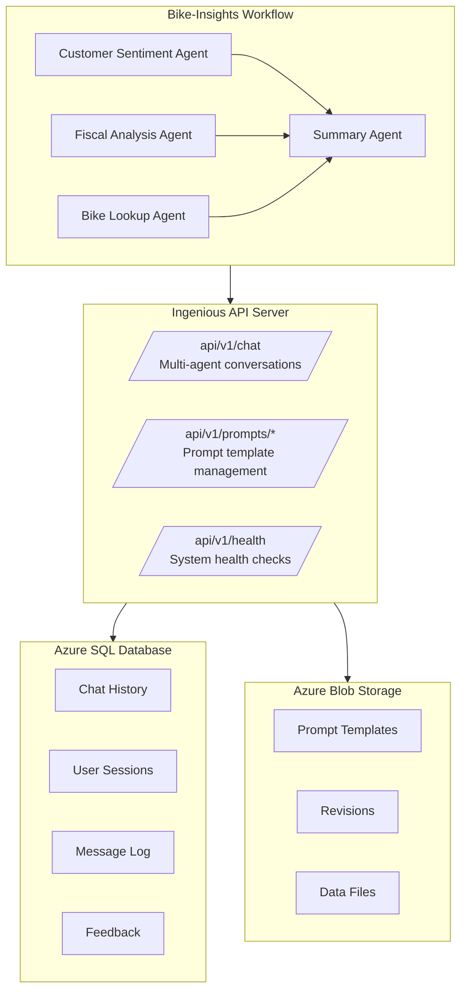

This guide provides step-by-step instructions for deploying the Ingenious bike-insights workflow with full Azure integration, including Azure SQL Database for chat history and Azure Blob Storage for prompt management.

> **Important:** When configuring Azure SQL, always use the connection string from the **ODBC** tab in the Azure Portal. Do **not** use ADO.NET or JDBC connection strings, as these formats are incompatible and will cause connection errors.

##  Overview

This deployment includes:
- **Bike-Insights Workflow**: Multi-agent system with 4 specialized agents
- **Azure SQL Database**: Enterprise-grade chat history storage
- **Azure Blob Storage**: Cloud-based prompt template management
- **API Integration**: Full REST API support for prompts management

##  Prerequisites

### Required Azure Resources
- Azure subscription with sufficient permissions
- Azure SQL Database instance
- Azure Storage Account with Blob service
- Azure OpenAI service with GPT-4 deployment

### Local Development Requirements
- Python 3.13+
- [uv package manager](https://docs.astral.sh/uv/)
- ODBC Driver 18 for SQL Server

##  Step-by-Step Deployment

### Step 1: Install Ingenious Library

```bash
#Install as package
uv add ingenious

# or from your project directory for maximum control
uv pip install -e ./ingenious
```

### Step 2: Initialize Project

```bash
# Initialize with bike-insights template
uv run ingen init
```

This creates:
- `.env.example` - Environment variable template
- `ingenious_extensions/` - Bike-insights workflow

### Step 3: Configure Environment Variables

Copy `.env.example` to `.env` and configure:

```bash
cp .env.example .env
```

Update `.env` with your Azure credentials:

```bash
# =============================================================================
# REQUIRED: Azure OpenAI Configuration
# =============================================================================
# Using nested environment variables format (recommended)
INGENIOUS_MODELS__0__MODEL=gpt-4.1-nano
INGENIOUS_MODELS__0__API_TYPE=rest
INGENIOUS_MODELS__0__API_VERSION=2024-12-01-preview
INGENIOUS_MODELS__0__DEPLOYMENT=your-gpt4-deployment-name
INGENIOUS_MODELS__0__API_KEY=your-azure-openai-api-key-here
INGENIOUS_MODELS__0__BASE_URL=https://your-resource.openai.azure.com/

# =============================================================================
# REQUIRED: Azure SQL Database Configuration
# =============================================================================
INGENIOUS_CHAT_HISTORY__DATABASE_TYPE=azuresql
INGENIOUS_CHAT_HISTORY__DATABASE_NAME=ChatHistory
INGENIOUS_CHAT_HISTORY__DATABASE_CONNECTION_STRING=${AZURE_SQL_CONNECTION_STRING}

# =============================================================================
# REQUIRED: Azure SQL Database Configuration
# =============================================================================
AZURE_SQL_CONNECTION_STRING=Driver={ODBC Driver 18 for SQL Server};Server=tcp:your-server.database.windows.net,1433;Database=your-database;Uid=your-username;Pwd=your-password;Encrypt=yes;TrustServerCertificate=no;Connection Timeout=30;

# =============================================================================
# REQUIRED: Azure Blob Storage Configuration
# =============================================================================
AZURE_STORAGE_CONNECTION_STRING=DefaultEndpointsProtocol=https;AccountName=your-account;AccountKey=your-key;EndpointSuffix=core.windows.net
AZURE_STORAGE_REVISIONS_URL=https://your-account.blob.core.windows.net/
AZURE_STORAGE_DATA_URL=https://your-account.blob.core.windows.net/

# =============================================================================
# OPTIONAL: Web Server Configuration
# =============================================================================
INGENIOUS_WEB_CONFIGURATION__IP_ADDRESS=0.0.0.0
INGENIOUS_WEB_CONFIGURATION__PORT=8080
```

### Step 4: Configure Azure SQL Integration

Add these environment variables to your `.env` file:

```bash
# Azure SQL configuration for chat history
INGENIOUS_CHAT_HISTORY__DATABASE_TYPE=azuresql
INGENIOUS_CHAT_HISTORY__DATABASE_NAME=ChatHistory
INGENIOUS_CHAT_HISTORY__DATABASE_CONNECTION_STRING=${AZURE_SQL_CONNECTION_STRING}
```

### Step 5: Configure Azure Blob Storage Integration

Add these environment variables to your `.env` file:

```bash
# Azure Blob Storage configuration
INGENIOUS_FILE_STORAGE__REVISIONS__ENABLE=true
INGENIOUS_FILE_STORAGE__REVISIONS__STORAGE_TYPE=azure
INGENIOUS_FILE_STORAGE__REVISIONS__CONTAINER_NAME=prompts
INGENIOUS_FILE_STORAGE__REVISIONS__PATH=ingenious-files
INGENIOUS_FILE_STORAGE__REVISIONS__ADD_SUB_FOLDERS=true
INGENIOUS_FILE_STORAGE__REVISIONS__URL=${AZURE_STORAGE_REVISIONS_URL}
INGENIOUS_FILE_STORAGE__REVISIONS__TOKEN=${AZURE_STORAGE_CONNECTION_STRING}
INGENIOUS_FILE_STORAGE__REVISIONS__AUTHENTICATION_METHOD=token

INGENIOUS_FILE_STORAGE__DATA__ENABLE=true
INGENIOUS_FILE_STORAGE__DATA__STORAGE_TYPE=azure
INGENIOUS_FILE_STORAGE__DATA__CONTAINER_NAME=data
INGENIOUS_FILE_STORAGE__DATA__PATH=ingenious-files
INGENIOUS_FILE_STORAGE__DATA__ADD_SUB_FOLDERS=true
INGENIOUS_FILE_STORAGE__DATA__URL=${AZURE_STORAGE_DATA_URL}
INGENIOUS_FILE_STORAGE__DATA__TOKEN=${AZURE_STORAGE_CONNECTION_STRING}
INGENIOUS_FILE_STORAGE__DATA__AUTHENTICATION_METHOD=token
```

> **⚠️ Important Configuration Gotcha**: The Azure files implementation checks for connection strings in the `TOKEN` field, not just the `AZURE_STORAGE_CONNECTION_STRING` environment variable. When using `AUTHENTICATION_METHOD=token`, you **must** set the `TOKEN` field to your Azure Storage connection string. Simply having `AZURE_STORAGE_CONNECTION_STRING` defined is not sufficient - the connection string must be explicitly passed through the `TOKEN` configuration field for each storage container.

### Step 6: Install ODBC Driver (if not already installed)

#### macOS
```bash
brew tap microsoft/mssql-release
brew install msodbcsql18

# Verify installation
odbcinst -q -d | grep "ODBC Driver 18"
```

#### Ubuntu/Debian
```bash
curl https://packages.microsoft.com/keys/microsoft.asc | apt-key add -
curl https://packages.microsoft.com/config/ubuntu/20.04/prod.list > /etc/apt/sources.list.d/mssql-release.list
apt-get update
ACCEPT_EULA=Y apt-get install msodbcsql18
```

### Step 7: Upload Prompt Templates to Azure Blob Storage

#### Option A: Use the Provided Upload Script (Recommended for bike-insights)

For bike-insights workflow, use the dedicated upload script:
```bash
# Ensure server is running first
uv run ingen serve --port 8080 &

# Upload bike-insights templates
uv run python scripts/upload_bike_templates.py
```

#### Option B: Create Custom Setup Script

Create and run this setup script:

```python
# setup_azure_prompts.py
import asyncio
import os
from pathlib import Path
from dotenv import load_dotenv

load_dotenv()

# Environment variables are loaded from .env file

async def setup_azure_prompts():
    from ingenious.dependencies import get_config
    from ingenious.files.files_repository import FileStorage

    config = get_config()
    storage = FileStorage(config, "revisions")

    source_templates = Path("templates/prompts/quickstart-1")

    for template_file in source_templates.glob("*.jinja"):
        content = template_file.read_text()
        await storage.write_file(
            contents=content,
            file_name=template_file.name,
            file_path="templates/prompts/quickstart-1"
        )
        print(f" Uploaded {template_file.name} to Azure Blob Storage")

    files = await storage.list_files("templates/prompts/quickstart-1")
    print(f" Verified {len(files)} files in Azure Blob Storage")

if __name__ == "__main__":
    asyncio.run(setup_azure_prompts())
```

Run the setup:
```bash
uv run python setup_azure_prompts.py
```

### Step 8: Validate Configuration

```bash
# Environment variables are loaded from .env file
uv run ingen validate
```

Expected output:
```
 Insight Ingenious Configuration Validation
1. Environment Variables:
2. Configuration File Validation:
3. Azure OpenAI Connectivity:
4. Workflow Availability:
 All validations passed! Your Ingenious setup is ready.
```

### Step 9: Start the Server

```bash
# Environment variables are loaded from .env file
uv run ingen serve --port 8080
```

### Step 10: Test the Deployment

#### Test Server Health
```bash
curl http://localhost:8080/api/v1/health
```

#### Test Bike-Insights Workflow
```bash
curl -X POST http://localhost:8080/api/v1/chat \
  -H "Content-Type: application/json" \
  -d '{
    "user_prompt": "{\"stores\": [{\"name\": \"Test Store\", \"location\": \"NSW\", \"bike_sales\": [{\"product_code\": \"TEST-001\", \"quantity_sold\": 2, \"sale_date\": \"2024-01-15\", \"year\": 2024, \"month\": \"January\", \"customer_review\": {\"rating\": 4.5, \"comment\": \"Great bike for testing!\"}}], \"bike_stock\": [{\"bike\": {\"brand\": \"TestBrand\", \"model\": \"TestModel\", \"year\": 2024, \"price\": 1299.99, \"battery_capacity\": 0.75, \"motor_power\": 500}, \"quantity\": 5}]}], \"revision_id\": \"test-1\", \"identifier\": \"basic-test\"}",
    "conversation_flow": "bike-insights"
  }'
```

#### Test Prompts API
```bash
# List prompt templates
curl "http://localhost:8080/api/v1/prompts/list/quickstart-1"

# View a prompt template
curl "http://localhost:8080/api/v1/prompts/view/quickstart-1/bike_lookup_agent_prompt.jinja"

# Update a prompt template
curl -X POST "http://localhost:8080/api/v1/prompts/update/quickstart-1/bike_lookup_agent_prompt.jinja" \
  -H "Content-Type: application/json" \
  -d '{"content": "### UPDATED ROLE\nYou are an updated bike lookup agent...\n"}'
```

##  Verification

### Verify Azure SQL Integration
```python
# verify_azure_sql.py
import pyodbc
import os
from dotenv import load_dotenv

load_dotenv()

conn_str = os.getenv('AZURE_SQL_CONNECTION_STRING')
conn = pyodbc.connect(conn_str)
cursor = conn.cursor()

cursor.execute("SELECT COUNT(*) FROM chat_history")
count = cursor.fetchone()[0]
print(f"Messages in chat_history table: {count}")

cursor.execute("SELECT TOP 5 thread_id, content FROM chat_history ORDER BY timestamp DESC")
for row in cursor.fetchall():
    print(f"Thread: {row[0]}, Content: {row[1][:50]}...")

conn.close()
```

### Verify Azure Blob Storage Integration
```python
# verify_azure_blob.py
from azure.storage.blob import BlobServiceClient
import os
from dotenv import load_dotenv

load_dotenv()

blob_service_client = BlobServiceClient.from_connection_string(
    os.getenv('AZURE_STORAGE_CONNECTION_STRING')
)

container_client = blob_service_client.get_container_client("revisions")
blobs = list(container_client.list_blobs(name_starts_with="ingenious-files/templates/prompts/quickstart-1"))

print(f"Found {len(blobs)} prompt templates in Azure Blob Storage:")
for blob in blobs:
    print(f"  - {blob.name}")
```

##  Architecture Overview



##  Production Considerations

### Security
- Use Azure Key Vault for sensitive credentials
- Configure firewall rules for Azure SQL
- Implement least-privilege access policies
- Enable Azure Monitor and logging

### Scaling
- Use Azure SQL Database elastic pools
- Configure Azure Blob Storage with appropriate tiers
- Implement connection pooling
- Consider Azure Container Instances for deployment

### Monitoring
- Set up Azure Application Insights
- Monitor database performance metrics
- Track blob storage usage and costs
- Configure alerts for system health

##  Docker Deployment

The Ingenious project includes production-ready Docker support for deploying to Azure Container Apps or other container orchestration platforms.

### Container Features

The generated Dockerfile includes:
- **Production Base**: Python 3.13 slim image for security and performance
- **Azure SQL Support**: Complete Microsoft ODBC Driver 18 installation
- **Modern Tooling**: uv package manager for fast, reliable dependency management
- **Health Endpoints**: Built-in health checks for container orchestration
- **Security**: Non-root execution and minimal attack surface

### Step 1: Build the Container

After completing the Azure setup above, build your production container:

```bash
# Build the container
docker build -t ingenious-app .

# Verify the build
docker images | grep ingenious-app
```

### Step 2: Test Locally with Docker

Test the container locally before deploying to Azure:

```bash
# Run with your environment file
docker run --env-file .env -p 8080:80 ingenious-app

# Test health endpoint
curl http://localhost:8080/api/v1/health

# Test bike-insights workflow
curl -X POST http://localhost:8080/api/v1/chat \
  -H "Content-Type: application/json" \
  -d '{
    "user_prompt": "{\"stores\": [{\"name\": \"Test Store\", \"location\": \"NSW\", \"bike_sales\": [{\"product_code\": \"TEST-001\", \"quantity_sold\": 2, \"sale_date\": \"2024-01-15\", \"year\": 2024, \"month\": \"January\", \"customer_review\": {\"rating\": 4.5, \"comment\": \"Great bike for testing!\"}}]}], \"revision_id\": \"test-1\", \"identifier\": \"basic-test\"}",
    "conversation_flow": "bike-insights"
  }'
```

### Step 3: Deploy to Azure Container Registry

```bash
# Login to Azure Container Registry
az acr login --name <your-registry>

# Tag for Azure Container Registry
docker tag ingenious-app <your-registry>.azurecr.io/ingenious-app:latest

# Push to registry
docker push <your-registry>.azurecr.io/ingenious-app:latest
```

### Step 4: Deploy to Azure Container Apps

#### Option A: Using Azure CLI

```bash
# Create or update the container app
az containerapp create \
  --resource-group <your-rg> \
  --name ingenious-app \
  --environment <your-environment> \
  --image <your-registry>.azurecr.io/ingenious-app:latest \
  --target-port 80 \
  --ingress external \
  --min-replicas 1 \
  --max-replicas 10 \
  --cpu 1.0 \
  --memory 2Gi \
  --env-vars \
    "INGENIOUS_MODELS__0__API_KEY=secretref:azure-openai-key" \
    "INGENIOUS_MODELS__0__BASE_URL=https://your-openai.openai.azure.com/" \
    "INGENIOUS_MODELS__0__MODEL=gpt-4.1-nano" \
    "INGENIOUS_CHAT_HISTORY__DATABASE_TYPE=azuresql" \
    "INGENIOUS_AZURE_SQL_SERVICES__DATABASE_CONNECTION_STRING=secretref:azure-sql-connection" \
    "INGENIOUS_FILE_STORAGE__REVISIONS__STORAGE_TYPE=azure" \
    "INGENIOUS_FILE_STORAGE__REVISIONS__TOKEN=secretref:azure-storage-token" \
  --secrets \
    "azure-openai-key=<your-openai-key>" \
    "azure-sql-connection=<your-sql-connection>" \
    "azure-storage-token=<your-storage-connection-string>"
```

#### Option B: Using Container Apps YAML

Create `container-app.yaml`:

```yaml
apiVersion: 2022-10-01
location: <your-region>
name: ingenious-app
properties:
  managedEnvironmentId: <your-environment-id>
  configuration:
    ingress:
      external: true
      targetPort: 80
    secrets:
      - name: azure-openai-key
        value: <your-openai-api-key>
      - name: azure-sql-connection
        value: <your-sql-connection-string>
      - name: azure-storage-token
        value: <your-storage-connection-string>
  template:
    containers:
      - name: ingenious-app
        image: <your-registry>.azurecr.io/ingenious-app:latest
        env:
          - name: INGENIOUS_MODELS__0__API_KEY
            secretRef: azure-openai-key
          - name: INGENIOUS_MODELS__0__BASE_URL
            value: "https://your-openai.openai.azure.com/"
          - name: INGENIOUS_MODELS__0__MODEL
            value: "gpt-4.1-nano"
          - name: INGENIOUS_MODELS__0__API_VERSION
            value: "2024-12-01-preview"
          - name: INGENIOUS_MODELS__0__DEPLOYMENT
            value: "your-gpt4-deployment"
          - name: INGENIOUS_MODELS__0__API_TYPE
            value: "rest"
          - name: INGENIOUS_CHAT_HISTORY__DATABASE_TYPE
            value: "azuresql"
          - name: INGENIOUS_AZURE_SQL_SERVICES__DATABASE_CONNECTION_STRING
            secretRef: azure-sql-connection
          - name: INGENIOUS_FILE_STORAGE__REVISIONS__ENABLE
            value: "true"
          - name: INGENIOUS_FILE_STORAGE__REVISIONS__STORAGE_TYPE
            value: "azure"
          - name: INGENIOUS_FILE_STORAGE__REVISIONS__CONTAINER_NAME
            value: "prompts"
          - name: INGENIOUS_FILE_STORAGE__REVISIONS__PATH
            value: "ingenious-files"
          - name: INGENIOUS_FILE_STORAGE__REVISIONS__URL
            value: "https://your-storage.blob.core.windows.net/"
          - name: INGENIOUS_FILE_STORAGE__REVISIONS__TOKEN
            secretRef: azure-storage-token
          - name: INGENIOUS_FILE_STORAGE__REVISIONS__AUTHENTICATION_METHOD
            value: "token"
        resources:
          cpu: 1.0
          memory: 2Gi
    scale:
      minReplicas: 1
      maxReplicas: 10
```

Deploy with:
```bash
az containerapp create --yaml container-app.yaml
```

### Step 5: Configure Health Probes

Azure Container Apps can use the built-in health endpoint for liveness and readiness checks:

```yaml
# Add to your container configuration
probes:
  - type: liveness
    httpGet:
      path: "/api/v1/health"
      port: 80
    initialDelaySeconds: 30
    periodSeconds: 30
  - type: readiness
    httpGet:
      path: "/api/v1/health"
      port: 80
    initialDelaySeconds: 10
    periodSeconds: 10
```

### Step 6: Test the Deployed Container

```bash
# Get the container app URL
az containerapp show --name ingenious-app --resource-group <your-rg> --query "properties.configuration.ingress.fqdn"

# Test health endpoint
curl https://<your-app-url>/api/v1/health

# Test bike-insights workflow
curl -X POST https://<your-app-url>/api/v1/chat \
  -H "Content-Type: application/json" \
  -d '{
    "user_prompt": "{\"stores\": [{\"name\": \"Test Store\", \"location\": \"NSW\", \"bike_sales\": [{\"product_code\": \"TEST-001\", \"quantity_sold\": 2, \"sale_date\": \"2024-01-15\", \"year\": 2024, \"month\": \"January\", \"customer_review\": {\"rating\": 4.5, \"comment\": \"Great bike for testing!\"}}]}], \"revision_id\": \"test-1\", \"identifier\": \"basic-test\"}",
    "conversation_flow": "bike-insights"
  }'
```

### Container Production Checklist

- [ ] Azure Container Registry created and configured
- [ ] Container built and pushed to registry
- [ ] Azure Container Apps environment provisioned
- [ ] Environment secrets configured (OpenAI, SQL, Storage)
- [ ] Network security groups configured for ingress
- [ ] Health check endpoints working
- [ ] Auto-scaling rules defined
- [ ] Monitoring and logging enabled
- [ ] Backup strategies implemented for persistent data
- [ ] Load testing completed

### Container Monitoring

Monitor your containerized deployment with:

```bash
# View container logs
az containerapp logs show --name ingenious-app --resource-group <your-rg>

# Monitor resource usage
az containerapp show --name ingenious-app --resource-group <your-rg> \
  --query "properties.template.containers[0].resources"

# Check scaling metrics
az containerapp revision list --name ingenious-app --resource-group <your-rg>
```

##  Troubleshooting

### Common Issues

**Azure SQL Connection Fails**
- Verify firewall rules allow your IP
- Check connection string format
- Ensure ODBC Driver 18 is installed
- Test connection with SQL Server Management Studio

**Azure Blob Storage Authentication Fails**
- Verify storage account name and key
- Check container names exist
- Ensure connection string format is correct
- Test with Azure Storage Explorer

**Bike-Insights Workflow Errors**
- Check Azure OpenAI API limits
- Verify prompt templates are uploaded
- Review agent configuration in templates
- Check model deployment names match

**Template Missing Error: "The specified blob does not exist"**
This is a common issue when testing the bike-insights workflow with Azure Blob Storage integration. The bike-insights workflow requires specific prompt template files for each agent:

Required templates for `bike-insights` workflow:
- `customer_sentiment_agent_prompt.jinja`
- `fiscal_analysis_agent_prompt.jinja`
- `summary_prompt.jinja`
- `user_proxy_prompt.jinja` (optional, but recommended)
- `bike_lookup_agent_prompt.jinja`

**Solution**: These templates exist in the local installation at `ingenious_extensions_template/templates/prompts/` but need to be copied to Azure Blob Storage for your specific revision ID.

**Quick Fix - Use the Upload Script**:
```bash
# Use the provided script to upload all bike-insights templates
uv run python scripts/upload_bike_templates.py
```

**Manual Fix - Use the prompts API**:
```bash
# Manually upload each template via API
curl -X POST "http://localhost:8080/api/v1/prompts/update/your-revision-id/customer_sentiment_agent_prompt.jinja" \
  -H "Content-Type: application/json" \
  -d '{"content": "### ROLE\n**System Prompt:**\nYou are an AI Customer Sentiment Analyst..."}'

# Repeat for each required template file
```

**Automated Setup**: Use the general setup script in Step 7 to upload all templates at once during initial deployment.

### Docker-Specific Issues

**Container Build Fails with ODBC Driver Errors**
- Ensure you're using the correct Debian version (bookworm/12)
- Check that Microsoft GPG key is properly installed
- Verify internet connectivity during build for package downloads

**Container Starts but Health Check Fails**
- Check that the service is binding to `0.0.0.0:80` (not localhost)
- Verify environment variables are properly passed to container
- Test health endpoint directly: `docker exec <container> curl localhost:80/api/v1/health`

**Azure Container Apps Deployment Issues**
- Verify the container registry is accessible from Azure
- Check that secrets are properly configured and referenced
- Ensure resource limits (CPU/memory) are sufficient for your workload
- Review container logs: `az containerapp logs show --name <app-name> --resource-group <rg>`

**Environment Variables Not Loading**
- Use `docker run --env-file .env` for local testing
- For Azure Container Apps, ensure secrets are correctly mapped to environment variables
- Verify the variable names match exactly (case-sensitive)

**Port Binding Issues**
- Container exposes port 80 internally
- Map to external port with `-p 8080:80` for local testing
- For Azure Container Apps, set `targetPort: 80` in configuration

For additional troubleshooting, see the [main troubleshooting guide](../troubleshooting/README.md).

##  Related Documentation

- [SQL Agent Setup Guide](sql-agent-setup.md)
- [API Integration Guide](api-integration.md)
- [Bike-Insights Workflow Details](../workflows/README.md)

---

*This guide was validated with a complete end-to-end deployment including multi-agent conversations, chat history persistence, and dynamic prompt management.*
