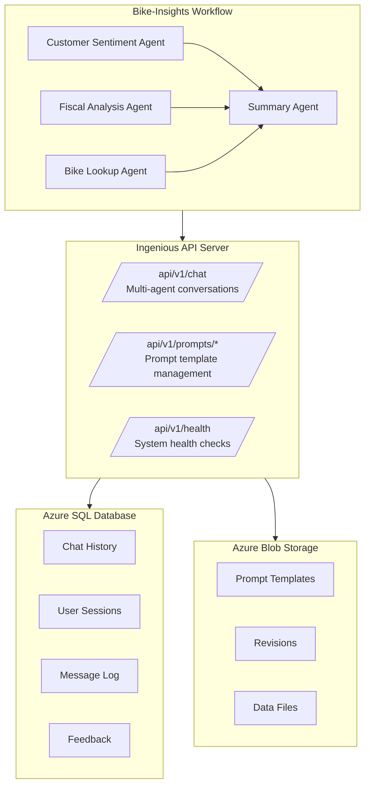

# Complete Azure Deployment Guide for Bike-Insights Workflow

This guide provides step-by-step instructions for deploying the Ingenious bike-insights workflow with full Azure integration, including Azure SQL Database for chat history and Azure Blob Storage for prompt management.

## 🎯 Overview

This deployment includes:
- **Bike-Insights Workflow**: Multi-agent system with 4 specialized agents
- **Azure SQL Database**: Enterprise-grade chat history storage
- **Azure Blob Storage**: Cloud-based prompt template management
- **API Integration**: Full REST API support for prompts management

## 📋 Prerequisites

### Required Azure Resources
- Azure subscription with sufficient permissions
- Azure SQL Database instance
- Azure Storage Account with Blob service
- Azure OpenAI service with GPT-4 deployment

### Local Development Requirements
- Python 3.13+
- [uv package manager](https://docs.astral.sh/uv/)
- ODBC Driver 18 for SQL Server

## 🚀 Step-by-Step Deployment

### Step 1: Install Ingenious Library

```bash
#Install as package
uv add ingenious

# or from your project directory for maximum control
uv pip install -e ./ingenious
```

### Step 2: Initialize Project

```bash
# Initialize with bike-insights template
uv run ingen init
```

This creates:
- `config.yml` - Main configuration file
- `profiles.yml` - Environment-specific settings
- `.env.example` - Environment variable template
- `ingenious_extensions/` - Bike-insights workflow
- `templates/prompts/quickstart-1/` - Prompt templates

### Step 3: Configure Environment Variables

Copy `.env.example` to `.env` and configure:

```bash
cp .env.example .env
```

Update `.env` with your Azure credentials:

```bash
# =============================================================================
# REQUIRED: Azure OpenAI Configuration
# =============================================================================
AZURE_OPENAI_API_KEY=your-azure-openai-api-key-here
AZURE_OPENAI_BASE_URL=https://your-endpoint.cognitiveservices.azure.com/
AZURE_OPENAI_MODEL_NAME=gpt-4.1-nano
AZURE_OPENAI_DEPLOYMENT=gpt-4.1-nano
AZURE_OPENAI_API_VERSION=2024-12-01-preview

# =============================================================================
# REQUIRED: Ingenious Configuration Paths
# =============================================================================
INGENIOUS_PROJECT_PATH=./config.yml
INGENIOUS_PROFILE_PATH=./profiles.yml

# =============================================================================
# REQUIRED: Azure SQL Database Configuration
# =============================================================================
AZURE_SQL_CONNECTION_STRING=Driver={ODBC Driver 18 for SQL Server};Server=tcp:your-server.database.windows.net,1433;Database=your-database;Uid=your-username;Pwd=your-password;Encrypt=yes;TrustServerCertificate=no;Connection Timeout=30;

# =============================================================================
# REQUIRED: Azure Blob Storage Configuration
# =============================================================================
AZURE_STORAGE_CONNECTION_STRING=DefaultEndpointsProtocol=https;AccountName=your-account;AccountKey=your-key;EndpointSuffix=core.windows.net
AZURE_STORAGE_REVISIONS_URL=https://your-account.blob.core.windows.net/
AZURE_STORAGE_DATA_URL=https://your-account.blob.core.windows.net/

# =============================================================================
# OPTIONAL: Web Server Configuration
# =============================================================================
WEB_IP_ADDRESS=0.0.0.0
WEB_PORT=8080
```

### Step 4: Configure Azure SQL Integration

#### Update config.yml

Edit `config.yml` to enable Azure SQL:

```yaml
chat_history:
  database_type: azuresql  # Changed from 'sqlite'
  database_path: ./.tmp/chat_history.db
  database_name: ChatHistory
  memory_path: ./.tmp
```

#### Update profiles.yml

Edit `profiles.yml` to use Azure SQL connection:

```yaml
- name: dev
  # ... other configuration ...
  chat_history:
    database_connection_string: ${AZURE_SQL_CONNECTION_STRING:REQUIRED_SET_IN_ENV}
```

### Step 5: Configure Azure Blob Storage Integration

#### Update config.yml

Edit `config.yml` to enable Azure Blob Storage:

```yaml
file_storage:
  revisions:
    enable: true
    storage_type: azure  # Changed from 'local'
    container_name: revisions
    path: ingenious-files
    add_sub_folders: true
  data:
    enable: true
    storage_type: azure  # Changed from 'local'
    container_name: data
    path: ingenious-files
    add_sub_folders: true
```

#### Update profiles.yml

Edit `profiles.yml` to use Azure Blob Storage:

```yaml
- name: dev
  # ... other configuration ...
  file_storage:
    revisions:
      url: ${AZURE_STORAGE_REVISIONS_URL:https://your-account.blob.core.windows.net}
      token: ${AZURE_STORAGE_CONNECTION_STRING:REQUIRED_SET_IN_ENV}
      authentication_method: "token"
    data:
      url: ${AZURE_STORAGE_DATA_URL:https://your-account.blob.core.windows.net}
      token: ${AZURE_STORAGE_CONNECTION_STRING:REQUIRED_SET_IN_ENV}
      authentication_method: "token"
```

### Step 6: Install ODBC Driver (if not already installed)

#### macOS
```bash
brew tap microsoft/mssql-release
brew install msodbcsql18

# Verify installation
odbcinst -q -d | grep "ODBC Driver 18"
```

#### Ubuntu/Debian
```bash
curl https://packages.microsoft.com/keys/microsoft.asc | apt-key add -
curl https://packages.microsoft.com/config/ubuntu/20.04/prod.list > /etc/apt/sources.list.d/mssql-release.list
apt-get update
ACCEPT_EULA=Y apt-get install msodbcsql18
```

### Step 7: Upload Prompt Templates to Azure Blob Storage

Create and run this setup script:

```python
# setup_azure_prompts.py
import asyncio
import os
from pathlib import Path
from dotenv import load_dotenv

load_dotenv()

os.environ['INGENIOUS_PROJECT_PATH'] = os.path.join(os.getcwd(), 'config.yml')
os.environ['INGENIOUS_PROFILE_PATH'] = os.path.join(os.getcwd(), 'profiles.yml')

async def setup_azure_prompts():
    from ingenious.dependencies import get_config
    from ingenious.files.files_repository import FileStorage

    config = get_config()
    storage = FileStorage(config, "revisions")

    source_templates = Path("templates/prompts/quickstart-1")

    for template_file in source_templates.glob("*.jinja"):
        content = template_file.read_text()
        await storage.write_file(
            contents=content,
            file_name=template_file.name,
            file_path="templates/prompts/quickstart-1"
        )
        print(f"✅ Uploaded {template_file.name} to Azure Blob Storage")

    files = await storage.list_files("templates/prompts/quickstart-1")
    print(f"✅ Verified {len(files)} files in Azure Blob Storage")

if __name__ == "__main__":
    asyncio.run(setup_azure_prompts())
```

Run the setup:
```bash
uv run python setup_azure_prompts.py
```

### Step 8: Validate Configuration

```bash
export INGENIOUS_PROJECT_PATH=$(pwd)/config.yml
export INGENIOUS_PROFILE_PATH=$(pwd)/profiles.yml
uv run ingen validate
```

Expected output:
```
✅ Insight Ingenious Configuration Validation
1. Environment Variables: ✅
2. Configuration File Validation: ✅
3. Azure OpenAI Connectivity: ✅
4. Workflow Availability: ✅
✅ All validations passed! Your Ingenious setup is ready.
```

### Step 9: Start the Server

```bash
export INGENIOUS_PROJECT_PATH=$(pwd)/config.yml
export INGENIOUS_PROFILE_PATH=$(pwd)/profiles.yml
uv run ingen serve --port 8080
```

### Step 10: Test the Deployment

#### Test Server Health
```bash
curl http://localhost:8080/api/v1/health
```

#### Test Bike-Insights Workflow
```bash
curl -X POST http://localhost:8080/api/v1/chat \
  -H "Content-Type: application/json" \
  -d '{
    "user_prompt": "{\"stores\": [{\"name\": \"Test Store\", \"location\": \"NSW\", \"bike_sales\": [{\"product_code\": \"TEST-001\", \"quantity_sold\": 2, \"sale_date\": \"2024-01-15\", \"year\": 2024, \"month\": \"January\", \"customer_review\": {\"rating\": 4.5, \"comment\": \"Great bike for testing!\"}}], \"bike_stock\": [{\"bike\": {\"brand\": \"TestBrand\", \"model\": \"TestModel\", \"year\": 2024, \"price\": 1299.99, \"battery_capacity\": 0.75, \"motor_power\": 500}, \"quantity\": 5}]}], \"revision_id\": \"test-1\", \"identifier\": \"basic-test\"}",
    "conversation_flow": "bike-insights"
  }'
```

#### Test Prompts API
```bash
# List prompt templates
curl "http://localhost:8080/api/v1/prompts/list/quickstart-1"

# View a prompt template
curl "http://localhost:8080/api/v1/prompts/view/quickstart-1/bike_lookup_agent_prompt.jinja"

# Update a prompt template
curl -X POST "http://localhost:8080/api/v1/prompts/update/quickstart-1/bike_lookup_agent_prompt.jinja" \
  -H "Content-Type: application/json" \
  -d '{"content": "### UPDATED ROLE\nYou are an updated bike lookup agent...\n"}'
```

## 🔍 Verification

### Verify Azure SQL Integration
```python
# verify_azure_sql.py
import pyodbc
import os
from dotenv import load_dotenv

load_dotenv()

conn_str = os.getenv('AZURE_SQL_CONNECTION_STRING')
conn = pyodbc.connect(conn_str)
cursor = conn.cursor()

cursor.execute("SELECT COUNT(*) FROM chat_history")
count = cursor.fetchone()[0]
print(f"Messages in chat_history table: {count}")

cursor.execute("SELECT TOP 5 thread_id, content FROM chat_history ORDER BY timestamp DESC")
for row in cursor.fetchall():
    print(f"Thread: {row[0]}, Content: {row[1][:50]}...")

conn.close()
```

### Verify Azure Blob Storage Integration
```python
# verify_azure_blob.py
from azure.storage.blob import BlobServiceClient
import os
from dotenv import load_dotenv

load_dotenv()

blob_service_client = BlobServiceClient.from_connection_string(
    os.getenv('AZURE_STORAGE_CONNECTION_STRING')
)

container_client = blob_service_client.get_container_client("revisions")
blobs = list(container_client.list_blobs(name_starts_with="ingenious-files/templates/prompts/quickstart-1"))

print(f"Found {len(blobs)} prompt templates in Azure Blob Storage:")
for blob in blobs:
    print(f"  - {blob.name}")
```

## 🎯 Architecture Overview



## 🔧 Production Considerations

### Security
- Use Azure Key Vault for sensitive credentials
- Configure firewall rules for Azure SQL
- Implement least-privilege access policies
- Enable Azure Monitor and logging

### Scaling
- Use Azure SQL Database elastic pools
- Configure Azure Blob Storage with appropriate tiers
- Implement connection pooling
- Consider Azure Container Instances for deployment

### Monitoring
- Set up Azure Application Insights
- Monitor database performance metrics
- Track blob storage usage and costs
- Configure alerts for system health

## 🐛 Troubleshooting

### Common Issues

**Azure SQL Connection Fails**
- Verify firewall rules allow your IP
- Check connection string format
- Ensure ODBC Driver 18 is installed
- Test connection with SQL Server Management Studio

**Azure Blob Storage Authentication Fails**
- Verify storage account name and key
- Check container names exist
- Ensure connection string format is correct
- Test with Azure Storage Explorer

**Bike-Insights Workflow Errors**
- Check Azure OpenAI API limits
- Verify prompt templates are uploaded
- Review agent configuration in templates
- Check model deployment names match

For additional troubleshooting, see the [main troubleshooting guide](../troubleshooting/README.md).

## 📚 Related Documentation

- [Azure SQL Setup Guide](azure-sql-setup.md)
- [Azure Blob Storage Setup Guide](azure-blob-storage-setup.md)
- [API Integration Guide](api-integration.md)
- [Bike-Insights Workflow Details](../workflows/README.md)

---

*This guide was validated with a complete end-to-end deployment including multi-agent conversations, chat history persistence, and dynamic prompt management.*
