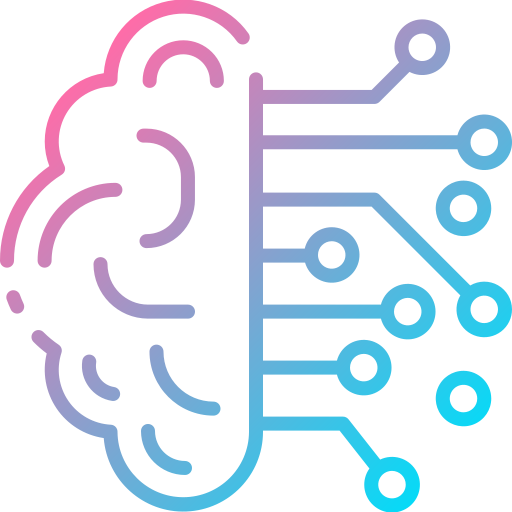

# Home

<strong><em>"Accelerating time-to-value for Generative AI Projects."</em></strong>

    

Welcome to the Insight Services APAC documentation. This guide is designed to assist you in developing and deploying Generative AI projects with ease. Our goal is to provide a clear roadmap to help you accelerate time-to-value, with a strong emphasis on achieving business outcomes and implementing production-ready architectures.

## Key Technologies

- **[Microsoft Autogen](https://microsoft.github.io/autogen/)** – A robust orchestration framework designed to streamline the creation and deployment of multi-agent Generative AI systems.

- **[Chainlit](https://docs.chainlit.io/get-started/overview)** – A framework for developing and deploying multi-agent systems with a focus on ease of use and rapid prototyping.

## Highlight

The accelerator is designed to speed up the development of Generative AI applications by utilizing prebuilt agent patterns. 
These patterns offer a robust foundation for rapid, efficient, and scalable AI project creation. With these patterns, you can:

- **Reduce development time** by utilizing ready-made templates for common AI use cases, minimizing the need for custom code.
- **Ensure consistency** across different AI projects with standardized architectures that promote best practices.
- **Facilitate rapid prototyping** of multi-agent systems with reusable components that integrate seamlessly into production environments.
- **Enhance scalability** by following patterns optimized for large-scale deployment, allowing for easy expansion as your project grows.
- **Focus on business outcomes** with pre-configured industry-specific conversation patterns, enabling you to tailor AI solutions to meet domain-specific requirements quickly.

By using these prefab patterns, your team can move from concept to deployment faster, without compromising on the quality or robustness of the solution.

## Development Log

Stay updated with ongoing development and feature enhancements by checking our [development log](./about/release_notes).

## Need Help?

For any assistance or to report an issue, please lodge a Git issue so our team can address your concerns promptly.

Explore the documentation to get started on your AI journey and accelerate time-to-value for your Generative AI projects!