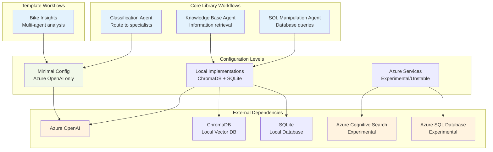
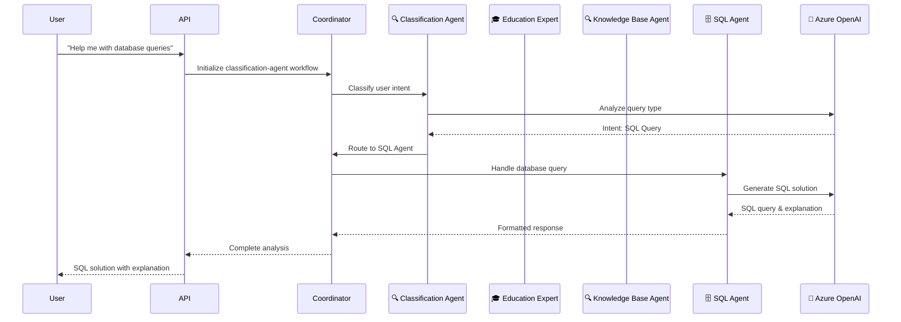
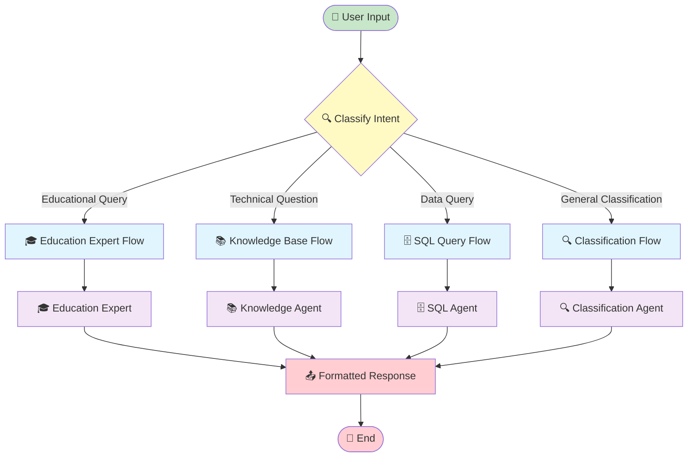
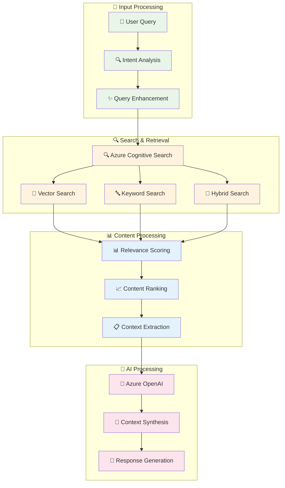
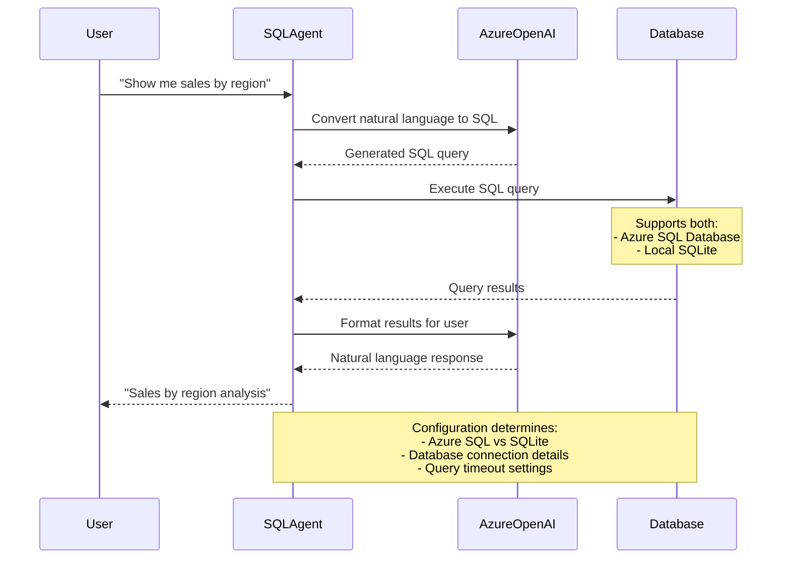
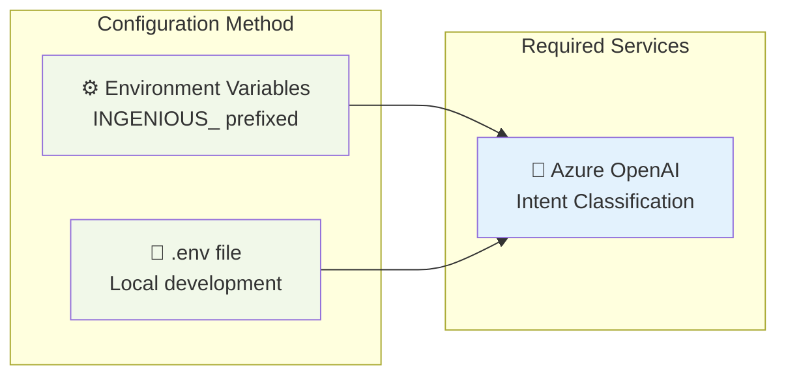
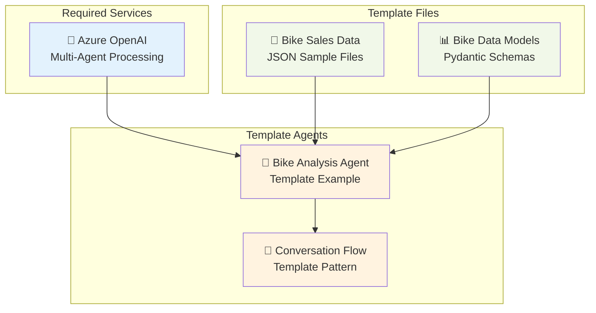
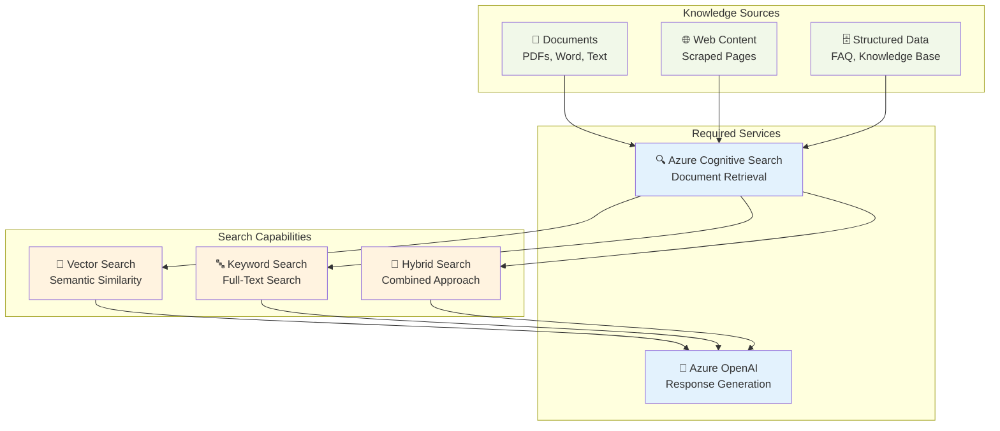
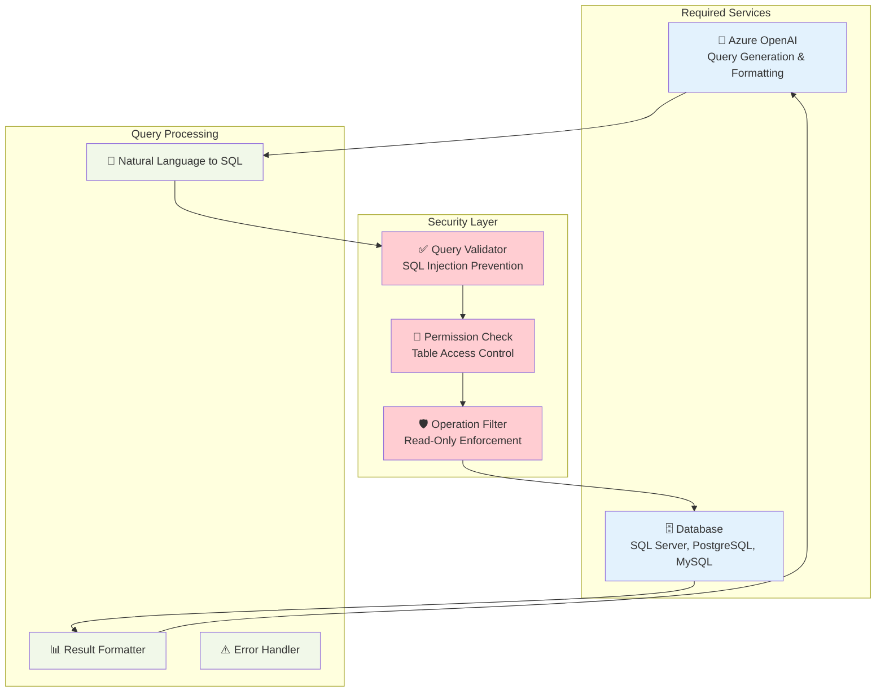

# Workflow Configuration Requirements

This guide outlines the configuration requirements for each conversation workflow in Insight Ingenious - an enterprise-grade Python library for AI agent APIs. Understanding these requirements will help you determine what Microsoft Azure services and configurations are needed for each workflow, along with available debugging and customization options.

## Workflow Architecture Overview



## Core vs Template Workflows

### Core Library Workflows
These workflows are built into the Insight Ingenious core library and are always available:
- **classification-agent** - Routes user queries to appropriate specialized agents
- **knowledge-base-agent** - Searches and retrieves information from knowledge bases
- **sql-manipulation-agent** - Executes SQL queries based on natural language

### Template Workflows
These workflows are provided as examples in the `ingenious_extensions_template` when you run `ingen init`:
- **bike-insights** - Multi-agent bike sales analysis (the "Hello World" example)

**Important**: Template workflows like `bike-insights` are only available in projects created with `ingen init`, not in the core library.

## Implementation Stability Guide

### ✅ Stable & Recommended
- **Local ChromaDB** (knowledge-base-agent): Stable vector database for knowledge search
- **Local SQLite** (sql-manipulation-agent): Stable database for SQL queries
- **Azure OpenAI**: Stable across all workflows

### ⚠️ Experimental (May contain bugs)
- **Azure Cognitive Search** (knowledge-base-agent): Experimental alternative to ChromaDB
- **Azure SQL Database** (sql-manipulation-agent): Experimental alternative to SQLite

**Recommendation**: Use local implementations (ChromaDB + SQLite) for stable production deployments.

## Detailed Workflow Flows

### 🔍 Classification Agent Workflow



### 🔍 Classification Agent Workflow Flow



### 🔍 Knowledge Base Workflow



### 🗄️ SQL Manipulation Workflow



## Configuration Requirements by Workflow

### ✅ Core Library Workflows (Azure OpenAI only)

These workflows are included in the core library and only require basic Azure OpenAI configuration:

#### 🔍 Classification Agent
Routes input to specialized agents based on content analysis.



**Required Configuration:**
```bash
# Environment variables for classification agent
INGENIOUS_PROFILE=dev
INGENIOUS_MODELS__0__MODEL=gpt-4o-mini
INGENIOUS_MODELS__0__API_TYPE=rest
INGENIOUS_MODELS__0__API_VERSION=2024-08-01-preview
INGENIOUS_MODELS__0__API_KEY=your-api-key
INGENIOUS_MODELS__0__BASE_URL=https://your-resource.openai.azure.com/openai/deployments/gpt-4o-mini/chat/completions?api-version=2024-08-01-preview
INGENIOUS_CHAT_SERVICE__TYPE=multi_agent
```

### ⭐ Template-Based Workflows (Azure OpenAI only)

#### 🚴 Bike Insights ("Hello World" Template)
Sample domain-specific workflow for bike sales analysis. Available in the `ingenious_extensions_template` when you run `ingen init`.

> **Note:** This workflow exists as a template example in `ingenious_extensions_template/`, not as a core workflow. It demonstrates how to build custom domain-specific workflows.



### 🔍 Core Library Workflows (Local Implementation - Stable)

#### 📚 Knowledge Base Agent
Search and retrieve information from knowledge bases using local ChromaDB (stable) or Azure Search (experimental).



**Additional Configuration Required:**
```bash
# Azure Search configuration (experimental)
INGENIOUS_AZURE_SEARCH_SERVICES__0__SERVICE=default
INGENIOUS_AZURE_SEARCH_SERVICES__0__ENDPOINT=https://your-search-service.search.windows.net
INGENIOUS_AZURE_SEARCH_SERVICES__0__KEY=your-search-api-key
```

> **Note**: The local ChromaDB implementation is recommended and requires no additional configuration.

### 📊 Core Library Workflows (Database Required)

#### 🗄️ SQL Manipulation Agent
Execute SQL queries on Azure SQL or local databases.



**Additional Configuration Required:**

**Local SQLite (Recommended):**
```bash
# Local SQLite configuration
INGENIOUS_LOCAL_SQL_DB__DATABASE_PATH=/tmp/sample_sql_db
INGENIOUS_LOCAL_SQL_DB__SAMPLE_CSV_PATH=./data/your_data.csv
INGENIOUS_LOCAL_SQL_DB__SAMPLE_DATABASE_NAME=sample_sql_db
```

**Azure SQL (Experimental):**
```bash
# Azure SQL configuration
INGENIOUS_AZURE_SQL_SERVICES__DATABASE_NAME=your-database-name
INGENIOUS_AZURE_SQL_SERVICES__TABLE_NAME=your-table-name
INGENIOUS_AZURE_SQL_SERVICES__DATABASE_CONNECTION_STRING="Driver={ODBC Driver 18 for SQL Server};Server=tcp:your-server.database.windows.net,1433;Database=your-database;Uid=your-username;Pwd=your-password;Encrypt=yes;TrustServerCertificate=no;Connection Timeout=30;"
```

> **Note**: The local SQLite implementation is recommended for stability.

## Workflow Selection Guide

### 🎯 Choosing the Right Workflow

```mermaid
flowchart TD
    START([🤔 What do you want to do?]) --> DECISION{Choose your use case}

    DECISION -->|Route user queries<br/>to different specialists| CLASSIFICATION[🔍 Classification Agent]
    DECISION -->|Analyze business data<br/>with multiple perspectives| BIKE_INSIGHTS[🚴 Bike Insights<br/>(Template only)]
    DECISION -->|Search through<br/>documents and knowledge| KNOWLEDGE[📚 Knowledge Base Agent]
    DECISION -->|Query databases<br/>with natural language| SQL[🗄️ SQL Manipulation]

    CLASSIFICATION --> SETUP_MINIMAL[⚙️ Minimal Setup<br/>Azure OpenAI only]
    BIKE_INSIGHTS --> SETUP_MINIMAL

    KNOWLEDGE --> SETUP_SEARCH[🔍 Search Setup<br/>+ Azure Cognitive Search]

    SQL --> SETUP_DATABASE[🗄️ Database Setup<br/>+ Database Connection]

    SETUP_MINIMAL --> READY[✅ Ready to Use]
    SETUP_SEARCH --> READY
    SETUP_DATABASE --> READY

    classDef start fill:#c8e6c9
    classDef decision fill:#fff9c4
    classDef workflow fill:#e1f5fe
    classDef setup fill:#f3e5f5
    classDef ready fill:#dcedc8

    class START start
    class DECISION decision
    class CLASSIFICATION,BIKE_INSIGHTS,KNOWLEDGE,SQL workflow
    class SETUP_MINIMAL,SETUP_SEARCH,SETUP_DATABASE setup
    class READY ready
```

## Next Steps

1. **📖 Choose Your Workflow**: Select the workflow that best fits your use case
2. **⚙️ Configure Services**: Set up the required Azure services and configuration
3. **🧪 Test Setup**: Validate your configuration with sample queries
4. **🚀 Deploy**: Launch your workflow in your preferred environment
5. **📊 Monitor**: Track performance and optimize as needed

For detailed setup instructions, see:
- [Configuration Guide](/configuration/) - Complete setup instructions
- [Getting Started](/getting-started/) - Quick start tutorial
- [Development Guide](/development/) - Advanced customization
- [API Documentation](/api/) - Integration details
