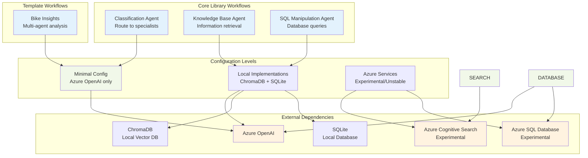

# Workflow Configuration Requirements

This guide outlines the configuration requirements for each conversation workflow in Insight Ingenious - an enterprise-grade Python library for AI agent APIs. Understanding these requirements will help you determine what Microsoft Azure services and configurations are needed for each workflow, along with available debugging and customization options.

## Workflow Architecture Overview



## Core vs Template Workflows

### Core Library Workflows
These workflows are built into the Insight Ingenious core library and are always available:
- **classification-agent** - Routes user queries to appropriate specialized agents
- **knowledge-base-agent** - Searches and retrieves information from knowledge bases
- **sql-manipulation-agent** - Executes SQL queries based on natural language

### Template Workflows
These workflows are provided as examples in the `ingenious_extensions_template` when you run `ingen init`:
- **bike-insights** - Multi-agent bike sales analysis (the "Hello World" example)

**Important**: Template workflows like `bike-insights` are only available in projects created with `ingen init`, not in the core library.

## Detailed Workflow Flows

### 🔍 Classification Agent Workflow

```mermaid
sequenceDiagram
    participant User
    participant API
    participant Coordinator
    participant ClassificationAgent as 🔍 Classification Agent
    participant EducationAgent as 🎓 Education Expert
    participant KnowledgeAgent as 🔍 Knowledge Base Agent
    participant SQLAgent as 🗄️ SQL Agent
    participant AzureOpenAI as 🧠 Azure OpenAI

    User->>API: "Help me with database queries"
    API->>Coordinator: Initialize classification-agent workflow

    Coordinator->>ClassificationAgent: Classify user intent
    ClassificationAgent->>AzureOpenAI: Analyze query type
    AzureOpenAI-->>ClassificationAgent: Intent: SQL Query

    ClassificationAgent->>Coordinator: Route to SQL Agent
    Coordinator->>SQLAgent: Handle database query
    SQLAgent->>AzureOpenAI: Generate SQL solution
    AzureOpenAI-->>SQLAgent: SQL query & explanation

    SQLAgent-->>Coordinator: Formatted response
    Coordinator-->>API: Complete analysis
    API-->>User: SQL solution with explanation
```



### 🔍 Classification Agent Workflow Flow

```mermaid
flowchart TD
    START([👤 User Input]) --> CLASSIFY{🔍 Classify Intent}

    CLASSIFY -->|Educational Query| EDUCATION_FLOW[🎓 Education Expert Flow]
    CLASSIFY -->|Technical Question| KNOWLEDGE_FLOW[📚 Knowledge Base Flow]
    CLASSIFY -->|Data Query| SQL_FLOW[🗄️ SQL Query Flow]
    CLASSIFY -->|General Classification| CLASSIFICATION_FLOW[🔍 Classification Flow]

    EDUCATION_FLOW --> EDUCATION_AGENT[🎓 Education Expert]
    KNOWLEDGE_FLOW --> KNOWLEDGE_AGENT[📚 Knowledge Agent]
    SQL_FLOW --> SQL_AGENT[🗄️ SQL Agent]
    CLASSIFICATION_FLOW --> CLASSIFICATION_AGENT[🔍 Classification Agent]

    EDUCATION_AGENT --> RESPONSE[📤 Formatted Response]
    KNOWLEDGE_AGENT --> RESPONSE
    SQL_AGENT --> RESPONSE
    CLASSIFICATION_AGENT --> RESPONSE

    RESPONSE --> FINISH([🏁 End])

    classDef start fill:#c8e6c9
    classDef decision fill:#fff9c4
    classDef workflow fill:#e1f5fe
    classDef agent fill:#f3e5f5
    classDef finish fill:#ffcdd2

    class START start
    class CLASSIFY decision
    class EDUCATION_FLOW,KNOWLEDGE_FLOW,SQL_FLOW,CLASSIFICATION_FLOW workflow
    class EDUCATION_AGENT,KNOWLEDGE_AGENT,SQL_AGENT,CLASSIFICATION_AGENT agent
    class RESPONSE,FINISH finish
```



### 🔍 Knowledge Base Workflow

```mermaid
graph TB
    subgraph "📝 Input Processing"
        USER_QUERY[👤 User Query]
        INTENT_ANALYSIS[🔍 Intent Analysis]
        QUERY_ENHANCEMENT[✨ Query Enhancement]
    end

    subgraph "🔍 Search & Retrieval"
        AZURE_SEARCH[🔍 Azure Cognitive Search]
        VECTOR_SEARCH[🎯 Vector Search]
        KEYWORD_SEARCH[🔤 Keyword Search]
        HYBRID_SEARCH[🔀 Hybrid Search]
    end

    subgraph "📊 Content Processing"
        RELEVANCE_SCORING[📊 Relevance Scoring]
        CONTENT_RANKING[📈 Content Ranking]
        CONTEXT_EXTRACTION[📋 Context Extraction]
    end

    subgraph "🧠 AI Processing"
        AZURE_OPENAI[🧠 Azure OpenAI]
        CONTEXT_SYNTHESIS[🔗 Context Synthesis]
        RESPONSE_GENERATION[📝 Response Generation]
    end

    USER_QUERY --> INTENT_ANALYSIS
    INTENT_ANALYSIS --> QUERY_ENHANCEMENT
    QUERY_ENHANCEMENT --> AZURE_SEARCH

    AZURE_SEARCH --> VECTOR_SEARCH
    AZURE_SEARCH --> KEYWORD_SEARCH
    AZURE_SEARCH --> HYBRID_SEARCH

    VECTOR_SEARCH --> RELEVANCE_SCORING
    KEYWORD_SEARCH --> RELEVANCE_SCORING
    HYBRID_SEARCH --> RELEVANCE_SCORING

    RELEVANCE_SCORING --> CONTENT_RANKING
    CONTENT_RANKING --> CONTEXT_EXTRACTION
    CONTEXT_EXTRACTION --> AZURE_OPENAI

    AZURE_OPENAI --> CONTEXT_SYNTHESIS
    CONTEXT_SYNTHESIS --> RESPONSE_GENERATION

    classDef input fill:#e8f5e8
    classDef search fill:#fff3e0
    classDef processing fill:#e3f2fd
    classDef ai fill:#fce4ec

    class USER_QUERY,INTENT_ANALYSIS,QUERY_ENHANCEMENT input
    class AZURE_SEARCH,VECTOR_SEARCH,KEYWORD_SEARCH,HYBRID_SEARCH search
    class RELEVANCE_SCORING,CONTENT_RANKING,CONTEXT_EXTRACTION processing
    class AZURE_OPENAI,CONTEXT_SYNTHESIS,RESPONSE_GENERATION ai
```



### 🗄️ SQL Manipulation Workflow


## Configuration Requirements by Workflow

### ✅ Core Library Workflows (Azure OpenAI only)

These workflows are included in the core library and only require basic Azure OpenAI configuration:

#### 🔍 Classification Agent
Routes input to specialized agents based on content analysis.

```mermaid
graph LR
    subgraph "Required Services"
        AZURE_OPENAI[🧠 Azure OpenAI<br/>Intent Classification]
    end

    subgraph "Configuration Files"
        CONFIG[📄 config.yml<br/>Model Settings]
        PROFILES[🔐 profiles.yml<br/>API Keys]
    end

    CONFIG --> AZURE_OPENAI
    PROFILES --> AZURE_OPENAI

    classDef service fill:#e3f2fd
    classDef config fill:#f1f8e9

    class AZURE_OPENAI service
    class CONFIG,PROFILES config
```



**Required Configuration:**
```yaml
# config.yml
profile: dev
models:
  - model: "gpt-4.1-nano"
    api_type: azure
    api_version: "2024-12-01-preview"

# profiles.yml
dev:
  azure_openai:
    endpoint: "https://your-resource.cognitiveservices.azure.com/"
    api_key: "your-api-key"
```

### ⭐ Template-Based Workflows (Azure OpenAI only)

#### 🚴 Bike Insights ("Hello World" Template)
Sample domain-specific workflow for bike sales analysis. Available in the `ingenious_extensions_template` when you run `ingen init`.

> **Note:** This workflow exists as a template example in `ingenious_extensions_template/`, not as a core workflow. It demonstrates how to build custom domain-specific workflows.

```mermaid
graph TB
    subgraph "Required Services"
        AZURE_OPENAI[🧠 Azure OpenAI\nMulti-Agent Processing]
    end

    subgraph "Template Files"
        BIKE_DATA[🚴 Bike Sales Data\nJSON Sample Files]
        BIKE_MODELS[📊 Bike Data Models\nPydantic Schemas]
    end

    subgraph "Template Agents"
        BIKE_AGENT[🚴 Bike Analysis Agent\nTemplate Example]
        AGENT_FLOW[🔄 Conversation Flow\nTemplate Pattern]
    end

    AZURE_OPENAI --> BIKE_AGENT
    BIKE_DATA --> BIKE_AGENT
    BIKE_MODELS --> BIKE_AGENT
    BIKE_AGENT --> AGENT_FLOW

    classDef service fill:#e3f2fd
    classDef template fill:#f1f8e9
    classDef agent fill:#fff3e0

    class AZURE_OPENAI service
    class BIKE_DATA,BIKE_MODELS template
    class BIKE_AGENT,AGENT_FLOW agent
```



### 🔍 Core Library Workflows (Azure Search Required)

#### 📚 Knowledge Base Agent
Search and retrieve information from knowledge bases.

```mermaid
graph TB
    subgraph "Required Services"
        AZURE_OPENAI[🧠 Azure OpenAI<br/>Response Generation]
        AZURE_SEARCH[🔍 Azure Cognitive Search<br/>Document Retrieval]
    end

    subgraph "Knowledge Sources"
        DOCUMENTS[📄 Documents<br/>PDFs, Word, Text]
        WEBSITES[🌐 Web Content<br/>Scraped Pages]
        DATABASES[🗄️ Structured Data<br/>FAQ, Knowledge Base]
    end

    subgraph "Search Capabilities"
        VECTOR_SEARCH[🎯 Vector Search<br/>Semantic Similarity]
        KEYWORD_SEARCH[🔤 Keyword Search<br/>Full-Text Search]
        HYBRID_SEARCH[🔀 Hybrid Search<br/>Combined Approach]
    end

    DOCUMENTS --> AZURE_SEARCH
    WEBSITES --> AZURE_SEARCH
    DATABASES --> AZURE_SEARCH

    AZURE_SEARCH --> VECTOR_SEARCH
    AZURE_SEARCH --> KEYWORD_SEARCH
    AZURE_SEARCH --> HYBRID_SEARCH

    VECTOR_SEARCH --> AZURE_OPENAI
    KEYWORD_SEARCH --> AZURE_OPENAI
    HYBRID_SEARCH --> AZURE_OPENAI

    classDef service fill:#e3f2fd
    classDef source fill:#f1f8e9
    classDef search fill:#fff3e0

    class AZURE_OPENAI,AZURE_SEARCH service
    class DOCUMENTS,WEBSITES,DATABASES source
    class VECTOR_SEARCH,KEYWORD_SEARCH,HYBRID_SEARCH search
```



**Additional Configuration Required:**
```yaml
# config.yml (additional)
azure_search:
  service_name: "your-search-service"
  index_name: "your-knowledge-index"
  api_version: "2023-11-01"

# profiles.yml (additional)
dev:
  azure_search:
    api_key: "your-search-api-key"
```

### 📊 Core Library Workflows (Database Required)

#### 🗄️ SQL Manipulation Agent
Execute SQL queries on Azure SQL or local databases.

```mermaid
graph TB
    subgraph "Required Services"
        AZURE_OPENAI[🧠 Azure OpenAI<br/>Query Generation & Formatting]
        DATABASE[🗄️ Database<br/>SQL Server, PostgreSQL, MySQL]
    end

    subgraph "Security Layer"
        QUERY_VALIDATOR[✅ Query Validator<br/>SQL Injection Prevention]
        PERMISSION_CHECK[🔐 Permission Check<br/>Table Access Control]
        OPERATION_FILTER[🛡️ Operation Filter<br/>Read-Only Enforcement]
    end

    subgraph "Query Processing"
        NL_TO_SQL[🔄 Natural Language to SQL]
        RESULT_FORMATTER[📊 Result Formatter]
        ERROR_HANDLER[⚠️ Error Handler]
    end

    AZURE_OPENAI --> NL_TO_SQL
    NL_TO_SQL --> QUERY_VALIDATOR
    QUERY_VALIDATOR --> PERMISSION_CHECK
    PERMISSION_CHECK --> OPERATION_FILTER
    OPERATION_FILTER --> DATABASE
    DATABASE --> RESULT_FORMATTER
    RESULT_FORMATTER --> AZURE_OPENAI

    classDef service fill:#e3f2fd
    classDef security fill:#ffcdd2
    classDef processing fill:#f1f8e9

    class AZURE_OPENAI,DATABASE service
    class QUERY_VALIDATOR,PERMISSION_CHECK,OPERATION_FILTER security
    class NL_TO_SQL,RESULT_FORMATTER,ERROR_HANDLER processing
```



**Additional Configuration Required:**
```yaml
# config.yml (additional)
database:
  type: "azure_sql"  # or "postgresql", "mysql", "sqlite"
  server: "your-server.database.windows.net"
  database: "your-database-name"
  driver: "ODBC Driver 18 for SQL Server"

# profiles.yml (additional)
dev:
  database:
    username: "your-username"
    password: "your-password"
    # Or use connection string:
    # connection_string: "your-full-connection-string"
```

## Workflow Selection Guide

### 🎯 Choosing the Right Workflow

```mermaid
flowchart TD
    START([🤔 What do you want to do?]) --> DECISION{Choose your use case}

    DECISION -->|Route user queries<br/>to different specialists| CLASSIFICATION[🔍 Classification Agent]
    DECISION -->|Analyze business data<br/>with multiple perspectives| BIKE_INSIGHTS[🚴 Bike Insights<br/>(Template only)]
    DECISION -->|Search through<br/>documents and knowledge| KNOWLEDGE[📚 Knowledge Base Agent]
    DECISION -->|Query databases<br/>with natural language| SQL[🗄️ SQL Manipulation]

    CLASSIFICATION --> SETUP_MINIMAL[⚙️ Minimal Setup<br/>Azure OpenAI only]
    BIKE_INSIGHTS --> SETUP_MINIMAL

    KNOWLEDGE --> SETUP_SEARCH[🔍 Search Setup<br/>+ Azure Cognitive Search]

    SQL --> SETUP_DATABASE[🗄️ Database Setup<br/>+ Database Connection]

    SETUP_MINIMAL --> READY[✅ Ready to Use]
    SETUP_SEARCH --> READY
    SETUP_DATABASE --> READY

    classDef start fill:#c8e6c9
    classDef decision fill:#fff9c4
    classDef workflow fill:#e1f5fe
    classDef setup fill:#f3e5f5
    classDef ready fill:#dcedc8

    class START start
    class DECISION decision
    class CLASSIFICATION,BIKE_INSIGHTS,KNOWLEDGE,SQL workflow
    class SETUP_MINIMAL,SETUP_SEARCH,SETUP_DATABASE setup
    class READY ready
```

## Next Steps

1. **📖 Choose Your Workflow**: Select the workflow that best fits your use case
2. **⚙️ Configure Services**: Set up the required Azure services and configuration
3. **🧪 Test Setup**: Validate your configuration with sample queries
4. **🚀 Deploy**: Launch your workflow in your preferred environment
5. **📊 Monitor**: Track performance and optimize as needed

For detailed setup instructions, see:
- [Configuration Guide](/configuration/) - Complete setup instructions
- [Getting Started](/getting-started/) - Quick start tutorial
- [Development Guide](/development/) - Advanced customization
- [API Documentation](/api/) - Integration details
