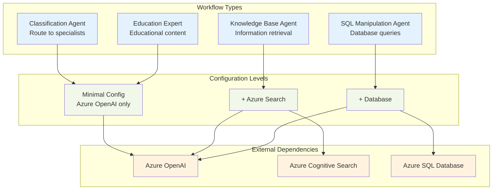
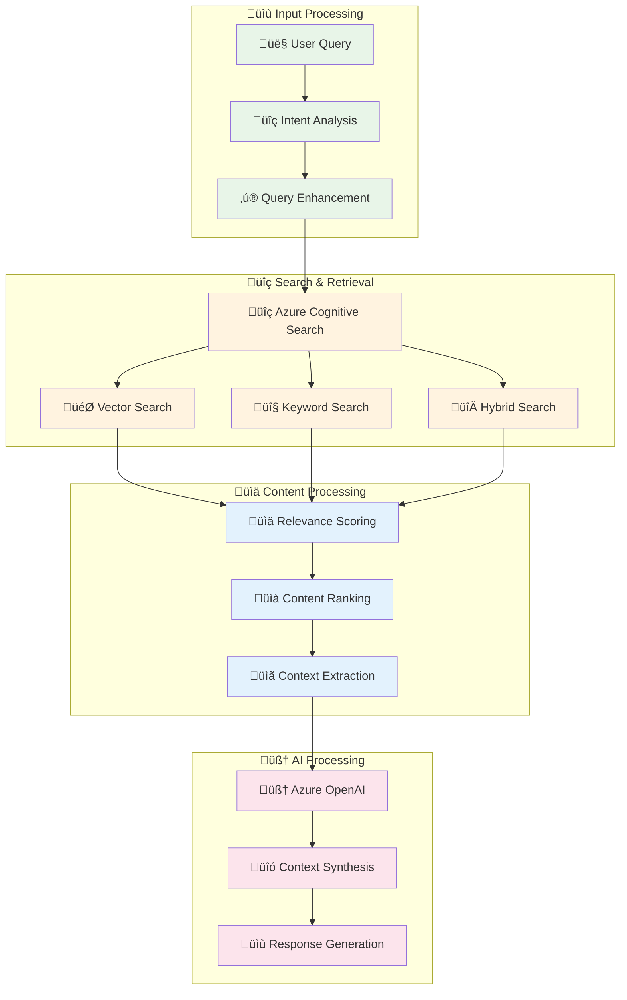
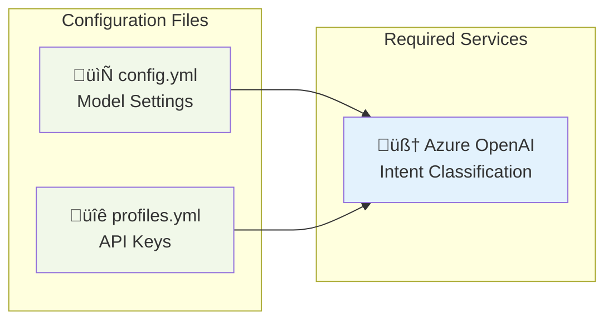
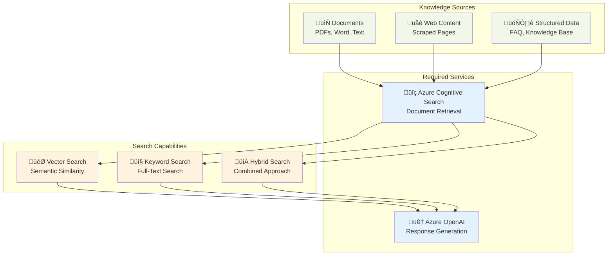
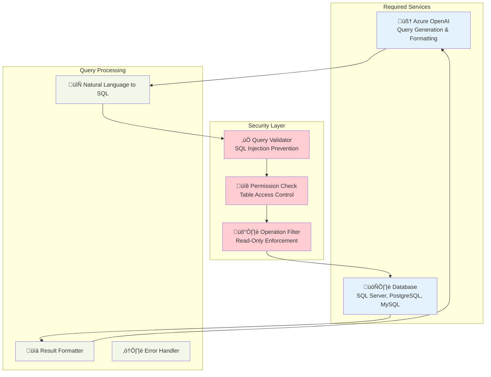

# Workflow Configuration Requirements

This guide outlines the configuration requirements for each conversation workflow in Insight Ingenious - an enterprise-grade Python library for AI agent APIs. Understanding these requirements will help you determine what Microsoft Azure services and configurations are needed for each workflow, along with available debugging and customization options.

## Workflow Architecture Overview



## Detailed Workflow Flows

### � Classification Agent Workflow

```mermaid
sequenceDiagram
    participant User
    participant API
    participant Coordinator
    participant ClassificationAgent as � Classification Agent
    participant EducationAgent as 🎓 Education Expert
    participant KnowledgeAgent as � Knowledge Base Agent
    participant SQLAgent as �️ SQL Agent
    participant AzureOpenAI as 🧠 Azure OpenAI

    User->>API: "Help me with database queries"
    API->>Coordinator: Initialize classification-agent workflow

    Coordinator->>ClassificationAgent: Classify user intent
    ClassificationAgent->>AzureOpenAI: Analyze query type
    AzureOpenAI-->>ClassificationAgent: Intent: SQL Query

    ClassificationAgent->>Coordinator: Route to SQL Agent
    Coordinator->>SQLAgent: Handle database query
    SQLAgent->>AzureOpenAI: Generate SQL solution
    AzureOpenAI-->>SQLAgent: SQL query & explanation

    SQLAgent-->>Coordinator: Formatted response
    Coordinator-->>API: Complete analysis
    API-->>User: SQL solution with explanation
```



### 🔍 Classification Agent Workflow Flow

```mermaid
flowchart TD
    START([👤 User Input]) --> CLASSIFY{🔍 Classify Intent}

    CLASSIFY -->|Educational Query| EDUCATION_FLOW[🎓 Education Expert Flow]
    CLASSIFY -->|Technical Question| KNOWLEDGE_FLOW[📚 Knowledge Base Flow]
    CLASSIFY -->|Data Query| SQL_FLOW[🗄️ SQL Query Flow]
    CLASSIFY -->|General Classification| CLASSIFICATION_FLOW[� Classification Flow]

    EDUCATION_FLOW --> EDUCATION_AGENT[🎓 Education Expert]
    KNOWLEDGE_FLOW --> KNOWLEDGE_AGENT[📚 Knowledge Agent]
    SQL_FLOW --> SQL_AGENT[🗄️ SQL Agent]
    CLASSIFICATION_FLOW --> CLASSIFICATION_AGENT[� Classification Agent]

    EDUCATION_AGENT --> RESPONSE[📤 Formatted Response]
    KNOWLEDGE_AGENT --> RESPONSE
    SQL_AGENT --> RESPONSE
    CLASSIFICATION_AGENT --> RESPONSE

    RESPONSE --> FINISH([🏁 End])

    classDef start fill:#c8e6c9
    classDef decision fill:#fff9c4
    classDef workflow fill:#e1f5fe
    classDef agent fill:#f3e5f5
    classDef finish fill:#ffcdd2

    class START start
    class CLASSIFY decision
    class EDUCATION_FLOW,KNOWLEDGE_FLOW,SQL_FLOW,CLASSIFICATION_FLOW workflow
    class EDUCATION_AGENT,KNOWLEDGE_AGENT,SQL_AGENT,CLASSIFICATION_AGENT agent
    class RESPONSE,FINISH finish
```



### � Knowledge Base Workflow



### �️ SQL Manipulation Workflow


## Configuration Requirements by Workflow

### ✅ Core Library Workflows (Azure OpenAI only)

These workflows are included in the core library and only require basic Azure OpenAI configuration:

#### 🔍 Classification Agent
Routes input to specialized agents based on content analysis.



**Required Configuration:**
```yaml
# config.yml
profile: dev
models:
  - model: "gpt-4.1-nano"
    api_type: azure
    api_version: "2024-12-01-preview"

# profiles.yml
dev:
  azure_openai:
    endpoint: "https://your-resource.cognitiveservices.azure.com/"
    api_key: "your-api-key"
```

### ⭐ Template-Based Workflows (Azure OpenAI only)

#### 🚴 Bike Insights ("Hello World" Template)
Sample domain-specific workflow for bike sales analysis. Available in the `ingenious_extensions_template` when you run `ingen init`.

> **Note:** This workflow exists as a template example in `ingenious_extensions_template/`, not as a core workflow. It demonstrates how to build custom domain-specific workflows.

```mermaid
graph TB
    subgraph "Required Services"
        AZURE_OPENAI[🧠 Azure OpenAI<br/>Multi-Agent Processing]
    end

    subgraph "Template Files"
        BIKE_DATA[🚴 Bike Sales Data<br/>JSON Sample Files]
        BIKE_MODELS[📊 Bike Data Models<br/>Pydantic Schemas]
    end

    subgraph "Template Agents"
        BIKE_AGENT[🚴 Bike Analysis Agent<br/>(Template Example)]
        AGENT_FLOW[� Conversation Flow<br/>(Template Pattern)]
    end

    AZURE_OPENAI --> BIKE_AGENT
    BIKE_DATA --> BIKE_AGENT
    BIKE_MODELS --> BIKE_AGENT
    BIKE_AGENT --> AGENT_FLOW

    classDef service fill:#e3f2fd
    classDef template fill:#f1f8e9
    classDef agent fill:#fff3e0

    class AZURE_OPENAI service
    class BIKE_DATA,BIKE_MODELS template
    class BIKE_AGENT,AGENT_FLOW agent
```

### 🔍 Core Library Workflows (Azure Search Required)

#### 📚 Knowledge Base Agent
Search and retrieve information from knowledge bases.



**Additional Configuration Required:**
```yaml
# config.yml (additional)
azure_search:
  service_name: "your-search-service"
  index_name: "your-knowledge-index"
  api_version: "2023-11-01"

# profiles.yml (additional)
dev:
  azure_search:
    api_key: "your-search-api-key"
```

### 📊 Core Library Workflows (Database Required)

#### 🗄️ SQL Manipulation Agent
Execute SQL queries on Azure SQL or local databases.



**Additional Configuration Required:**
```yaml
# config.yml (additional)
database:
  type: "azure_sql"  # or "postgresql", "mysql", "sqlite"
  server: "your-server.database.windows.net"
  database: "your-database-name"
  driver: "ODBC Driver 18 for SQL Server"

# profiles.yml (additional)
dev:
  database:
    username: "your-username"
    password: "your-password"
    # Or use connection string:
    # connection_string: "your-full-connection-string"
```

## Workflow Selection Guide

### 🎯 Choosing the Right Workflow

```mermaid
flowchart TD
    START([🤔 What do you want to do?]) --> DECISION{Choose your use case}

    DECISION -->|Route user queries<br/>to different specialists| CLASSIFICATION[🔍 Classification Agent]
    DECISION -->|Analyze business data<br/>with multiple perspectives| BIKE_INSIGHTS[🚴 Bike Insights]
    DECISION -->|Search through<br/>documents and knowledge| KNOWLEDGE[📚 Knowledge Base Agent]
    DECISION -->|Query databases<br/>with natural language| SQL[🗄️ SQL Manipulation]

    CLASSIFICATION --> SETUP_MINIMAL[⚙️ Minimal Setup<br/>Azure OpenAI only]
    BIKE_INSIGHTS --> SETUP_MINIMAL

    KNOWLEDGE --> SETUP_SEARCH[🔍 Search Setup<br/>+ Azure Cognitive Search]

    SQL --> SETUP_DATABASE[🗄️ Database Setup<br/>+ Database Connection]

    SETUP_MINIMAL --> READY[✅ Ready to Use]
    SETUP_SEARCH --> READY
    SETUP_DATABASE --> READY

    classDef start fill:#c8e6c9
    classDef decision fill:#fff9c4
    classDef workflow fill:#e1f5fe
    classDef setup fill:#f3e5f5
    classDef ready fill:#dcedc8

    class START start
    class DECISION decision
    class CLASSIFICATION,BIKE_INSIGHTS,KNOWLEDGE,SQL workflow
    class SETUP_MINIMAL,SETUP_SEARCH,SETUP_DATABASE setup
    class READY ready
```



## Next Steps

1. **📖 Choose Your Workflow**: Select the workflow that best fits your use case
2. **⚙️ Configure Services**: Set up the required Azure services and configuration
3. **🧪 Test Setup**: Validate your configuration with sample queries
4. **🚀 Deploy**: Launch your workflow in your preferred environment
5. **📊 Monitor**: Track performance and optimize as needed

For detailed setup instructions, see:
- [Configuration Guide](/configuration/) - Complete setup instructions
- [Getting Started](/getting-started/) - Quick start tutorial
- [Development Guide](/development/) - Advanced customization
- [API Documentation](/api/) - Integration details
  database_path: "./.tmp/high_level_logs.db"
  memory_path: "./.tmp"
```

#### profiles.yml
```yaml
- name: "dev"
  models:
    - model: "gpt-4.1-nano"  # Must match config.yml
      api_key: "your-azure-openai-api-key"
      base_url: "https://your-endpoint.openai.azure.com/openai/deployments/gpt-4.1-nano/chat/completions?api-version=2024-08-01-preview"
      deployment: "gpt-4.1-nano"  # Your deployment name
```

---

### knowledge-base-agent (Azure Search Required)

**Purpose**: Search and retrieve information from Azure Cognitive Search indexes

**Additional Configuration Required**:

#### config.yml
```yaml
azure_search_services:
  - service: "default"
    endpoint: "https://your-search-service.search.windows.net"
```

#### profiles.yml
```yaml
azure_search_services:
  - service: "default"
    key: "your-azure-search-api-key"
```

**What you need to provide**:
- Azure Cognitive Search service endpoint
- Azure Cognitive Search API key
- Pre-configured search indexes (referenced in the workflow as 'index-document-set-1', 'index-document-set-2')

**Without this configuration**: The workflow will fail when trying to search knowledge bases.

---

### sql-manipulation-agent (Database Required)

**Purpose**: Execute SQL queries based on natural language input

**Configuration Options**:

#### Option 1: Local SQLite Database
```yaml
# config.yml
local_sql_db:
  database_path: "/tmp/sample_sql.db"
  sample_csv_path: "./ingenious/sample_dataset/cleaned_students_performance.csv"
  sample_database_name: "sample_data"

azure_sql_services:
  database_name: "skip"  # Use "skip" to enable local mode
```

#### Option 2: Azure SQL Database
```yaml
# config.yml
azure_sql_services:
  database_name: "your_database"
  table_name: "your_table"
```

```yaml
# profiles.yml
azure_sql_services:
  database_connection_string: "Server=tcp:yourserver.database.windows.net,1433;Database=yourdatabase;User ID=yourusername;Password=yourpassword;Encrypt=true;TrustServerCertificate=false;Connection Timeout=30;"
```

**What you need to provide**:
- For local: CSV file or SQLite database
- For Azure: Azure SQL connection string with proper credentials

**Without this configuration**: The workflow will fail when trying to execute SQL queries.

---

### classification-agent (Minimal Configuration)

**Purpose**: Classify user input and route to appropriate topic agents

**Configuration Required**: Only basic Azure OpenAI configuration (see "All Workflows" section above)

**What you need to provide**: Just Azure OpenAI credentials

**Without this configuration**: Will not work - requires Azure OpenAI for classification logic.

---

### bike-insights (Minimal Configuration)

**Purpose**: Sample domain-specific workflow for bike sales analysis

**Configuration Required**: Only basic Azure OpenAI configuration (see "All Workflows" section above)

**What you need to provide**: Just Azure OpenAI credentials

**Without this configuration**: Will not work - requires Azure OpenAI for analysis.

---

## Quick Start Guide

### 1. Azure OpenAI Only Setup (classification-agent, bike-insights)
1. Configure Azure OpenAI in `config.yml` and `profiles.yml`
2. Run: `uv run ingen serve`
3. Test with classification-agent workflow or bike-insights workflow (if created via `ingen init`)

### 2. Knowledge Base Setup (knowledge-base-agent)
1. Complete Azure OpenAI setup above
2. Set up Azure Cognitive Search service
3. Create and populate search indexes
4. Add Azure Search configuration to config files
5. Test with knowledge-base-agent workflow

### 3. Database Setup (sql-manipulation-agent)
1. Complete Azure OpenAI setup above
2. Choose local SQLite or Azure SQL
3. Configure database connection
4. Prepare data (CSV for local, tables for Azure SQL)
5. Test with sql-manipulation-agent workflow

### 4. Full Setup (All workflows)
1. Complete all setup steps above
2. Optionally configure Azure Document Intelligence
3. Test all workflows

## Testing Configuration

Use these commands to test specific workflows:

```bash
# Test basic configuration
curl -X POST http://localhost:80/api/v1/chat \
  -H "Content-Type: application/json" \
  -d '{"user_prompt": "Hello", "conversation_flow": "classification-agent"}'

# Test knowledge base (requires Azure Search)
curl -X POST http://localhost:80/api/v1/chat \
  -H "Content-Type: application/json" \
  -d '{"user_prompt": "Search for health information", "conversation_flow": "knowledge-base-agent"}'

# Test SQL queries (requires database)
curl -X POST http://localhost:80/api/v1/chat \
  -H "Content-Type: application/json" \
  -d '{"user_prompt": "Show me student performance data", "conversation_flow": "sql-manipulation-agent"}'
```

## Troubleshooting

### Common Issues

1. **"Azure OpenAI API key not found"**
   - Check profiles.yml has correct API key
   - Verify INGENIOUS_PROFILE_PATH environment variable

2. **"Search service not configured"**
   - Add Azure Search configuration to config.yml and profiles.yml
   - Verify search service endpoint and API key

3. **"Database connection failed"**
   - Check connection string in profiles.yml
   - Verify database exists and is accessible
   - For local SQLite, check file path and permissions

4. **"Document processing failed"**
   - For Azure: Check AZURE_DOC_INTEL_ENDPOINT and AZURE_DOC_INTEL_KEY
   - For local: Install required optional dependencies

### Getting Help

1. Check logs for specific error messages
2. Verify configuration files against templates
3. Test connection to external services independently
4. Review the [Configuration Guide](../configuration/README.md) for detailed setup instructions
