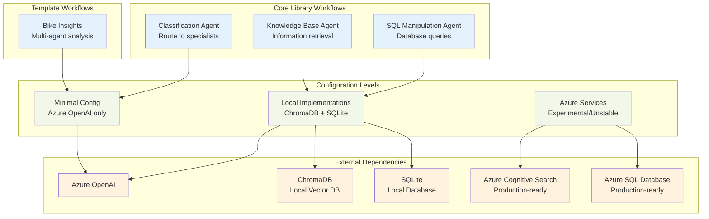
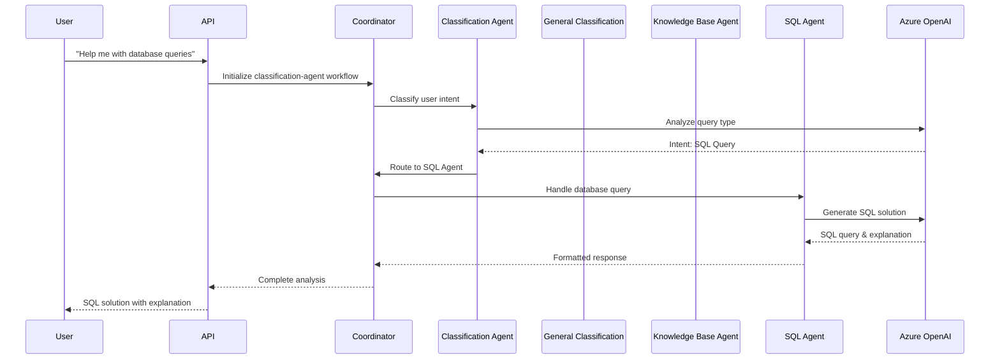
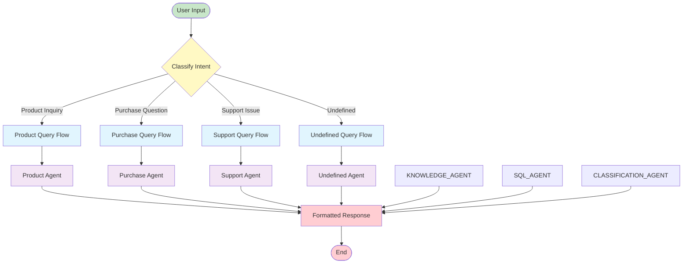
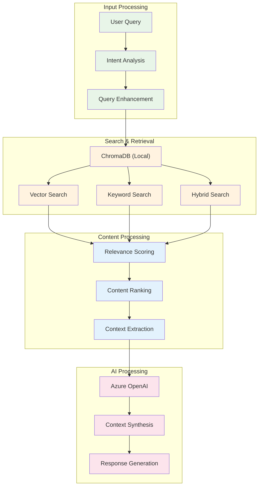
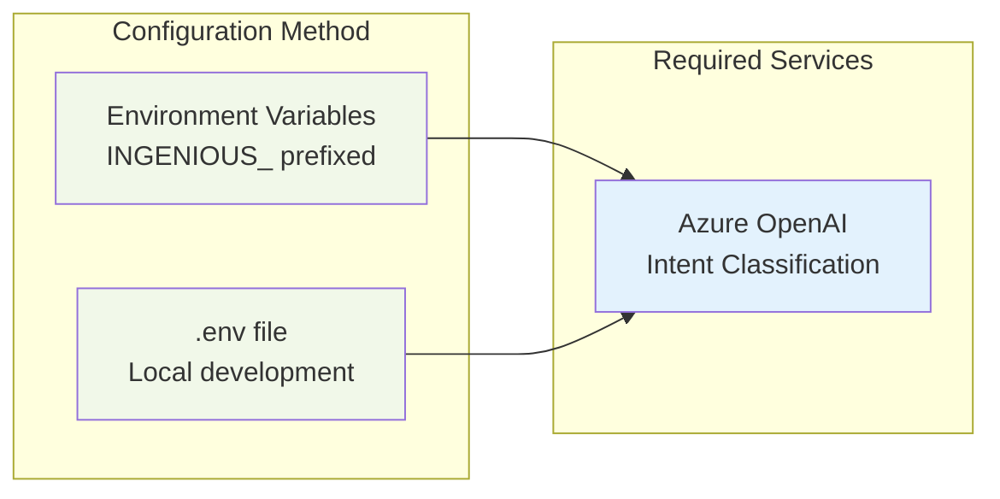
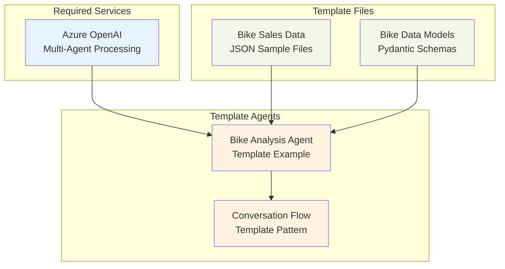
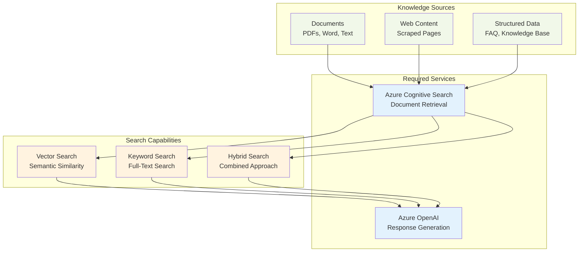
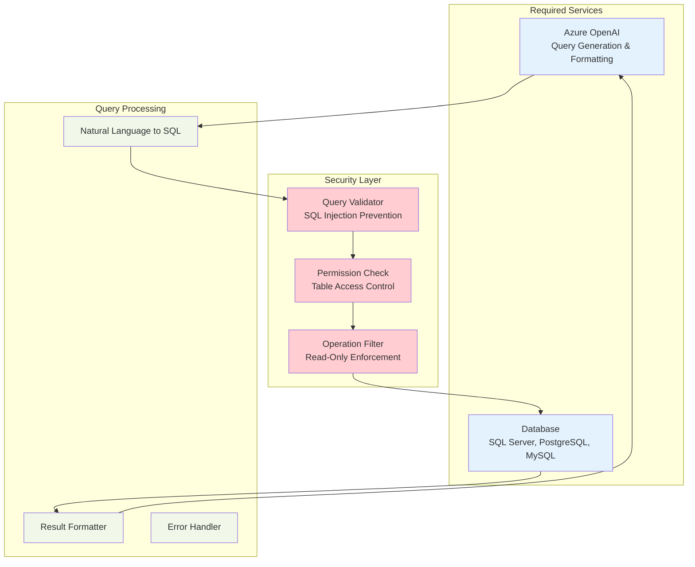
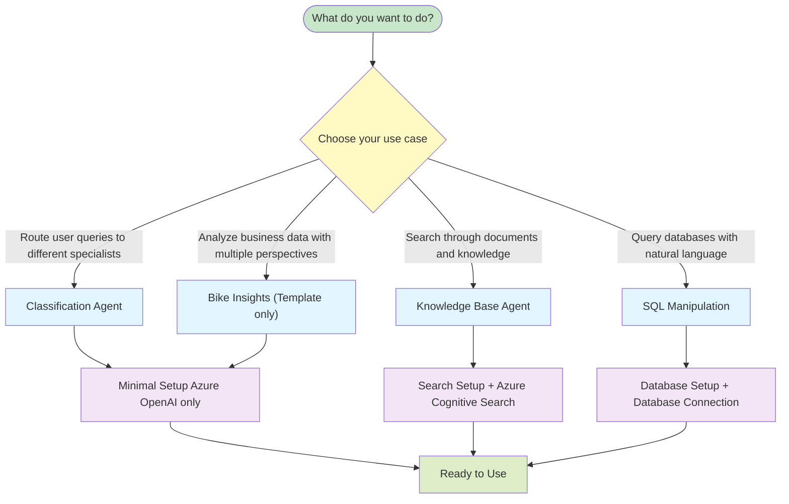

This guide outlines the configuration requirements for each conversation workflow in Insight Ingenious - an enterprise-grade Python library for quickly setting up APIs to interact with AI Agents. Understanding these requirements will help you determine what Azure services and configurations are needed for each workflow, along with available debugging and customization options.

## Workflow Architecture Overview



## Core vs Template Workflows

### Core Library Workflows
These workflows are built into the Insight Ingenious core library and are always available:
- **classification-agent** - Routes user queries to appropriate specialized agents
- **knowledge-base-agent** - Searches and retrieves information from knowledge bases
- **sql-manipulation-agent** - Executes SQL queries based on natural language

### Template Workflows
These workflows are provided as examples in the `ingenious_extensions_template` when you run `uv run ingen init`:
- **bike-insights** - Multi-agent bike sales analysis (the "Hello World" example)

**Important**: Template workflows like `bike-insights` are only available in projects created with `uv run ingen init`, not in the core library.

## Implementation Stability Guide

###  Production-Ready Implementations
- **Local ChromaDB** (knowledge-base-agent): Vector database for knowledge search
- **Local SQLite** (sql-manipulation-agent): Database for SQL queries
- **Azure OpenAI**: Required across all workflows
- **Azure Cognitive Search** (knowledge-base-agent): Cloud-based knowledge search
- **Azure SQL Database** (sql-manipulation-agent): Cloud-based database

**Note**: Both local (ChromaDB + SQLite) and Azure (Azure Search + Azure SQL) implementations are production-ready. Choose based on your infrastructure requirements.

## Detailed Workflow Flows

###  Classification Agent Workflow



### Classification Agent Workflow Flow



### Knowledge Base Workflow



### SQL Manipulation Workflow


## Configuration Requirements by Workflow

### Core Library Workflows (Azure OpenAI only)

These workflows are included in the core library and only require basic Azure OpenAI configuration:

#### Classification Agent
Routes input to specialized agents based on content analysis.



**Required Configuration:**
```bash
# Environment variables for classification agent
INGENIOUS_PROFILE=dev
INGENIOUS_MODELS__0__MODEL=gpt-4o-mini
INGENIOUS_MODELS__0__API_TYPE=rest
INGENIOUS_MODELS__0__API_VERSION=2024-12-01-preview
INGENIOUS_MODELS__0__DEPLOYMENT=gpt-4o-mini
INGENIOUS_MODELS__0__API_KEY=your-api-key
INGENIOUS_MODELS__0__BASE_URL=https://your-resource.openai.azure.com/
INGENIOUS_CHAT_SERVICE__TYPE=multi_agent
```

### Template-Based Workflows (Azure OpenAI only)

#### Bike Insights ("Hello World" Template)
Sample domain-specific workflow for bike sales analysis. Available in the `ingenious_extensions_template` when you run `ingen init`.

> **Note:** This workflow exists as a template example in `ingenious_extensions_template/`, not as a core workflow. It demonstrates how to build custom domain-specific workflows and is the recommended "Hello World" example for new users.



### Core Library Workflows (Local Implementation - Stable)

#### Knowledge Base Agent
Search and retrieve information from knowledge bases using local ChromaDB (stable) or Azure Search (experimental).

> **Note**: Both local ChromaDB and Azure Search implementations are production-ready. ChromaDB requires no additional configuration and is ideal for development.



**Configuration Options:**

**Recommended: Local ChromaDB (Stable - No additional configuration needed)**
```bash
# No additional configuration required!
# Uses local ChromaDB for vector storage
# Documents stored in ./.tmp/knowledge_base/

# To use knowledge-base-agent, ensure these dependencies are installed:
uv add chromadb aiofiles autogen-ext
```

**Alternative: Azure Search (Production-ready)**
```bash
# Additional Azure Search configuration
INGENIOUS_AZURE_SEARCH_SERVICES__0__ENDPOINT=https://your-search-service.search.windows.net
INGENIOUS_AZURE_SEARCH_SERVICES__0__KEY=your-search-api-key
```

> **Note**: Both implementations are production-ready. ChromaDB is ideal for development and smaller deployments, while Azure Search provides enterprise-scale capabilities.

### Core Library Workflows (Database Required)

#### SQL Manipulation Agent
Execute SQL queries on Azure SQL or local databases.



**Additional Configuration Required:**

**Local SQLite (Recommended - Stable):**
```bash
# Local SQLite configuration
INGENIOUS_LOCAL_SQL_DB__DATABASE_PATH=/tmp/sample_sql.db

# No additional dependencies required - SQLite support is built-in
```

**Azure SQL (Production-ready):**
```bash
# Azure SQL configuration
INGENIOUS_AZURE_SQL_SERVICES__DATABASE_NAME=your-database-name
INGENIOUS_AZURE_SQL_SERVICES__TABLE_NAME=your-table-name
INGENIOUS_AZURE_SQL_SERVICES__DATABASE_CONNECTION_STRING="Driver={ODBC Driver 18 for SQL Server};Server=tcp:your-server.database.windows.net,1433;Database=your-database;Uid=your-username;Pwd=your-password;Encrypt=yes;TrustServerCertificate=no;Connection Timeout=30;"
```

> **Note**: Both SQLite and Azure SQL implementations are production-ready. SQLite is ideal for development and testing.

## Workflow Selection Guide

### Choosing the Right Workflow



## Next Steps

1. **Choose Your Workflow**: Select the workflow that best fits your use case
2. **Configure Services**: Set up the required Azure services and configuration
3. **Test Setup**: Validate your configuration with sample queries
4. **Deploy**: Launch your workflow in your preferred environment
5. **Monitor**: Track performance and optimize as needed

For detailed setup instructions, see:
- [Configuration Guide](../getting-started/configuration.md) - Complete setup instructions
- [Getting Started](../getting-started/README.md) - Quick start tutorial
- [Development Guide](../development/README.md) - Advanced customization
- [API Documentation](../api/README.md) - Integration details
